Final\_class\_project
================
Megan Hupka
4/21/2023

# Loading in peaks and creating dataframes

``` r
# load("results/filtered_consensus_list.RData") # To reload so we do not have to redo all these functions

broadpeakfilepath <- "/scratch/Shares/rinnclass/CLASS_2023/data/data/peaks"

# importing peaks as granges with "import_peaks" function
# can take 10+ min !
peak_list <- import_peaks(consensus_file_path = broadpeakfilepath)


# Creating unique DBP object for create_consensus_peaks_from_reduced
dbp <- unique(sapply(names(peak_list), function(x) {
   unlist(strsplit(x, "_"))[1]
}))

# now run our function consensus_from_reduced
consensus_list <- lapply(dbp, consensus_from_reduced, peak_list)

# adding names to the GRange list
names(consensus_list) <- dbp

# creating list of num_peaks per dbp
num_peaks <- sapply(consensus_list, length)

# Filtering to over 1000 peaks
filtered_consensus_list <- consensus_list[sapply(consensus_list, length) > 1000]

# saving 
save(filtered_consensus_list, file = "results/filtered_consensus_list.RData")
```

# Loading Genome Features

``` r
gencode_gr <- rtracklayer::import("/scratch/Shares/rinnclass/CLASS_2023/data/data/genomes/gencode.v32.annotation.gtf")

# gencode genes
gencode_genes <- gencode_gr[gencode_gr$type == "gene"] 

# mrna_genes
mrna_genes <- gencode_genes[gencode_genes$gene_type %in% "protein_coding"]

# lncrna_genes
lncrna_genes <- gencode_genes[gencode_genes$gene_type %in% "lncRNA"] 

# mrna_lncrna_genes
mrna_lncrna_genes <- gencode_genes[gencode_genes$gene_type %in% c("protein_coding","lncRNA")]

# lncrna_mrna_promoters
lncrna_mrna_promoters <- promoters(mrna_lncrna_genes, upstream = 1000, downstream = 1000)

# lncrna_gene_ids
lncrna_gene_ids <- mrna_lncrna_genes$gene_id[mrna_lncrna_genes$gene_type == "lncRNA"]

# mrna_gene_ids
mrna_gene_ids <-mrna_lncrna_genes$gene_id[mrna_lncrna_genes$gene_type == "protein_coding"]

# Creating peak occurrence
promoter_peak_occurrence <- count_peaks_per_feature(lncrna_mrna_promoters, filtered_consensus_list, 
                                               type = "occurrence")

# Let's double check that all lncrna & mrna genes are accounted for:
stopifnot(all(colnames(promoter_peak_occurrence) == lncrna_mrna_promoters$gene_id))

# Great we will use this quite a bit moving forward so let's write it out! 
write.table(promoter_peak_occurrence, "lncrna_mrna_promoter_peak_occurrence_matrix.tsv")

# Creating a dataframe
stopifnot(all(colnames(promoter_peak_occurrence) == lncrna_mrna_promoters$gene_id))
peak_occurrence_df <- data.frame("gene_id" = colnames(promoter_peak_occurrence),
                                "gene_name" = lncrna_mrna_promoters$gene_name,
                                "gene_type" = lncrna_mrna_promoters$gene_type,
                                "chr" = lncrna_mrna_promoters@seqnames,   
                                "1kb_up_tss_start" = lncrna_mrna_promoters@ranges@start,
                                "strand" = lncrna_mrna_promoters@strand,
                                "number_of_dbp" = colSums(promoter_peak_occurrence))

write_csv(peak_occurrence_df, "peak_occurrence_dataframe.csv")
peak_occurrence_df <- read_csv("peak_occurrence_dataframe.csv")
```

    ## Rows: 36814 Columns: 7
    ## ── Column specification ────────────────────────────────────────────────────────
    ## Delimiter: ","
    ## chr (5): gene_id, gene_name, gene_type, chr, strand
    ## dbl (2): X1kb_up_tss_start, number_of_dbp
    ## 
    ## ℹ Use `spec()` to retrieve the full column specification for this data.
    ## ℹ Specify the column types or set `show_col_types = FALSE` to quiet this message.

# Finding super binders

``` r
#load("results/super_binders.RData") # To reload so we do not have to redo all these functions

super_binders <- filter(peak_occurrence_df, number_of_dbp > 200)
save(super_binders, file = "results/super_binders.RData")
```

# Peak Number and Genome Coverage Comparison

``` r
# num_peaks_df <- read_csv("results/num_peaks_df.csv") # loading the csv so we do not have to run all the functions below

num_peaks_df <- data.frame("dbp" = names(filtered_consensus_list),
                           "num_peaks" = sapply(filtered_consensus_list, length))

# total genome covered by peaks
num_peaks_df$total_peak_length <- sapply(filtered_consensus_list, function(x) sum(width(x)))

# creating number of promoter overlaps entry
promoter_peak_counts <- count_peaks_per_feature(lncrna_mrna_promoters, filtered_consensus_list, type = "counts")

# summing rows to get total number of promoter overlaps
num_peaks_df$peaks_overlapping_promoters <- rowSums(promoter_peak_counts)

# Plotting
ggplot(num_peaks_df, aes(x = num_peaks, y = total_peak_length)) +
  geom_point() + 

  ylab("BP covered") +
  xlab("Number of peaks") +
  ggtitle("Peak count vs. total bases covered")
```

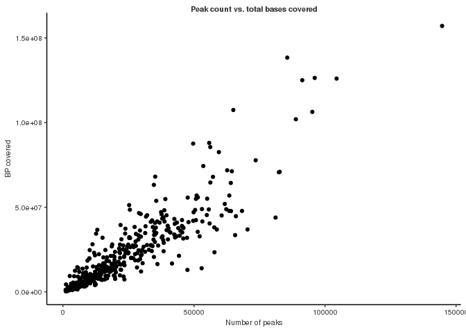<!-- -->

``` r
ggsave("figures/genome_coverage.pdf")
```

    ## Saving 7 x 5 in image

# What is the distribution of promoter overlaps versus gene-bodies (hint hist)

``` r
# lncrna promoter overlaps 
num_peaks_df$peaks_overlapping_lncrna_promoters <- rowSums(promoter_peak_occurrence[,lncrna_gene_ids])

# mrna promoter overlaps
num_peaks_df$peaks_overlapping_mrna_promoters <- rowSums(promoter_peak_occurrence[,mrna_gene_ids])

# Finding overlaps with gene_bodies (will take a few minutes again)
# Note this takes several minutes
genebody_peak_counts <- count_peaks_per_feature(mrna_lncrna_genes, 
                                                filtered_consensus_list, 
                                                type = "counts")

# All gene bodies overlaps
num_peaks_df$peaks_overlapping_genebody <- rowSums(genebody_peak_counts)

# lncRNA gene bodies 
num_peaks_df$peaks_overlapping_lncrna_genebody <- rowSums(genebody_peak_counts[,lncrna_gene_ids])

# mRNA gene bodies
num_peaks_df$peaks_overlapping_mrna_genebody <- rowSums(genebody_peak_counts[,mrna_gene_ids])

# Saving Num Peaks
write_csv(num_peaks_df, "results/num_peaks_df.csv")

# Plotting
ggplot(num_peaks_df, aes(x = num_peaks)) +
  geom_point(aes(y = peaks_overlapping_promoters), color = "red") +
  geom_point(aes(y = peaks_overlapping_genebody), color = "black") +
  xlab("Number of Peaks") +
  ylab("Number of peaks overlapping") +
  ggtitle("Number of peaks overlapping genebodies compared to promoters")
```

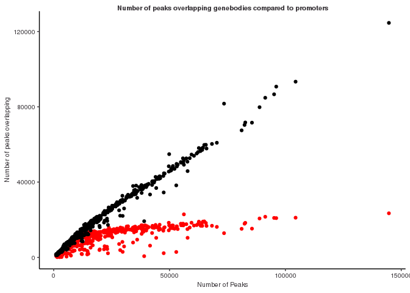<!-- -->

``` r
#Saving Plot
ggsave("figures/lncRNA-mRNA-promoter_binding.pdf")
```

    ## Saving 7 x 5 in image

# Super binders and lncRNAs and mRNAs

``` r
# Are there more super binders associated with lncRNAs or mRNAs?
barplot(table(super_binders$gene_type), xlab = "Gene Type", ylab = "Number of Super Binders") 
```

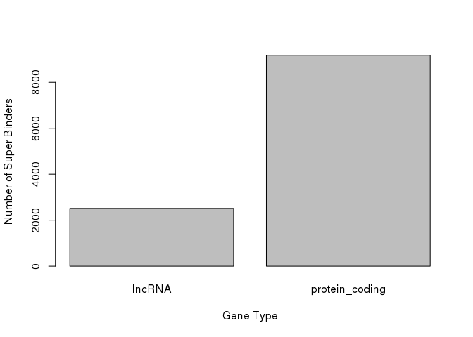<!-- -->

``` r
# What chromosome has the most super binders? 
barplot(table(super_binders$chr), xlab = "Chromosome", ylab = "Number of Super Binders", las = 2,
        cex.names = 0.7) 
```

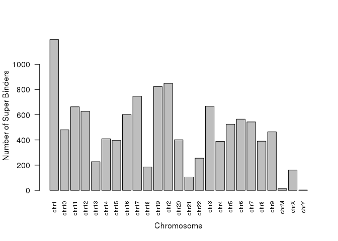<!-- -->
\# Results: Based on the barplot created above, there are more
super-binders that are associated with protein coding or mRNAs then
lncRNAs. Chromosome 1 seems to have the most super binds. It is
interesting that there are also super binders in mitochondrial DNA.

# Mitochondrial Super Binders

``` r
mito_super_binders <- filter(super_binders, chr == "chrM")
save(mito_super_binders, file = "results/mito_super_binders.RData")

table(mito_super_binders$gene_name, mito_super_binders$number_of_dbp)
```

    ##          
    ##           257 265 267 268 270 271 272 275 276
    ##   MT-ATP6   0   1   0   0   0   0   0   0   0
    ##   MT-ATP8   0   1   0   0   0   0   0   0   0
    ##   MT-CO1    1   0   0   0   0   0   0   0   0
    ##   MT-CO2    0   1   0   0   0   0   0   0   0
    ##   MT-CO3    0   0   1   0   0   0   0   0   0
    ##   MT-CYB    0   0   0   0   0   0   0   0   1
    ##   MT-ND1    0   0   0   0   0   1   0   0   0
    ##   MT-ND2    0   0   0   0   1   0   0   0   0
    ##   MT-ND3    0   0   0   1   0   0   0   0   0
    ##   MT-ND4    0   0   0   0   0   0   1   0   0
    ##   MT-ND4L   0   0   0   0   0   0   1   0   0
    ##   MT-ND5    0   0   0   0   0   1   0   0   0
    ##   MT-ND6    0   0   0   0   0   0   0   1   0

``` r
mito_df <- data.frame(
  "Gene Name" = mito_super_binders$gene_name,
  "Number of DBP" = mito_super_binders$number_of_dbp
)
print(mito_df)
```

    ##    Gene.Name Number.of.DBP
    ## 1     MT-ND1           271
    ## 2     MT-ND2           270
    ## 3     MT-CO1           257
    ## 4     MT-CO2           265
    ## 5    MT-ATP8           265
    ## 6    MT-ATP6           265
    ## 7     MT-CO3           267
    ## 8     MT-ND3           268
    ## 9    MT-ND4L           272
    ## 10    MT-ND4           272
    ## 11    MT-ND5           271
    ## 12    MT-ND6           275
    ## 13    MT-CYB           276

# Results: The super-binder with the highest DBP is MT-CYB and MT-ND6. MT-ND6 encodes NADH dehydrogenase 6 which is one of the proteins in complex 1. Complex 1 is important in the electron transport chain and is vital in the creation of ATP molecules. This makes sense why this gene would have a lot of DNA binding proteins. MT-CYB encodes cytochrome b which is important in complex 3, another complex needed to convert “food” to ATP. None of the super binders found in mitochondrial DNA are associated with lncRNAs.

# Let’s see how similar our genes are to each other

# Clustering

``` r
promoter_peak_occurrence_matrix <- read.table("lncrna_mrna_promoter_peak_occurrence_matrix.tsv")

promoter_peak_occurrence_matrix <- as.matrix(promoter_peak_occurrence_matrix)

# Calculating distance matrix
peak_occurrence_dist <- dist(promoter_peak_occurrence_matrix, method = "binary")

# Clustering Distance Matrix
bin_hier <- hclust(peak_occurrence_dist, method = "complete")
plot(bin_hier)
```

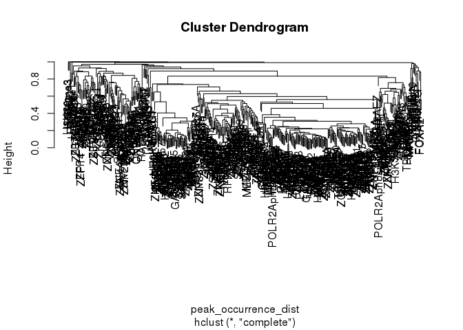<!-- -->

``` r
pdf("figures/dbp_hclust_dendro.pdf", height = 12, width = 70)


 ggdendro::ggdendrogram(bin_hier, rotate = FALSE,  size = 3, 
                       theme_dendro = TRUE) +
   # 90 degree rotation to right
   coord_flip() +
   scale_y_continuous() +
   # adds label
   scale_x_continuous(position = "top") +
   # subsection to labels in order of clustering
   # ? seq_along
   scale_x_continuous(breaks = seq_along(bin_hier$labels[bin_hier$order]),
                      
                      # adding labels that are in the order 'column'
             labels = bin_hier$labels[bin_hier$order], position = "top",
             expand = c(0,0)) +
   theme(axis.text.x = element_text(angle = 90, hjust  = 1)) + 
   theme(axis.text.y = element_text(angle = 0,hjust = 1)) +
   scale_y_reverse(expand = c(0.01, 0)) +
   theme(
     plot.background = element_blank(),
     panel.grid.major = element_blank(),
   panel.grid.minor = element_blank(),
     panel.border = element_blank()
   )
```

    ## Scale for y is already present.
    ## Adding another scale for y, which will replace the existing scale.
    ## Scale for x is already present.
    ## Adding another scale for x, which will replace the existing scale.
    ## Scale for x is already present.
    ## Adding another scale for x, which will replace the existing scale.
    ## Scale for y is already present.
    ## Adding another scale for y, which will replace the existing scale.

``` r
ggsave("figures/ggdendro_plot.pdf", height = 50, width = 12, limitsize = F)
```

# Clustering of lncRNA and mRNA seperately

# lncRNA

``` r
lncrna_mrna_promoters <- rtracklayer::import("/scratch/Shares/rinnclass/CLASS_2023/mehu6123/CLASS_2023/CLASSES/05_R_analyses/01_peak_features/results/gene_annotations/lncrna_mrna_promoters.gtf")

# now we can split into lncRNA and mRNA
lncrna_promoters <- lncrna_mrna_promoters[lncrna_mrna_promoters$gene_type == "lncRNA"]

# mrna promoters

mrna_promoters <- lncrna_mrna_promoters[lncrna_mrna_promoters$gene_type == "protein_coding"]

lncrna_peak_occurrence <- promoter_peak_occurrence_matrix[,lncrna_promoters$gene_id]

# we do the clutering the same as above or we can combine the dist and hclust:
bin_hier_lncrna <- hclust(dist(lncrna_peak_occurrence, method = "binary"))

# Now plot with ggdendro
ggdendro::ggdendrogram(bin_hier_lncrna, rotate = T,  size = 3)
```

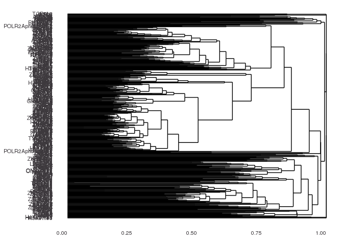<!-- -->

``` r
# Now let's save this figure
ggsave("figures/lncrna_hclust_binary_dist.pdf", height = 49, width = 6)
```

# Result: MED13 is a subunit of the CDK8-kinase which can reversibly bind the protein, Mediator, which is a required protein in polymerase II transcription initiation. MED1 is another closely related protein to MED13 and as such is clustered together with MED13. ZNF503 is fairly close in clustering to MED13 and MED1. Although its exact function is not known, it is predicted to enable metal ion binding activity and may have a negative role in gene expression. I wonder if there is any connection between the CDK8-kinase complex and this ZNF in terms of negative regulation of transcription.

# mRNA

``` r
mrna_peak_occurrence <- promoter_peak_occurrence_matrix[,mrna_promoters$gene_id]

# getting the distance matrix for only mRNA promoters  
bin_hier_mrna <- hclust(dist(mrna_peak_occurrence, method = "binary"))
 
# plotting with ggdendro
ggdendro::ggdendrogram(bin_hier, rotate = TRUE,  size = 3)
```

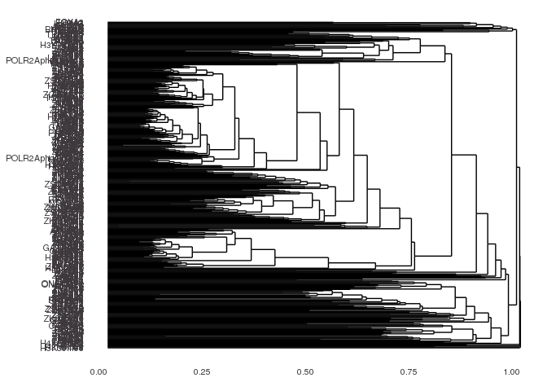<!-- -->

``` r
# saving
ggsave("figures/mrna_hclust_binary_dist.pdf", height = 44, width = 6)
```

# DBPs Binding to Promoter

``` r
DBPs_on_promoter <- bind_rows(lncrna_promoters %>% 
                                 as.data.frame(),
                 mrna_promoters %>% 
                    as.data.frame()) %>%
  dplyr::select(gene_id, gene_name)

promoter_dbps <- promoter_peak_occurrence_matrix %>%
  as.data.frame() %>%
  rownames_to_column("dbp") %>%
pivot_longer(2:ncol(.), names_to = "gene_id", values_to = "occurrence") %>%
  filter(occurrence == 1) %>%
  dplyr::select(-occurrence) %>%
  left_join(DBPs_on_promoter)
```

    ## Joining with `by = join_by(gene_id)`

``` r
write.csv(promoter_dbps, "dbps_on_a_promoter.csv")
```

# Metaplot lncRNAs

``` r
lncrna_promoters <- lncrna_mrna_promoters[lncrna_mrna_promoters$gene_type == "lncRNA"]
mrna_promoters <- lncrna_mrna_promoters[lncrna_mrna_promoters$gene_type == "protein_coding"]

#setting up lncrna DF.
lncrna_metaplot_df <- data.frame(x = integer(), dens = numeric(), dbp = character())

# for loop to populate DF with overlap density in lncrna promoters
for(i in 1:length(filtered_consensus_list)) {
  #print(names(filtered_consensus_list)[[i]])
  tmp_df <- profile_tss(filtered_consensus_list[[i]], lncrna_mrna_promoters = lncrna_promoters)
  tmp_df$dbp <- names(filtered_consensus_list)[[i]]
  lncrna_metaplot_df <- bind_rows(lncrna_metaplot_df, tmp_df)
  
}
```

    ## Warning in .Seqinfo.mergexy(x, y): Each of the 2 combined objects has sequence levels not in the other:
    ##   - in 'x': chrY
    ##   - in 'y': GL000214.1, GL000218.1, GL000220.1, GL000252.2, KI270438.1, KI270442.1, KI270467.1, KI270733.1, KI270767.1, KI270857.1, KI270878.1, KN196487.1, KQ031389.1, KV575244.1, ML143377.1, ML143380.1, GL000194.1, GL000216.2, GL000219.1, GL000224.1, GL000225.1, GL383577.2, KI270712.1, KI270728.1, KI270729.1, KI270861.1, KQ458384.1, KZ208915.1, ML143372.1
    ##   Make sure to always combine/compare objects based on the same reference
    ##   genome (use suppressWarnings() to suppress this warning).

    ## Warning in .Seqinfo.mergexy(x, y): Each of the 2 combined objects has sequence levels not in the other:
    ##   - in 'x': chrM
    ##   - in 'y': GL000194.1, GL000218.1, GL000219.1, GL000251.2, GL000252.2, GL000254.2, GL339449.2, GL383527.1, GL383556.1, GL383563.3, GL383577.2, GL877875.1, KI270467.1, KI270713.1, KI270721.1, KI270744.1, KI270782.1, KI270803.1, KI270829.1, KI270857.1, KI270861.1, KI270862.1, KI270878.1, KI270879.1, KI270908.1, KN196484.1, KQ458384.1, KV575244.1, KV880768.1, KZ208915.1, ML143371.1, ML143377.1, ML143381.1, GL000224.1, KI270712.1, KI270728.1, KI270733.1, KI270830.1, KI270853.1, KI270869.1, KN538372.1, KV766196.1, KV880764.1
    ##   Make sure to always combine/compare objects based on the same reference
    ##   genome (use suppressWarnings() to suppress this warning).

    ## Warning in .Seqinfo.mergexy(x, y): Each of the 2 combined objects has sequence levels not in the other:
    ##   - in 'x': chrM
    ##   - in 'y': GL000219.1, GL383577.2, GL383581.2, KI270713.1, KI270729.1, KI270879.1, KI270904.1, KQ458384.1, KV880768.1, KZ208922.1, GL000218.1, GL000251.2, KZ208915.1
    ##   Make sure to always combine/compare objects based on the same reference
    ##   genome (use suppressWarnings() to suppress this warning).

    ## Warning in .Seqinfo.mergexy(x, y): Each of the 2 combined objects has sequence levels not in the other:
    ##   - in 'x': chrM
    ##   - in 'y': GL000009.2, GL000194.1, GL000208.1, GL000214.1, GL000216.2, GL000218.1, GL000219.1, GL000220.1, GL000221.1, GL000224.1, GL000225.1, GL000252.2, GL000255.2, GL000256.2, GL339449.2, GL383522.1, GL383542.1, GL383563.3, GL383577.2, GL383581.2, JH159146.1, KI270442.1, KI270706.1, KI270711.1, KI270712.1, KI270713.1, KI270714.1, KI270718.1, KI270719.1, KI270721.1, KI270722.1, KI270723.1, KI270725.1, KI270726.1, KI270728.1, KI270731.1, KI270732.1, KI270733.1, KI270734.1, KI270736.1, KI270742.1, KI270743.1, KI270744.1, KI270745.1, KI270750.1, KI270751.1, KI270754.1, KI270762.1, KI270764.1, KI270772.1, KI270805.1, KI270819.1, KI270830.1, KI270832.1, KI270846.1, KI270847.1, KI270850.1, KI270853.1, KI270861.1, KI270862.1, KI270865.1, KI270868.1, KI270869.1, KI270879.1, KI270894.1, KI270896.1, KI270903.1, KI270905.1, KI270907.1, KI270908.1, KI270913.1, KI270936.1, KN196484.1, KN196487.1, KN538372.1, KQ031389.1, KQ090026.1, KQ090028.1, KQ759762.1, KV575244.1, KV766193.1, KV880764.1, KV880768.1, KZ208908.1, KZ208915.1, KZ208921.1, KZ208922.1, KZ559100.1, ML143353.1, ML143364.1, ML143365.1, ML143371.1, ML143372.1, ML143375.1, ML143377.1, ML143380.1, GL000008.2, GL000195.1, GL000251.2, GL000254.2, GL383556.1, KI270438.1, KI270866.1, KI270878.1
    ##   Make sure to always combine/compare objects based on the same reference
    ##   genome (use suppressWarnings() to suppress this warning).

    ## Warning in .Seqinfo.mergexy(x, y): Each of the 2 combined objects has sequence levels not in the other:
    ##   - in 'x': chrY
    ##   - in 'y': GL000224.1, GL877875.1, KI270438.1, KI270712.1, KI270713.1, KI270733.1, KI270744.1, KN196487.1, KV880768.1
    ##   Make sure to always combine/compare objects based on the same reference
    ##   genome (use suppressWarnings() to suppress this warning).

    ## Warning in .Seqinfo.mergexy(x, y): Each of the 2 combined objects has sequence levels not in the other:
    ##   - in 'x': chrY
    ##   - in 'y': KI270438.1, KI270466.1, KI270467.1, KI270713.1, KI270830.1, KI270869.1, KI270879.1, KN196487.1, KV880768.1, ML143380.1, KI270712.1
    ##   Make sure to always combine/compare objects based on the same reference
    ##   genome (use suppressWarnings() to suppress this warning).

    ## Warning in .Seqinfo.mergexy(x, y): Each of the 2 combined objects has sequence levels not in the other:
    ##   - in 'x': chrY
    ##   - in 'y': GL000214.1, GL000216.2, GL000220.1, GL000224.1, GL000225.1, KI270330.1, KI270333.1, KI270336.1, KI270337.1, KI270438.1, KI270442.1, KI270466.1, KI270467.1, KI270713.1, KI270729.1, KI270733.1, KI270879.1, KN196487.1, KV880768.1, ML143380.1, GL383577.2
    ##   Make sure to always combine/compare objects based on the same reference
    ##   genome (use suppressWarnings() to suppress this warning).

    ## Warning in .Seqinfo.mergexy(x, y): Each of the 2 combined objects has sequence levels not in the other:
    ##   - in 'x': chrM
    ##   - in 'y': GL000009.2, GL000194.1, GL000205.2, GL000213.1, GL000214.1, GL000216.2, GL000218.1, GL000219.1, GL000220.1, GL000221.1, GL000224.1, GL000225.1, GL000252.2, GL000253.2, GL000254.2, GL000255.2, GL000256.2, GL339449.2, GL383563.3, GL383566.1, GL383574.1, GL383577.2, JH159146.1, JH159147.1, KI270442.1, KI270512.1, KI270519.1, KI270538.1, KI270706.1, KI270709.1, KI270711.1, KI270712.1, KI270713.1, KI270714.1, KI270718.1, KI270719.1, KI270721.1, KI270722.1, KI270723.1, KI270724.1, KI270725.1, KI270728.1, KI270731.1, KI270732.1, KI270733.1, KI270734.1, KI270735.1, KI270736.1, KI270742.1, KI270743.1, KI270744.1, KI270745.1, KI270749.1, KI270750.1, KI270751.1, KI270753.1, KI270754.1, KI270762.1, KI270767.1, KI270772.1, KI270780.1, KI270782.1, KI270791.1, KI270792.1, KI270795.1, KI270797.1, KI270805.1, KI270815.1, KI270816.1, KI270819.1, KI270821.1, KI270830.1, KI270831.1, KI270832.1, KI270846.1, KI270847.1, KI270850.1, KI270853.1, KI270854.1, KI270856.1, KI270857.1, KI270860.1, KI270861.1, KI270862.1, KI270865.1, KI270868.1, KI270869.1, KI270870.1, KI270871.1, KI270872.1, KI270875.1, KI270877.1, KI270878.1, KI270879.1, KI270894.1, KI270896.1, KI270901.1, KI270903.1, KI270905.1, KI270908.1, KI270913.1, KI270937.1, KN196484.1, KN538361.1, KN538364.1, KN538368.1, KN538372.1, KN538373.1, KQ031389.1, KQ090026.1, KQ090028.1, KQ458383.1, KQ458386.1, KQ759759.1, KQ759762.1, KV575244.1, KV766196.1, KV880764.1, KV880768.1, KZ208904.1, KZ208906.1, KZ208915.1, KZ208918.1, KZ208919.1, KZ208921.1, KZ208922.1, KZ559100.1, KZ559109.1, ML143341.1, ML143353.1, ML143355.1, ML143358.1, ML143364.1, ML143365.1, ML143366.1, ML143371.1, ML143372.1, ML143375.1, ML143377.1, ML143378.1, ML143379.1, ML143380.1, GL000258.2, KI270589.1, KI270876.1, KI270907.1, KI270936.1, KQ090022.1, KZ208908.1, KZ208916.1, ML143370.1
    ##   Make sure to always combine/compare objects based on the same reference
    ##   genome (use suppressWarnings() to suppress this warning).

    ## Warning in .Seqinfo.mergexy(x, y): Each of the 2 combined objects has sequence levels not in the other:
    ##   - in 'x': chrM
    ##   - in 'y': GL000214.1, GL000218.1, GL000219.1, GL000225.1, GL383577.2, KI270713.1, KI270721.1, KI270733.1, KI270869.1, KI270879.1, KI270908.1, KZ208915.1, GL000008.2, GL000009.2, GL000194.1, GL000208.1, GL000216.2, GL000220.1, GL000221.1, GL000224.1, GL000251.2, GL000252.2, GL000253.2, GL000254.2, GL000256.2, GL339449.2, GL383522.1, GL383533.1, GL383563.3, GL383566.1, GL383574.1, GL877875.1, KI270330.1, KI270442.1, KI270706.1, KI270709.1, KI270711.1, KI270712.1, KI270714.1, KI270718.1, KI270719.1, KI270720.1, KI270722.1, KI270723.1, KI270724.1, KI270725.1, KI270728.1, KI270731.1, KI270732.1, KI270734.1, KI270742.1, KI270743.1, KI270744.1, KI270745.1, KI270746.1, KI270750.1, KI270751.1, KI270753.1, KI270754.1, KI270762.1, KI270764.1, KI270772.1, KI270787.1, KI270791.1, KI270805.1, KI270819.1, KI270821.1, KI270824.1, KI270830.1, KI270831.1, KI270832.1, KI270845.1, KI270847.1, KI270853.1, KI270854.1, KI270857.1, KI270861.1, KI270868.1, KI270871.1, KI270872.1, KI270877.1, KI270878.1, KI270894.1, KI270902.1, KI270903.1, KI270905.1, KI270907.1, KN196484.1, KN196487.1, KN538372.1, KQ031389.1, KQ090020.1, KQ090026.1, KQ458386.1, KV575244.1, KV766196.1, KV880768.1, KZ208904.1, KZ208906.1, KZ208918.1, KZ208921.1, KZ208922.1, KZ559100.1, ML143353.1, ML143364.1, ML143365.1, ML143366.1, ML143367.1, ML143371.1, ML143372.1, ML143373.1, ML143374.1, ML143377.1
    ##   Make sure to always combine/compare objects based on the same reference
    ##   genome (use suppressWarnings() to suppress this warning).

    ## Warning in .Seqinfo.mergexy(x, y): Each of the 2 combined objects has sequence levels not in the other:
    ##   - in 'x': chrM
    ##   - in 'y': GL000194.1, GL000219.1, GL000224.1, KI270712.1, KI270713.1, KI270721.1, KI270728.1, KI270733.1, KI270744.1, KI270869.1, KI270879.1, KI270894.1, KI270908.1, KZ208915.1, GL000009.2, GL000214.1, GL000216.2, GL000218.1, GL000225.1, GL000252.2, GL000255.2, GL339449.2, GL383533.1, GL383557.1, GL877875.1, JH159146.1, KI270442.1, KI270709.1, KI270711.1, KI270714.1, KI270718.1, KI270719.1, KI270722.1, KI270725.1, KI270734.1, KI270745.1, KI270750.1, KI270754.1, KI270772.1, KI270830.1, KI270847.1, KI270871.1, KI270877.1, KI270878.1, KI270903.1, KI270907.1, KN196484.1, KN538372.1, KQ090026.1, KV880768.1, KZ208908.1, KZ208921.1, KZ208922.1, ML143345.1, ML143364.1
    ##   Make sure to always combine/compare objects based on the same reference
    ##   genome (use suppressWarnings() to suppress this warning).

    ## Warning in .Seqinfo.mergexy(x, y): Each of the 2 combined objects has sequence levels not in the other:
    ##   - in 'x': chrY, chrM
    ##   - in 'y': GL000194.1, GL000219.1, GL339449.2, GL383577.2, KI270713.1, KI270879.1, GL000254.2
    ##   Make sure to always combine/compare objects based on the same reference
    ##   genome (use suppressWarnings() to suppress this warning).

    ## Warning in .Seqinfo.mergexy(x, y): Each of the 2 combined objects has sequence levels not in the other:
    ##   - in 'x': chrY, chrM
    ##   - in 'y': KI270712.1, KI270729.1, KI270824.1, KI270830.1, KI270894.1, KQ090026.1, ML143364.1, KI270733.1, KI270845.1, KI270871.1
    ##   Make sure to always combine/compare objects based on the same reference
    ##   genome (use suppressWarnings() to suppress this warning).

    ## Warning in .Seqinfo.mergexy(x, y): Each of the 2 combined objects has sequence levels not in the other:
    ##   - in 'x': chrM
    ##   - in 'y': GL000218.1, GL000219.1, GL000251.2, GL000254.2, GL000256.2, GL000257.2, GL383556.1, GL383577.2, GL383580.2, KI270713.1, KI270721.1, KI270744.1, KI270772.1, KI270827.1, KI270830.1, KI270853.1, KI270857.1, KI270861.1, KI270862.1, KI270878.1, KI270879.1, KI270904.1, KI270905.1, KQ031389.1, KQ090028.1, KQ458383.1, KV880768.1, KZ208915.1, KZ208918.1, KZ208919.1, ML143343.1, ML143381.1, GL339449.2, GL383527.1, GL383555.2, GL949742.1, KI270734.1, KI270801.1, KI270908.1, KN196474.1, KN196483.1, KN196484.1, KQ458384.1, KZ208922.1, KZ559105.1, ML143360.1, ML143366.1, ML143371.1, GL000253.2, KI270803.1, KN196487.1, GL383552.1, KI270733.1, KI270751.1, KI270850.1, KV575244.1, GL000214.1, GL000216.2, GL000224.1, GL000225.1, KI270330.1, KI270438.1, KI270712.1, KI270730.1, KI270754.1, ML143372.1, ML143377.1, ML143380.1, GL000194.1, KI270442.1, KI270709.1, KI270723.1, KI270735.1, KI270745.1, KI270782.1, KI270821.1, KI270896.1, KQ031384.1
    ##   Make sure to always combine/compare objects based on the same reference
    ##   genome (use suppressWarnings() to suppress this warning).

    ## Warning in .Seqinfo.mergexy(x, y): Each of the 2 combined objects has sequence levels not in the other:
    ##   - in 'x': chrM
    ##   - in 'y': GL000205.2, GL000219.1, GL000251.2, GL000254.2, GL000257.2, GL339449.2, GL383526.1, GL383552.1, GL383556.1, GL383563.3, GL383571.1, GL383577.2, GL383580.2, GL383581.2, KI270713.1, KI270721.1, KI270723.1, KI270734.1, KI270744.1, KI270782.1, KI270801.1, KI270822.1, KI270827.1, KI270830.1, KI270853.1, KI270857.1, KI270861.1, KI270862.1, KI270878.1, KI270879.1, KI270896.1, KI270904.1, KI270905.1, KN196484.1, KQ031389.1, KQ090022.1, KQ090026.1, KQ090028.1, KQ458383.1, KV575244.1, KV880768.1, KZ208915.1, KZ208918.1, KZ208919.1, KZ559105.1, ML143343.1, ML143360.1, ML143371.1, ML143377.1, ML143381.1, KI270333.1, KI270337.1, KI270466.1, KI270467.1, KN196487.1, ML143380.1, GL000214.1, GL000216.2, GL000224.1, GL000225.1, GL000252.2, KI270330.1, KI270438.1, KI270709.1, KI270729.1, KI270730.1, KI270735.1, KI270751.1, KI270754.1, ML143366.1, GL000194.1, GL000195.1, GL000218.1, GL000253.2, GL000255.2, KI270442.1, KI270519.1, KI270720.1, KI270733.1, KI270803.1, KI270908.1, KQ458384.1, KQ759762.1, KZ208922.1
    ##   Make sure to always combine/compare objects based on the same reference
    ##   genome (use suppressWarnings() to suppress this warning).

    ## Warning in .Seqinfo.mergexy(x, y): Each of the 2 combined objects has sequence levels not in the other:
    ##   - in 'x': chrM
    ##   - in 'y': GL000219.1, GL000252.2, GL000255.2, GL339449.2, GL383563.3, GL383577.2, GL383580.2, KI270713.1, KI270721.1, KI270734.1, KI270736.1, KI270744.1, KI270773.1, KI270830.1, KI270850.1, KI270857.1, KI270861.1, KI270862.1, KI270869.1, KI270878.1, KI270879.1, KI270905.1, KQ090026.1, KQ458383.1, KQ458384.1, KV880768.1, ML143365.1, ML143377.1, ML143380.1
    ##   Make sure to always combine/compare objects based on the same reference
    ##   genome (use suppressWarnings() to suppress this warning).

    ## Warning in .Seqinfo.mergexy(x, y): Each of the 2 combined objects has sequence levels not in the other:
    ##   - in 'x': chrM
    ##   - in 'y': GL000219.1, GL000251.2, GL000255.2, GL339449.2, KI270816.1, KI270830.1, KI270879.1, KV880768.1, ML143371.1, ML143377.1, ML143380.1, GL000194.1, GL000218.1, GL000254.2, KZ208915.1, ML143364.1
    ##   Make sure to always combine/compare objects based on the same reference
    ##   genome (use suppressWarnings() to suppress this warning).

    ## Warning in .Seqinfo.mergexy(x, y): Each of the 2 combined objects has sequence levels not in the other:
    ##   - in 'x': chrM
    ##   - in 'y': KI270713.1, KI270733.1, KI270879.1, KZ208906.1, GL000194.1, GL000251.2, GL339449.2, GL383577.2, KI270712.1, KI270721.1, KI270728.1, KI270905.1, KN196484.1, KV880768.1, ML143377.1
    ##   Make sure to always combine/compare objects based on the same reference
    ##   genome (use suppressWarnings() to suppress this warning).

    ## Warning in .Seqinfo.mergexy(x, y): Each of the 2 combined objects has sequence levels not in the other:
    ##   - in 'x': chrM
    ##   - in 'y': KI270442.1, KI270729.1
    ##   Make sure to always combine/compare objects based on the same reference
    ##   genome (use suppressWarnings() to suppress this warning).

    ## Warning in .Seqinfo.mergexy(x, y): Each of the 2 combined objects has sequence levels not in the other:
    ##   - in 'x': chrM
    ##   - in 'y': GL000218.1, GL000251.2, GL000254.2, GL000255.2, GL000257.2, GL339449.2, GL383563.3, GL383574.1, KI270713.1, KI270721.1, KI270729.1, KI270744.1, KI270782.1, KI270857.1, KI270878.1, KI270879.1, KI270903.1, KI270904.1, KN196484.1, KQ458384.1, KV575244.1, KV880768.1, KZ208915.1, ML143366.1, ML143372.1, ML143377.1, ML143380.1, GL000194.1, GL000219.1, GL383577.2, GL383581.2, KI270861.1, KQ759762.1
    ##   Make sure to always combine/compare objects based on the same reference
    ##   genome (use suppressWarnings() to suppress this warning).

    ## Warning in .Seqinfo.mergexy(x, y): Each of the 2 combined objects has sequence levels not in the other:
    ##   - in 'x': chrM
    ##   - in 'y': GL000194.1, GL000225.1, GL383557.1, KI270442.1, KI270711.1, KI270729.1, KI270736.1, KI270801.1, KI270853.1, KI270866.1, KI270879.1, KQ090028.1, KV575244.1, KZ559109.1, GL000218.1, GL000219.1, KI270467.1, KI270728.1, GL383522.1, KN196474.1, KV766194.1, ML143377.1
    ##   Make sure to always combine/compare objects based on the same reference
    ##   genome (use suppressWarnings() to suppress this warning).

    ## Warning in .Seqinfo.mergexy(x, y): Each of the 2 combined objects has sequence levels not in the other:
    ##   - in 'x': chrM
    ##   - in 'y': GL000194.1, GL000218.1, GL000219.1, GL000257.2, GL383574.1, GL383577.2, GL383581.2, KI270442.1, KI270713.1, KI270729.1, KI270744.1, KI270829.1, KI270830.1, KI270847.1, KI270856.1, KI270861.1, KI270877.1, KI270878.1, KI270879.1, KI270903.1, KN196484.1, KQ090026.1, KQ458383.1, KQ458384.1, KV880764.1, KZ208919.1, KZ208922.1, ML143360.1, ML143366.1, ML143377.1, ML143380.1, KZ208915.1
    ##   Make sure to always combine/compare objects based on the same reference
    ##   genome (use suppressWarnings() to suppress this warning).

    ## Warning in .Seqinfo.mergexy(x, y): Each of the 2 combined objects has sequence levels not in the other:
    ##   - in 'x': chrM
    ##   - in 'y': GL000194.1, GL000205.2, GL000214.1, GL000218.1, GL000219.1, GL000220.1, GL000251.2, GL000252.2, GL000253.2, GL000254.2, GL000255.2, GL000256.2, GL339449.2, GL383552.1, GL383563.3, GL383574.1, GL383577.2, GL383580.2, KI270706.1, KI270712.1, KI270713.1, KI270714.1, KI270729.1, KI270744.1, KI270782.1, KI270803.1, KI270809.1, KI270821.1, KI270830.1, KI270831.1, KI270832.1, KI270853.1, KI270856.1, KI270857.1, KI270860.1, KI270861.1, KI270878.1, KI270879.1, KI270903.1, KI270904.1, KI270905.1, KI270908.1, KN196481.1, KN196484.1, KN538364.1, KQ090026.1, KQ458383.1, KQ458384.1, KQ759762.1, KV575244.1, KV880764.1, KV880768.1, KZ208904.1, KZ208906.1, KZ208915.1, KZ208921.1, KZ208922.1, KZ559105.1, ML143360.1, ML143366.1, ML143367.1, ML143372.1, ML143377.1, ML143380.1, KV766196.1, ML143371.1
    ##   Make sure to always combine/compare objects based on the same reference
    ##   genome (use suppressWarnings() to suppress this warning).

    ## Warning in .Seqinfo.mergexy(x, y): Each of the 2 combined objects has sequence levels not in the other:
    ##   - in 'x': chrM
    ##   - in 'y': GL000194.1, GL000218.1, GL000219.1, GL000220.1, GL000251.2, GL000252.2, GL000253.2, GL000254.2, GL000255.2, GL000256.2, GL339449.2, GL383563.3, KI270712.1, KI270713.1, KI270714.1, KI270717.1, KI270721.1, KI270744.1, KI270762.1, KI270816.1, KI270824.1, KI270830.1, KI270832.1, KI270847.1, KI270849.1, KI270850.1, KI270853.1, KI270857.1, KI270861.1, KI270872.1, KI270879.1, KI270894.1, KI270897.1, KI270904.1, KI270905.1, KI270908.1, KN538364.1, KQ031389.1, KQ090026.1, KQ759762.1, KV575244.1, KV880764.1, KV880768.1, KZ208906.1, KZ208915.1, KZ208922.1, KZ559105.1, KZ559109.1, ML143366.1, ML143371.1, ML143372.1, ML143377.1, ML143380.1, KI270765.1, KI270848.1, KI270856.1, KZ208917.1, KI270333.1, KI270337.1, KI270466.1, KI270467.1, KI270878.1, KI270336.1, KI270438.1, KI270442.1, KI270515.1, KI270729.1, KI270735.1, KI270736.1, KI270750.1, KN196487.1, GL000216.2, GL000224.1, GL000225.1, KI270435.1, KI270509.1, KI270519.1, KI270588.1, KI270591.1, KI270709.1, KI270746.1, KI270751.1, KI270757.1, GL383556.1, GL383574.1, KI270745.1, KI270815.1
    ##   Make sure to always combine/compare objects based on the same reference
    ##   genome (use suppressWarnings() to suppress this warning).

    ## Warning in .Seqinfo.mergexy(x, y): Each of the 2 combined objects has sequence levels not in the other:
    ##   - in 'x': chrM
    ##   - in 'y': GL383557.1, KI270729.1, KI270744.1, KI270830.1, KI270832.1, KI270866.1, KI270879.1, KI270904.1, KN538364.1, KQ458384.1, KV575244.1, KV880768.1, KZ208915.1, ML143366.1, ML143377.1, ML143380.1
    ##   Make sure to always combine/compare objects based on the same reference
    ##   genome (use suppressWarnings() to suppress this warning).

    ## Warning in .Seqinfo.mergexy(x, y): Each of the 2 combined objects has sequence levels not in the other:
    ##   - in 'x': chrM
    ##   - in 'y': GL000194.1, GL000218.1, GL000219.1, GL000220.1, GL000251.2, GL000252.2, GL339449.2, GL383563.3, GL383574.1, KI270713.1, KI270721.1, KI270729.1, KI270736.1, KI270744.1, KI270745.1, KI270830.1, KI270857.1, KI270879.1, KI270904.1, KI270908.1, KN196484.1, KQ458384.1, KV575244.1, KV880768.1, KZ208915.1, ML143377.1, ML143380.1, GL000254.2, GL000255.2, KI270866.1, KI270872.1, KI270903.1, KQ090026.1, KV880764.1
    ##   Make sure to always combine/compare objects based on the same reference
    ##   genome (use suppressWarnings() to suppress this warning).

    ## Warning in .Seqinfo.mergexy(x, y): Each of the 2 combined objects has sequence levels not in the other:
    ##   - in 'x': chrM
    ##   - in 'y': GL000008.2, GL000009.2, GL000208.1, GL000216.2, GL000224.1, GL000225.1, KI270435.1, KI270438.1, KI270442.1, KI270468.1, KI270511.1, KI270512.1, KI270515.1, KI270516.1, KI270517.1, KI270519.1, KI270522.1, KI270538.1, KI270584.1, KI270587.1, KI270589.1, KI270590.1, KI270591.1, KI270709.1, KI270716.1, KI270718.1, KI270719.1, KI270720.1, KI270722.1, KI270723.1, KI270725.1, KI270729.1, KI270730.1, KI270732.1, KI270735.1, KI270736.1, KI270746.1, KI270747.1, KI270749.1, KI270750.1, KI270751.1, KI270753.1, KI270756.1, KI270757.1, KN196487.1, KN538372.1, KQ031387.1, KV766197.1, ML143354.1, ML143364.1, ML143378.1, GL000194.1, GL000218.1, GL000219.1, GL000221.1, KI270320.1, KI270322.1, KI270333.1, KI270337.1, KI270429.1, KI270448.1, KI270465.1, KI270466.1, KI270467.1, KI270507.1, KI270508.1, KI270509.1, KI270510.1, KI270518.1, KI270521.1, KI270580.1, KI270583.1, KI270588.1, KI270593.1, KI270710.1, KI270712.1, KI270724.1, KI270728.1, KI270733.1, KI270738.1, KI270742.1, KI270743.1, KI270775.1, KI270839.1, KI270881.1, KI270907.1, KN538360.1, KN538367.1, KN538368.1, KQ031384.1, KV766199.1, KZ208924.1, ML143359.1
    ##   Make sure to always combine/compare objects based on the same reference
    ##   genome (use suppressWarnings() to suppress this warning).

    ## Warning in .Seqinfo.mergexy(x, y): Each of the 2 combined objects has sequence levels not in the other:
    ##   - in 'x': chrM
    ##   - in 'y': KI270333.1, KI270729.1, KI270819.1, KI270866.1
    ##   Make sure to always combine/compare objects based on the same reference
    ##   genome (use suppressWarnings() to suppress this warning).

    ## Warning in .Seqinfo.mergexy(x, y): Each of the 2 combined objects has sequence levels not in the other:
    ##   - in 'x': chrM
    ##   - in 'y': GL000194.1, GL000195.1, GL000218.1, GL000219.1, GL000251.2, GL000252.2, GL000253.2, GL000254.2, GL000255.2, GL000256.2, GL339449.2, GL383556.1, GL383563.3, GL383577.2, KI270466.1, KI270467.1, KI270712.1, KI270713.1, KI270714.1, KI270721.1, KI270733.1, KI270734.1, KI270744.1, KI270750.1, KI270751.1, KI270782.1, KI270816.1, KI270830.1, KI270832.1, KI270850.1, KI270853.1, KI270857.1, KI270860.1, KI270861.1, KI270862.1, KI270869.1, KI270872.1, KI270878.1, KI270879.1, KI270897.1, KI270904.1, KI270905.1, KI270908.1, KN196484.1, KN196487.1, KQ090026.1, KQ458384.1, KQ759762.1, KV575244.1, KV766196.1, KV880764.1, KV880768.1, KZ208915.1, KZ208921.1, KZ208922.1, KZ559109.1, ML143371.1, ML143377.1, ML143380.1, KI270745.1, KI270842.1
    ##   Make sure to always combine/compare objects based on the same reference
    ##   genome (use suppressWarnings() to suppress this warning).

    ## Warning in .Seqinfo.mergexy(x, y): Each of the 2 combined objects has sequence levels not in the other:
    ##   - in 'x': chrM
    ##   - in 'y': GL000009.2, GL000194.1, GL000214.1, GL000218.1, GL000219.1, GL000220.1, GL000221.1, GL000224.1, GL000225.1, GL000251.2, GL000252.2, GL000253.2, GL000254.2, GL000255.2, GL000257.2, GL339449.2, GL383522.1, GL383542.1, GL383563.3, GL383574.1, GL383577.2, GL383581.2, GL877875.1, JH159146.1, KI270442.1, KI270706.1, KI270709.1, KI270711.1, KI270712.1, KI270713.1, KI270719.1, KI270721.1, KI270722.1, KI270723.1, KI270728.1, KI270731.1, KI270733.1, KI270734.1, KI270743.1, KI270744.1, KI270745.1, KI270751.1, KI270754.1, KI270772.1, KI270791.1, KI270810.1, KI270816.1, KI270819.1, KI270827.1, KI270830.1, KI270832.1, KI270842.1, KI270846.1, KI270850.1, KI270853.1, KI270854.1, KI270857.1, KI270861.1, KI270862.1, KI270869.1, KI270878.1, KI270879.1, KI270894.1, KI270901.1, KI270903.1, KI270905.1, KI270907.1, KI270908.1, KI270913.1, KN196484.1, KN538364.1, KN538372.1, KQ090026.1, KQ759762.1, KV575244.1, KV766196.1, KV880764.1, KV880768.1, KZ208906.1, KZ208908.1, KZ208915.1, KZ208918.1, KZ208921.1, KZ208922.1, KZ559105.1, KZ559109.1, ML143343.1, ML143364.1, ML143371.1, ML143372.1, ML143377.1, ML143380.1, GL000205.2, GL000208.1, GL000216.2, GL000256.2, GL000258.2, GL383533.1, GL383550.2, GL383566.1, GL949742.1, KI270707.1, KI270714.1, KI270724.1, KI270725.1, KI270729.1, KI270732.1, KI270742.1, KI270749.1, KI270750.1, KI270753.1, KI270762.1, KI270765.1, KI270781.1, KI270792.1, KI270805.1, KI270824.1, KI270831.1, KI270856.1, KI270860.1, KI270868.1, KI270871.1, KI270872.1, KI270896.1, KI270902.1, KN196480.1, KN196487.1, KQ090022.1, KQ458383.1, KQ458386.1, KZ208914.1, KZ559103.1, ML143358.1, ML143367.1, ML143374.1
    ##   Make sure to always combine/compare objects based on the same reference
    ##   genome (use suppressWarnings() to suppress this warning).

    ## Warning in .Seqinfo.mergexy(x, y): Each of the 2 combined objects has sequence levels not in the other:
    ##   - in 'x': chrM
    ##   - in 'y': GL000194.1, GL000218.1, GL000219.1, GL000251.2, GL000252.2, GL000254.2, GL000257.2, GL339449.2, GL383563.3, GL383577.2, KI270442.1, KI270713.1, KI270721.1, KI270744.1, KI270782.1, KI270819.1, KI270830.1, KI270832.1, KI270853.1, KI270857.1, KI270861.1, KI270862.1, KI270872.1, KI270878.1, KI270879.1, KI270905.1, KI270907.1, KN196484.1, KQ031389.1, KQ983256.1, KV575244.1, KV880768.1, KZ208915.1, KZ208921.1, KZ208922.1, ML143343.1, ML143371.1, ML143372.1, ML143377.1, ML143380.1, GL000008.2, GL000009.2, GL000195.1, GL000205.2, GL000214.1, GL000216.2, GL000220.1, GL000224.1, GL000225.1, GL000258.2, GL383533.1, KI270438.1, KI270589.1, KI270591.1, KI270709.1, KI270712.1, KI270718.1, KI270719.1, KI270720.1, KI270722.1, KI270723.1, KI270725.1, KI270728.1, KI270730.1, KI270732.1, KI270733.1, KI270734.1, KI270735.1, KI270736.1, KI270745.1, KI270746.1, KI270750.1, KI270751.1, KI270753.1, KI270754.1, KI270756.1, KI270757.1, KI270762.1, KI270816.1, KI270821.1, KI270846.1, KI270869.1, KI270894.1, KI270913.1, KN538372.1, KV880764.1, ML143364.1, ML143379.1
    ##   Make sure to always combine/compare objects based on the same reference
    ##   genome (use suppressWarnings() to suppress this warning).

    ## Warning in .Seqinfo.mergexy(x, y): Each of the 2 combined objects has sequence levels not in the other:
    ##   - in 'x': chrM
    ##   - in 'y': GL000194.1, GL000195.1, GL000218.1, GL000219.1, GL000224.1, GL000251.2, GL000252.2, GL000253.2, GL000254.2, GL000255.2, GL339449.2, GL383555.2, GL383556.1, GL383557.1, GL383563.3, GL383574.1, GL383577.2, GL383580.2, GL877875.1, KI270442.1, KI270711.1, KI270713.1, KI270714.1, KI270721.1, KI270728.1, KI270731.1, KI270734.1, KI270744.1, KI270751.1, KI270781.1, KI270782.1, KI270803.1, KI270809.1, KI270830.1, KI270832.1, KI270845.1, KI270846.1, KI270850.1, KI270853.1, KI270856.1, KI270857.1, KI270861.1, KI270869.1, KI270872.1, KI270878.1, KI270879.1, KI270894.1, KI270903.1, KI270904.1, KI270905.1, KI270907.1, KI270908.1, KN196483.1, KN196484.1, KQ090026.1, KQ458383.1, KQ458384.1, KQ759762.1, KQ983256.1, KV575244.1, KV880763.1, KV880764.1, KV880768.1, KZ208906.1, KZ208915.1, KZ208918.1, KZ208921.1, KZ208922.1, KZ559105.1, ML143360.1, ML143367.1, ML143372.1, ML143377.1, GL000205.2, GL000225.1, GL000256.2, GL383578.2, KI270762.1, KI270862.1, KI270875.1, KI270896.1, KV766197.1, ML143371.1, ML143380.1
    ##   Make sure to always combine/compare objects based on the same reference
    ##   genome (use suppressWarnings() to suppress this warning).

    ## Warning in .Seqinfo.mergexy(x, y): Each of the 2 combined objects has sequence levels not in the other:
    ##   - in 'x': chrM
    ##   - in 'y': GL000218.1, GL000219.1, GL000220.1, GL339449.2, KI270712.1, KI270713.1, KI270721.1, KI270728.1, KI270733.1, KI270744.1, KI270821.1, KI270830.1, KI270861.1, KI270869.1, KI270879.1, KI270903.1, KI270908.1, KV880768.1, KZ208915.1, ML143377.1, GL383577.2, KI270442.1, KI270857.1, KI270878.1, KI270894.1, ML143372.1
    ##   Make sure to always combine/compare objects based on the same reference
    ##   genome (use suppressWarnings() to suppress this warning).

    ## Warning in .Seqinfo.mergexy(x, y): Each of the 2 combined objects has sequence levels not in the other:
    ##   - in 'x': chrM
    ##   - in 'y': GL000219.1, GL000252.2, GL383563.3, GL383577.2, KI270713.1, KI270853.1, KI270857.1, KI270861.1, KI270878.1, KV880768.1, ML143377.1, GL000216.2, GL000218.1, GL000224.1, GL000225.1, KI270330.1, KI270467.1, KI270733.1, KI270879.1, KI270442.1, KI270729.1, KN196480.1, KN196484.1, KN538361.1, KQ031389.1, KV880764.1
    ##   Make sure to always combine/compare objects based on the same reference
    ##   genome (use suppressWarnings() to suppress this warning).

    ## Warning in .Seqinfo.mergexy(x, y): Each of the 2 combined objects has sequence levels not in the other:
    ##   - in 'x': chrM
    ##   - in 'y': GL000194.1, GL000214.1, GL000218.1, GL000219.1, GL000255.2, GL000256.2, GL383563.3, KI270706.1, KI270712.1, KI270713.1, KI270714.1, KI270721.1, KI270728.1, KI270731.1, KI270733.1, KI270734.1, KI270744.1, KI270830.1, KI270832.1, KI270857.1, KI270862.1, KI270869.1, KI270879.1, KI270894.1, KI270903.1, KI270904.1, KI270905.1, KI270908.1, KN196484.1, KN538364.1, KQ090026.1, KV880768.1, KZ208915.1, KZ208921.1, KZ208922.1, ML143353.1, ML143372.1, GL000008.2, GL000195.1, GL000205.2, GL000220.1, GL000224.1, GL000225.1, GL000251.2, GL000252.2, GL000253.2, GL000254.2, GL000258.2, GL339449.2, GL383522.1, GL383533.1, GL383555.2, GL383556.1, GL383557.1, GL383566.1, GL383574.1, GL383577.2, GL383580.2, GL383581.2, GL877875.1, JH159146.1, JH159148.1, KI270442.1, KI270707.1, KI270709.1, KI270711.1, KI270719.1, KI270723.1, KI270726.1, KI270745.1, KI270746.1, KI270750.1, KI270751.1, KI270754.1, KI270762.1, KI270772.1, KI270780.1, KI270782.1, KI270791.1, KI270804.1, KI270809.1, KI270816.1, KI270819.1, KI270820.1, KI270821.1, KI270824.1, KI270831.1, KI270835.1, KI270842.1, KI270846.1, KI270847.1, KI270850.1, KI270853.1, KI270854.1, KI270856.1, KI270860.1, KI270861.1, KI270868.1, KI270870.1, KI270872.1, KI270877.1, KI270878.1, KI270896.1, KI270897.1, KI270907.1, KI270927.1, KI270936.1, KI270937.1, KN196480.1, KN196487.1, KN538372.1, KQ031389.1, KQ090021.1, KQ458383.1, KQ458386.1, KQ759762.1, KV575244.1, KV766193.1, KV766196.1, KV880764.1, KZ208904.1, KZ208906.1, KZ208908.1, KZ208919.1, KZ559105.1, KZ559109.1, ML143341.1, ML143358.1, ML143364.1, ML143365.1, ML143366.1, ML143367.1, ML143371.1, ML143377.1, ML143380.1
    ##   Make sure to always combine/compare objects based on the same reference
    ##   genome (use suppressWarnings() to suppress this warning).

    ## Warning in .Seqinfo.mergexy(x, y): Each of the 2 combined objects has sequence levels not in the other:
    ##   - in 'x': chrY
    ##   - in 'y': GL000216.2, GL000224.1, GL000225.1, KI270438.1, KI270442.1, KI270466.1, KI270467.1, KI270713.1, KI270729.1, KI270733.1, KI270744.1, KI270869.1, KN196487.1, KV880768.1, ML143380.1, GL000219.1, GL383563.3, GL383577.2, KI270330.1, KI270731.1, KI270879.1, KN196484.1
    ##   Make sure to always combine/compare objects based on the same reference
    ##   genome (use suppressWarnings() to suppress this warning).

    ## Warning in .Seqinfo.mergexy(x, y): Each of the 2 combined objects has sequence levels not in the other:
    ##   - in 'x': chrM
    ##   - in 'y': GL000224.1, GL000254.2, KI270712.1, KI270728.1, KI270733.1, KI270744.1, KI270762.1, KI270853.1, KI270908.1, KN196483.1, KN538372.1, KZ559100.1, ML143377.1, GL000220.1, KI270330.1, KI270754.1
    ##   Make sure to always combine/compare objects based on the same reference
    ##   genome (use suppressWarnings() to suppress this warning).

    ## Warning in .Seqinfo.mergexy(x, y): Each of the 2 combined objects has sequence levels not in the other:
    ##   - in 'x': chrY
    ##   - in 'y': GL000008.2, GL000194.1, GL000214.1, GL000216.2, GL000218.1, GL000219.1, GL000220.1, GL000224.1, GL000225.1, GL877875.1, KI270330.1, KI270438.1, KI270442.1, KI270589.1, KI270709.1, KI270712.1, KI270713.1, KI270718.1, KI270719.1, KI270723.1, KI270728.1, KI270729.1, KI270730.1, KI270733.1, KI270734.1, KI270735.1, KI270736.1, KI270744.1, KI270754.1, KI270756.1, KI270757.1, KI270762.1, KI270772.1, KI270830.1, KI270878.1, KI270879.1, KI270894.1, KN196487.1, KN538372.1, KV880768.1, ML143377.1, ML143380.1, KI270731.1, KI270819.1, KQ031384.1, KQ031389.1, KQ090026.1, KZ208915.1, KZ208922.1
    ##   Make sure to always combine/compare objects based on the same reference
    ##   genome (use suppressWarnings() to suppress this warning).

    ## Warning in .Seqinfo.mergexy(x, y): Each of the 2 combined objects has sequence levels not in the other:
    ##   - in 'x': chrM
    ##   - in 'y': GL000194.1, GL000214.1, GL000218.1, GL000219.1, GL000224.1, GL000251.2, GL000252.2, GL000253.2, GL000254.2, GL000255.2, GL000256.2, GL339449.2, GL383556.1, GL383563.3, GL383574.1, GL383577.2, GL383581.2, KI270442.1, KI270712.1, KI270713.1, KI270714.1, KI270719.1, KI270721.1, KI270728.1, KI270733.1, KI270734.1, KI270744.1, KI270745.1, KI270754.1, KI270782.1, KI270816.1, KI270821.1, KI270830.1, KI270832.1, KI270850.1, KI270853.1, KI270857.1, KI270861.1, KI270862.1, KI270869.1, KI270872.1, KI270877.1, KI270878.1, KI270879.1, KI270894.1, KI270905.1, KI270907.1, KI270908.1, KN196484.1, KN538364.1, KN538372.1, KQ090026.1, KQ458384.1, KQ759762.1, KV575244.1, KV766196.1, KV880768.1, KZ208915.1, KZ208922.1, KZ559109.1, ML143371.1, ML143372.1, ML143377.1, ML143380.1, GL000009.2, GL000205.2, GL000216.2, GL000225.1, GL383527.1, GL383533.1, GL383550.2, GL383557.1, GL877875.1, JH159146.1, JH159147.1, KI270706.1, KI270709.1, KI270711.1, KI270717.1, KI270722.1, KI270723.1, KI270726.1, KI270729.1, KI270731.1, KI270748.1, KI270762.1, KI270765.1, KI270772.1, KI270780.1, KI270791.1, KI270802.1, KI270804.1, KI270813.1, KI270819.1, KI270827.1, KI270835.1, KI270845.1, KI270846.1, KI270847.1, KI270854.1, KI270856.1, KI270868.1, KI270871.1, KI270897.1, KI270903.1, KI270904.1, KI270913.1, KQ090021.1, KQ090022.1, KQ458383.1, KQ458386.1, KZ208904.1, KZ208906.1, KZ208909.1, KZ208914.1, KZ208921.1, KZ559105.1, ML143355.1, ML143358.1, ML143364.1, ML143366.1
    ##   Make sure to always combine/compare objects based on the same reference
    ##   genome (use suppressWarnings() to suppress this warning).

    ## Warning in .Seqinfo.mergexy(x, y): Each of the 2 combined objects has sequence levels not in the other:
    ##   - in 'x': chrM
    ##   - in 'y': GL000216.2, GL000218.1, GL000219.1, GL000252.2, GL383563.3, GL383577.2, KI270438.1, KI270442.1, KI270713.1, KI270714.1, KI270718.1, KI270721.1, KI270754.1, KI270782.1, KI270857.1, KI270861.1, KI270869.1, KI270878.1, KI270905.1, KN196484.1, KV880768.1, KZ208915.1, ML143377.1, GL000009.2, GL000194.1, GL000208.1, GL000214.1, GL000220.1, GL000221.1, GL000224.1, GL000225.1, GL000251.2, GL000253.2, GL000254.2, GL000255.2, GL000256.2, GL000258.2, GL339449.2, GL383522.1, GL383533.1, GL383550.2, GL383555.2, GL383557.1, GL383574.1, GL383581.2, GL877875.1, GL949742.1, JH159146.1, JH159147.1, KI270508.1, KI270519.1, KI270706.1, KI270707.1, KI270709.1, KI270712.1, KI270719.1, KI270720.1, KI270722.1, KI270723.1, KI270724.1, KI270725.1, KI270726.1, KI270728.1, KI270729.1, KI270731.1, KI270732.1, KI270733.1, KI270734.1, KI270735.1, KI270742.1, KI270743.1, KI270744.1, KI270745.1, KI270746.1, KI270749.1, KI270750.1, KI270751.1, KI270753.1, KI270762.1, KI270764.1, KI270765.1, KI270767.1, KI270772.1, KI270791.1, KI270792.1, KI270795.1, KI270797.1, KI270804.1, KI270805.1, KI270810.1, KI270813.1, KI270816.1, KI270819.1, KI270821.1, KI270824.1, KI270827.1, KI270830.1, KI270831.1, KI270832.1, KI270835.1, KI270842.1, KI270845.1, KI270846.1, KI270847.1, KI270850.1, KI270853.1, KI270854.1, KI270856.1, KI270860.1, KI270862.1, KI270868.1, KI270870.1, KI270871.1, KI270872.1, KI270876.1, KI270877.1, KI270879.1, KI270894.1, KI270897.1, KI270901.1, KI270902.1, KI270903.1, KI270907.1, KI270908.1, KI270910.1, KI270913.1, KI270927.1, KI270936.1, KI270937.1, KN196481.1, KN196487.1, KN538364.1, KN538372.1, KQ031389.1, KQ090017.1, KQ090022.1, KQ090026.1, KQ458384.1, KQ458386.1, KQ759759.1, KQ759762.1, KV575244.1, KV766193.1, KV766196.1, KV880764.1, KZ208904.1, KZ208906.1, KZ208908.1, KZ208909.1, KZ208917.1, KZ208918.1, KZ208919.1, KZ208921.1, KZ208922.1, KZ559100.1, KZ559105.1, KZ559109.1, KZ559113.1, ML143353.1, ML143355.1, ML143358.1, ML143361.1, ML143364.1, ML143365.1, ML143366.1, ML143367.1, ML143370.1, ML143371.1, ML143372.1, ML143373.1, ML143374.1, ML143378.1, ML143380.1
    ##   Make sure to always combine/compare objects based on the same reference
    ##   genome (use suppressWarnings() to suppress this warning).

    ## Warning in .Seqinfo.mergexy(x, y): Each of the 2 combined objects has sequence levels not in the other:
    ##   - in 'x': chrM
    ##   - in 'y': GL000195.1, GL000251.2, GL000252.2, GL000255.2, GL000256.2, GL339449.2, GL383563.3, KI270712.1, KI270713.1, KI270717.1, KI270731.1, KI270765.1, KI270824.1, KI270829.1, KI270830.1, KI270850.1, KI270857.1, KI270862.1, KI270869.1, KI270879.1, KI270894.1, KI270905.1, KI270908.1, KQ458383.1, KV880768.1, KZ208906.1, KZ208915.1, KZ559113.1
    ##   Make sure to always combine/compare objects based on the same reference
    ##   genome (use suppressWarnings() to suppress this warning).

    ## Warning in .Seqinfo.mergexy(x, y): Each of the 2 combined objects has sequence levels not in the other:
    ##   - in 'x': chrM
    ##   - in 'y': GL000194.1, GL000214.1, GL000216.2, GL000218.1, GL000219.1, GL000220.1, GL000224.1, GL000225.1, GL000252.2, GL000254.2, GL000255.2, GL339449.2, GL383533.1, GL383563.3, GL383574.1, GL383577.2, JH159147.1, KI270435.1, KI270438.1, KI270442.1, KI270589.1, KI270591.1, KI270706.1, KI270709.1, KI270712.1, KI270713.1, KI270714.1, KI270719.1, KI270721.1, KI270722.1, KI270723.1, KI270726.1, KI270728.1, KI270733.1, KI270734.1, KI270744.1, KI270745.1, KI270750.1, KI270754.1, KI270762.1, KI270781.1, KI270782.1, KI270813.1, KI270816.1, KI270821.1, KI270830.1, KI270832.1, KI270846.1, KI270850.1, KI270853.1, KI270857.1, KI270861.1, KI270862.1, KI270868.1, KI270869.1, KI270879.1, KI270894.1, KI270896.1, KI270897.1, KI270904.1, KI270905.1, KI270908.1, KI270927.1, KN196484.1, KN538364.1, KN538372.1, KQ458383.1, KQ458386.1, KQ759762.1, KV575244.1, KV766193.1, KV766196.1, KV880768.1, KZ208906.1, KZ208915.1, KZ208921.1, KZ559113.1, ML143364.1, ML143371.1, ML143377.1, ML143380.1, GL000256.2, KI270872.1
    ##   Make sure to always combine/compare objects based on the same reference
    ##   genome (use suppressWarnings() to suppress this warning).

    ## Warning in .Seqinfo.mergexy(x, y): Each of the 2 combined objects has sequence levels not in the other:
    ##   - in 'x': chrM
    ##   - in 'y': GL000225.1, KI270438.1, KI270467.1, KI270713.1, KI270729.1, KI270733.1, KI270879.1, KN196487.1, GL000194.1, GL000219.1, GL000252.2, GL339449.2, GL383563.3, GL383577.2, KI270830.1, KI270857.1, KI270861.1, KI270862.1, KQ759762.1, KV575244.1, KV880768.1, KZ208915.1, ML143367.1, ML143377.1, ML143380.1, KI270466.1
    ##   Make sure to always combine/compare objects based on the same reference
    ##   genome (use suppressWarnings() to suppress this warning).

    ## Warning in .Seqinfo.mergexy(x, y): Each of the 2 combined objects has sequence levels not in the other:
    ##   - in 'x': chrM
    ##   - in 'y': GL000219.1, KI270713.1, KI270908.1, KN196487.1, KI270466.1, KI270467.1
    ##   Make sure to always combine/compare objects based on the same reference
    ##   genome (use suppressWarnings() to suppress this warning).

    ## Warning in .Seqinfo.mergexy(x, y): Each of the 2 combined objects has sequence levels not in the other:
    ##   - in 'x': chrM
    ##   - in 'y': GL000194.1, GL000214.1, GL000219.1, GL000255.2, GL383577.2, KI270713.1, KI270721.1, KI270733.1, KI270744.1, KI270745.1, KI270830.1, KI270862.1, KI270879.1, KN196484.1, KQ090026.1, KV880768.1, ML143377.1, KI270711.1, KQ458383.1, KZ208915.1
    ##   Make sure to always combine/compare objects based on the same reference
    ##   genome (use suppressWarnings() to suppress this warning).

    ## Warning in .Seqinfo.mergexy(x, y): Each of the 2 combined objects has sequence levels not in the other:
    ##   - in 'x': chrM
    ##   - in 'y': GL000194.1, GL000208.1, GL000214.1, GL000216.2, GL000218.1, GL000219.1, GL000220.1, GL000224.1, GL000225.1, GL339449.2, GL383566.1, KI270435.1, KI270442.1, KI270589.1, KI270712.1, KI270713.1, KI270721.1, KI270723.1, KI270725.1, KI270728.1, KI270731.1, KI270733.1, KI270744.1, KI270754.1, KI270816.1, KI270830.1, KI270832.1, KI270857.1, KI270869.1, KI270879.1, KI270894.1, KI270908.1, KN538360.1, KN538372.1, KV766196.1, KV880768.1, KZ208915.1, KZ208922.1, KZ559105.1, ML143343.1, ML143367.1, ML143377.1, ML143380.1, GL000008.2, GL000009.2, GL000205.2, GL000251.2, GL000252.2, GL000255.2, GL000256.2, GL383522.1, GL383527.1, GL383533.1, GL383563.3, GL383574.1, GL383577.2, GL383581.2, JH159147.1, KI270714.1, KI270719.1, KI270722.1, KI270724.1, KI270750.1, KI270753.1, KI270772.1, KI270791.1, KI270802.1, KI270821.1, KI270831.1, KI270842.1, KI270847.1, KI270850.1, KI270853.1, KI270856.1, KI270861.1, KI270868.1, KI270878.1, KI270903.1, KI270904.1, KI270907.1, KI270936.1, KN196484.1, KN538364.1, KQ090028.1, KQ458386.1, KV575244.1, KV766193.1, KZ208906.1, KZ208916.1, KZ208921.1, ML143353.1, ML143355.1, ML143360.1, ML143364.1, ML143372.1
    ##   Make sure to always combine/compare objects based on the same reference
    ##   genome (use suppressWarnings() to suppress this warning).

    ## Warning in .Seqinfo.mergexy(x, y): Each of the 2 combined objects has sequence levels not in the other:
    ##   - in 'x': chrY
    ##   - in 'y': KI270438.1, KI270466.1, KI270467.1, KI270857.1, KN196487.1, ML143380.1
    ##   Make sure to always combine/compare objects based on the same reference
    ##   genome (use suppressWarnings() to suppress this warning).

    ## Warning in .Seqinfo.mergexy(x, y): Each of the 2 combined objects has sequence levels not in the other:
    ##   - in 'x': chrM
    ##   - in 'y': GL000009.2, GL000194.1, GL000195.1, GL000208.1, GL000214.1, GL000216.2, GL000218.1, GL000219.1, GL000220.1, GL000224.1, GL000225.1, GL000252.2, GL000253.2, GL000254.2, GL000255.2, GL000256.2, GL339449.2, GL383563.3, GL383574.1, GL383577.2, GL877875.1, JH159146.1, KI270442.1, KI270706.1, KI270709.1, KI270712.1, KI270713.1, KI270714.1, KI270717.1, KI270719.1, KI270721.1, KI270722.1, KI270723.1, KI270724.1, KI270728.1, KI270731.1, KI270732.1, KI270733.1, KI270734.1, KI270742.1, KI270743.1, KI270744.1, KI270745.1, KI270746.1, KI270748.1, KI270750.1, KI270751.1, KI270754.1, KI270772.1, KI270782.1, KI270791.1, KI270810.1, KI270816.1, KI270819.1, KI270830.1, KI270831.1, KI270832.1, KI270845.1, KI270846.1, KI270847.1, KI270850.1, KI270853.1, KI270856.1, KI270857.1, KI270861.1, KI270862.1, KI270868.1, KI270869.1, KI270872.1, KI270878.1, KI270879.1, KI270894.1, KI270903.1, KI270905.1, KI270907.1, KI270908.1, KN196484.1, KN196487.1, KN538364.1, KN538372.1, KQ090020.1, KQ090026.1, KQ458383.1, KQ458386.1, KQ759762.1, KV575244.1, KV766196.1, KV880768.1, KZ208915.1, KZ208918.1, KZ208921.1, KZ208922.1, KZ559105.1, KZ559109.1, ML143372.1, ML143373.1, ML143374.1, ML143377.1, ML143380.1, GL000221.1, GL000251.2, GL383527.1, GL383531.1, GL383542.1, GL383550.2, GL383566.1, JH159147.1, KI270438.1, KI270519.1, KI270711.1, KI270718.1, KI270720.1, KI270725.1, KI270726.1, KI270729.1, KI270735.1, KI270753.1, KI270762.1, KI270795.1, KI270804.1, KI270805.1, KI270824.1, KI270876.1, KI270877.1, KI270901.1, KI270904.1, KQ031389.1, KQ759759.1, KZ208908.1, KZ559100.1, ML143341.1, ML143353.1, ML143364.1, ML143365.1, ML143366.1, ML143367.1
    ##   Make sure to always combine/compare objects based on the same reference
    ##   genome (use suppressWarnings() to suppress this warning).

    ## Warning in .Seqinfo.mergexy(x, y): Each of the 2 combined objects has sequence levels not in the other:
    ##   - in 'x': chrM
    ##   - in 'y': KI270713.1, KI270862.1, KV880768.1, KI270728.1, KI270733.1, KI270846.1
    ##   Make sure to always combine/compare objects based on the same reference
    ##   genome (use suppressWarnings() to suppress this warning).

    ## Warning in .Seqinfo.mergexy(x, y): Each of the 2 combined objects has sequence levels not in the other:
    ##   - in 'x': chrM
    ##   - in 'y': GL000194.1, GL000195.1, GL000205.2, GL000214.1, GL000218.1, GL000219.1, GL000220.1, GL000251.2, GL000252.2, GL000253.2, GL000254.2, GL000255.2, GL339449.2, GL383556.1, GL383563.3, GL383574.1, GL383577.2, GL383580.2, KI270442.1, KI270711.1, KI270712.1, KI270713.1, KI270714.1, KI270721.1, KI270726.1, KI270728.1, KI270731.1, KI270733.1, KI270744.1, KI270745.1, KI270751.1, KI270754.1, KI270782.1, KI270803.1, KI270829.1, KI270830.1, KI270832.1, KI270842.1, KI270846.1, KI270847.1, KI270850.1, KI270853.1, KI270857.1, KI270861.1, KI270862.1, KI270869.1, KI270877.1, KI270878.1, KI270879.1, KI270894.1, KI270903.1, KI270904.1, KI270905.1, KI270907.1, KI270908.1, KN196484.1, KN538364.1, KQ090026.1, KQ090028.1, KQ458383.1, KQ458384.1, KQ759762.1, KV575244.1, KV880768.1, KZ208906.1, KZ208908.1, KZ208915.1, KZ208921.1, KZ208922.1, KZ559105.1, ML143367.1, ML143371.1, ML143377.1, ML143380.1, ML143381.1, GL000224.1, GL000256.2, KI270722.1, KI270734.1, KI270816.1, KI270821.1, ML143353.1, ML143366.1, ML143375.1
    ##   Make sure to always combine/compare objects based on the same reference
    ##   genome (use suppressWarnings() to suppress this warning).

    ## Warning in .Seqinfo.mergexy(x, y): Each of the 2 combined objects has sequence levels not in the other:
    ##   - in 'x': chrM
    ##   - in 'y': GL000194.1, GL000218.1, GL000219.1, GL000251.2, GL000252.2, GL000254.2, GL000255.2, GL000257.2, GL339449.2, GL383563.3, GL383574.1, GL383577.2, KI270589.1, KI270712.1, KI270713.1, KI270721.1, KI270728.1, KI270733.1, KI270744.1, KI270745.1, KI270782.1, KI270821.1, KI270829.1, KI270830.1, KI270850.1, KI270853.1, KI270857.1, KI270861.1, KI270862.1, KI270879.1, KI270904.1, KI270905.1, KI270908.1, KN196484.1, KN538364.1, KQ458383.1, KQ458384.1, KV575244.1, KV880768.1, KZ208915.1, KZ208921.1, KZ208922.1, ML143371.1, ML143377.1, ML143380.1, ML143381.1, KI270805.1, KI270832.1, KI270842.1, KZ208906.1
    ##   Make sure to always combine/compare objects based on the same reference
    ##   genome (use suppressWarnings() to suppress this warning).

    ## Warning in .Seqinfo.mergexy(x, y): Each of the 2 combined objects has sequence levels not in the other:
    ##   - in 'x': chrM
    ##   - in 'y': GL000194.1, GL000218.1, GL000219.1, GL000220.1, GL000251.2, GL000252.2, GL000253.2, GL000254.2, GL000255.2, GL339449.2, GL383563.3, GL383574.1, GL383577.2, KI270713.1, KI270721.1, KI270744.1, KI270782.1, KI270819.1, KI270831.1, KI270847.1, KI270853.1, KI270857.1, KI270866.1, KI270878.1, KI270879.1, KI270903.1, KI270904.1, KI270905.1, KI270908.1, KQ458383.1, KQ759762.1, KV575244.1, KV880768.1, KZ208915.1, KZ208921.1, ML143377.1, ML143380.1, KI270438.1, KI270816.1, KI270830.1, KI270832.1, KI270850.1, KI270861.1, KI270907.1, KN538364.1, KQ090026.1, KQ090028.1, KV766196.1, KZ208904.1, ML143366.1, ML143367.1, ML143372.1, ML143379.1
    ##   Make sure to always combine/compare objects based on the same reference
    ##   genome (use suppressWarnings() to suppress this warning).

    ## Warning in .Seqinfo.mergexy(x, y): Each of the 2 combined objects has sequence levels not in the other:
    ##   - in 'x': chrY
    ##   - in 'y': KI270438.1, KI270713.1, KN196487.1, ML143380.1, GL000194.1, GL000218.1, KI270721.1, KI270730.1, KI270733.1, KI270744.1, KI270869.1, KI270879.1
    ##   Make sure to always combine/compare objects based on the same reference
    ##   genome (use suppressWarnings() to suppress this warning).

    ## Warning in .Seqinfo.mergexy(x, y): Each of the 2 combined objects has sequence levels not in the other:
    ##   - in 'x': chrM
    ##   - in 'y': GL000219.1, GL000251.2, GL000252.2, GL000255.2, GL339449.2, GL383577.2, KI270713.1, KI270721.1, KI270731.1, KI270744.1, KI270782.1, KI270861.1, KI270869.1, KI270879.1, KI270904.1, KI270908.1, KN538364.1, KQ458383.1, KV880768.1, KZ208921.1, ML143377.1, GL000195.1, GL000254.2, GL383563.3, KI270711.1, KI270714.1, KI270809.1, KI270816.1, KI270830.1, KI270831.1, KI270832.1, KI270847.1, KI270850.1, KI270857.1, KI270862.1, KI270866.1, KI270878.1, KI270894.1, KI270903.1, KI270907.1, KN196484.1, KQ458384.1, KQ759762.1, KV575244.1, KZ208906.1, KZ208915.1, ML143380.1
    ##   Make sure to always combine/compare objects based on the same reference
    ##   genome (use suppressWarnings() to suppress this warning).

    ## Warning in .Seqinfo.mergexy(x, y): Each of the 2 combined objects has sequence levels not in the other:
    ##   - in 'x': chrM
    ##   - in 'y': GL000252.2, GL383563.3, KI270713.1, KI270714.1, KI270721.1, KI270728.1, KI270733.1, KI270745.1, KI270846.1, KI270857.1, KI270862.1, KI270879.1, KI270894.1, KI270904.1, ML143380.1, GL000219.1, KI270466.1
    ##   Make sure to always combine/compare objects based on the same reference
    ##   genome (use suppressWarnings() to suppress this warning).

    ## Warning in .Seqinfo.mergexy(x, y): Each of the 2 combined objects has sequence levels not in the other:
    ##   - in 'x': chrM
    ##   - in 'y': GL000194.1, GL000218.1, GL000219.1, GL000251.2, GL000252.2, GL000254.2, GL000255.2, GL000257.2, GL339449.2, GL383563.3, GL383574.1, GL383577.2, GL383580.2, GL383581.2, KI270442.1, KI270713.1, KI270714.1, KI270721.1, KI270731.1, KI270734.1, KI270744.1, KI270745.1, KI270782.1, KI270816.1, KI270829.1, KI270830.1, KI270842.1, KI270850.1, KI270853.1, KI270856.1, KI270857.1, KI270861.1, KI270862.1, KI270872.1, KI270875.1, KI270878.1, KI270879.1, KI270894.1, KI270903.1, KI270904.1, KI270905.1, KI270908.1, KN196483.1, KN196484.1, KQ031389.1, KQ458383.1, KQ458384.1, KV575244.1, KV766197.1, KV880768.1, KZ208906.1, KZ208915.1, KZ208921.1, KZ208922.1, KZ559105.1, KZ559109.1, ML143360.1, ML143371.1, ML143372.1, ML143377.1, ML143380.1, ML143381.1, GL000253.2, KI270712.1, KI270827.1, KI270832.1, KN538364.1
    ##   Make sure to always combine/compare objects based on the same reference
    ##   genome (use suppressWarnings() to suppress this warning).

    ## Warning in .Seqinfo.mergexy(x, y): Each of the 2 combined objects has sequence levels not in the other:
    ##   - in 'x': chrM
    ##   - in 'y': GL000194.1, GL000218.1, GL000219.1, GL000251.2, GL000252.2, GL000254.2, GL339449.2, GL383577.2, KI270442.1, KI270712.1, KI270713.1, KI270721.1, KI270728.1, KI270733.1, KI270744.1, KI270830.1, KI270862.1, KI270869.1, KI270878.1, KI270879.1, KI270894.1, KI270908.1, KV575244.1, KV880768.1, KZ208915.1, KZ208921.1, KZ208922.1, ML143377.1, ML143380.1, GL000214.1, GL000253.2, GL000255.2, GL383556.1, GL383563.3, GL383574.1, KI270714.1, KI270731.1, KI270782.1, KI270816.1, KI270827.1, KI270832.1, KI270850.1, KI270853.1, KI270857.1, KI270861.1, KI270877.1, KI270903.1, KI270905.1, KI270907.1, KN196484.1, KN538364.1, KQ090026.1, KQ458384.1, KQ759762.1, KZ208906.1, KZ559105.1, ML143367.1, ML143371.1
    ##   Make sure to always combine/compare objects based on the same reference
    ##   genome (use suppressWarnings() to suppress this warning).

    ## Warning in .Seqinfo.mergexy(x, y): Each of the 2 combined objects has sequence levels not in the other:
    ##   - in 'x': chrM
    ##   - in 'y': GL000220.1, GL000225.1, GL383577.2, KI270713.1, KI270723.1, KI270733.1, KI270861.1, KI270879.1, KN196487.1, GL000194.1, GL000216.2, GL000219.1, GL339449.2, KI270442.1, KI270709.1, KI270721.1, KI270744.1, KI270754.1, KI270772.1, KI270857.1, KZ559109.1
    ##   Make sure to always combine/compare objects based on the same reference
    ##   genome (use suppressWarnings() to suppress this warning).

    ## Warning in .Seqinfo.mergexy(x, y): Each of the 2 combined objects has sequence levels not in the other:
    ##   - in 'x': chrM
    ##   - in 'y': GL000225.1, KI270333.1, KI270587.1, KI270729.1, KI270829.1, KI270337.1, KI270466.1, KI270467.1, KI270746.1, KI270750.1, ML143380.1, GL000194.1, GL000218.1, GL000219.1, GL000251.2, GL000252.2, GL000254.2, GL383577.2, KI270712.1, KI270713.1, KI270714.1, KI270721.1, KI270728.1, KI270733.1, KI270744.1, KI270861.1, KI270862.1, KI270869.1, KI270878.1, KI270879.1, KI270894.1, KI270903.1, KI270905.1, KN196484.1, KQ458384.1, KV575244.1, KV880768.1, KZ208915.1, KZ559109.1, ML143371.1, ML143377.1, GL000255.2, GL339449.2, KI270734.1, KI270782.1, KI270830.1, KI270842.1, KI270857.1, KZ208921.1, KZ208922.1, ML143381.1
    ##   Make sure to always combine/compare objects based on the same reference
    ##   genome (use suppressWarnings() to suppress this warning).

    ## Warning in .Seqinfo.mergexy(x, y): Each of the 2 combined objects has sequence levels not in the other:
    ##   - in 'x': chrM
    ##   - in 'y': KI270713.1, GL000194.1, GL000219.1, GL000252.2, GL339449.2, GL383577.2, GL383580.2, KI270712.1, KI270721.1, KI270733.1, KI270744.1, KI270830.1, KI270869.1, KI270879.1, KI270908.1, KV880768.1, ML143377.1, ML143380.1
    ##   Make sure to always combine/compare objects based on the same reference
    ##   genome (use suppressWarnings() to suppress this warning).

    ## Warning in .Seqinfo.mergexy(x, y): Each of the 2 combined objects has sequence levels not in the other:
    ##   - in 'x': chrM
    ##   - in 'y': GL000218.1, GL000219.1, GL000251.2, GL000254.2, GL000255.2, GL383563.3, GL383574.1, GL383577.2, GL383580.2, KI270711.1, KI270712.1, KI270713.1, KI270721.1, KI270728.1, KI270731.1, KI270734.1, KI270744.1, KI270830.1, KI270850.1, KI270853.1, KI270857.1, KI270869.1, KI270878.1, KI270879.1, KI270894.1, KI270903.1, KI270905.1, KN196484.1, KQ090026.1, KV880768.1, KZ208915.1, KZ208921.1, ML143377.1, ML143380.1, GL000214.1, GL000220.1, KI270733.1, KI270736.1, KI270753.1, KI270908.1
    ##   Make sure to always combine/compare objects based on the same reference
    ##   genome (use suppressWarnings() to suppress this warning).

    ## Warning in .Seqinfo.mergexy(x, y): Each of the 2 combined objects has sequence levels not in the other:
    ##   - in 'x': chrM
    ##   - in 'y': GL000205.2, GL000218.1, GL000251.2, GL000252.2, GL000255.2, GL383556.1, GL383557.1, KI270733.1, KI270841.1, KI270842.1, KI270878.1, KI270879.1, KI270908.1, KQ759762.1, KV880768.1, ML143377.1, ML143381.1, GL000194.1, GL000219.1, GL000220.1, GL339449.2, GL383555.2, GL383577.2, KI270713.1, KI270734.1, KI270743.1, KI270744.1, KI270830.1, KI270850.1, KI270853.1, KI270857.1, KI270861.1, KI270869.1, KI270872.1, KI270877.1, KQ090026.1, KZ208908.1, KZ208915.1, KZ208921.1, ML143364.1, ML143366.1, GL000214.1, GL000216.2, GL000224.1, GL000225.1, GL000254.2, GL000256.2, KI270438.1, KI270709.1, KI270735.1, KI270745.1, KI270748.1, KI270754.1, KI270782.1, KI270821.1, KI270832.1, KN538372.1, KV575244.1, KZ208913.1, ML143371.1, ML143380.1
    ##   Make sure to always combine/compare objects based on the same reference
    ##   genome (use suppressWarnings() to suppress this warning).

    ## Warning in .Seqinfo.mergexy(x, y): Each of the 2 combined objects has sequence levels not in the other:
    ##   - in 'x': chrM
    ##   - in 'y': GL000194.1, GL000218.1, GL000219.1, GL000220.1, GL000224.1, GL000225.1, GL000252.2, KI270442.1, KI270712.1, KI270713.1, KI270721.1, KI270728.1, KI270733.1, KI270744.1, KI270750.1, KI270753.1, KI270782.1, KI270830.1, KI270857.1, KI270869.1, KI270879.1, KV880768.1, KZ208921.1, ML143377.1, GL000255.2, GL383556.1, GL383574.1, GL383577.2, KI270734.1, KI270894.1, KI270908.1, KN196484.1, KZ208915.1
    ##   Make sure to always combine/compare objects based on the same reference
    ##   genome (use suppressWarnings() to suppress this warning).

    ## Warning in .Seqinfo.mergexy(x, y): Each of the 2 combined objects has sequence levels not in the other:
    ##   - in 'x': chrM
    ##   - in 'y': GL000252.2, KI270713.1, KI270861.1, KI270862.1, GL000195.1, GL000251.2, GL000255.2, GL000256.2, GL339449.2, KI270721.1, KI270734.1, KI270857.1, KI270869.1, KI270879.1, KI270908.1, KV880768.1, KZ208906.1, KZ208915.1, KZ208921.1
    ##   Make sure to always combine/compare objects based on the same reference
    ##   genome (use suppressWarnings() to suppress this warning).

    ## Warning in .Seqinfo.mergexy(x, y): Each of the 2 combined objects has sequence levels not in the other:
    ##   - in 'x': chrM
    ##   - in 'y': GL000194.1, KI270712.1, KI270713.1, KI270721.1, KI270728.1, KI270733.1, KI270905.1, KV880768.1, GL000220.1, GL000225.1, KI270744.1, KI270754.1, KN538372.1
    ##   Make sure to always combine/compare objects based on the same reference
    ##   genome (use suppressWarnings() to suppress this warning).

    ## Warning in .Seqinfo.mergexy(x, y): Each of the 2 combined objects has sequence levels not in the other:
    ##   - in 'x': chrY, chrM
    ##   - in 'y': KI270713.1, KI270879.1, KI270908.1, GL000194.1, KI270733.1, KI270830.1
    ##   Make sure to always combine/compare objects based on the same reference
    ##   genome (use suppressWarnings() to suppress this warning).

    ## Warning in .Seqinfo.mergexy(x, y): Each of the 2 combined objects has sequence levels not in the other:
    ##   - in 'x': chrY
    ##   - in 'y': GL000194.1, GL000216.2, GL000220.1, GL000224.1, GL000225.1, GL000252.2, KI270438.1, KI270713.1, KI270728.1, KI270730.1, KI270733.1, KI270744.1, KI270869.1, KI270712.1, KI270754.1
    ##   Make sure to always combine/compare objects based on the same reference
    ##   genome (use suppressWarnings() to suppress this warning).

    ## Warning in .Seqinfo.mergexy(x, y): Each of the 2 combined objects has sequence levels not in the other:
    ##   - in 'x': chrM
    ##   - in 'y': GL000218.1, GL000219.1, KI270466.1, KI270467.1, KI270713.1, KI270721.1, KI270733.1, KI270816.1, KI270830.1, KI270832.1, KI270869.1, KI270879.1, KI270908.1, KN538364.1, KV880768.1, KZ208915.1, ML143380.1
    ##   Make sure to always combine/compare objects based on the same reference
    ##   genome (use suppressWarnings() to suppress this warning).

    ## Warning in .Seqinfo.mergexy(x, y): Each of the 2 combined objects has sequence levels not in the other:
    ##   - in 'x': chrM
    ##   - in 'y': GL000219.1, GL000255.2, GL339449.2, KI270712.1, KI270713.1, KI270721.1, KI270728.1, KI270733.1, KI270821.1, KI270830.1, KI270869.1, KI270879.1, KN196484.1, KN538364.1, KV880768.1, KZ208922.1, GL000194.1, GL000218.1
    ##   Make sure to always combine/compare objects based on the same reference
    ##   genome (use suppressWarnings() to suppress this warning).

    ## Warning in .Seqinfo.mergexy(x, y): Each of the 2 combined objects has sequence levels not in the other:
    ##   - in 'x': chrM
    ##   - in 'y': GL000194.1, GL000214.1, GL000216.2, GL000219.1, GL000220.1, GL000224.1, GL000225.1, GL000252.2, GL000253.2, KI270442.1, KI270709.1, KI270711.1, KI270712.1, KI270713.1, KI270714.1, KI270726.1, KI270728.1, KI270731.1, KI270733.1, KI270735.1, KI270744.1, KI270750.1, KI270751.1, KI270754.1, KI270869.1, KI270879.1, KI270894.1, KI270903.1, KN196487.1, KQ031389.1, KV880768.1, ML143372.1, ML143377.1, GL383577.2, KI270721.1
    ##   Make sure to always combine/compare objects based on the same reference
    ##   genome (use suppressWarnings() to suppress this warning).

    ## Warning in .Seqinfo.mergexy(x, y): Each of the 2 combined objects has sequence levels not in the other:
    ##   - in 'x': chrY, chrM
    ##   - in 'y': GL000219.1, KI270733.1, KI270869.1, GL000216.2, GL000220.1, KI270442.1, KI270466.1, KI270713.1, KI270728.1, KI270744.1, KI270850.1, KI270894.1, KI270908.1, KN538372.1
    ##   Make sure to always combine/compare objects based on the same reference
    ##   genome (use suppressWarnings() to suppress this warning).

    ## Warning in .Seqinfo.mergexy(x, y): Each of the 2 combined objects has sequence levels not in the other:
    ##   - in 'x': chrM
    ##   - in 'y': GL000008.2, GL000009.2, GL000194.1, GL000195.1, GL000205.2, GL000208.1, GL000214.1, GL000216.2, GL000218.1, GL000219.1, GL000220.1, GL000221.1, GL000224.1, GL000225.1, GL000251.2, GL000252.2, GL000253.2, GL000254.2, GL000255.2, GL000256.2, GL000258.2, GL339449.2, GL383530.1, GL383542.1, GL383555.2, GL383557.1, GL383563.3, GL383574.1, GL383577.2, GL383581.2, GL877875.1, GL949742.1, JH159146.1, KI270442.1, KI270706.1, KI270709.1, KI270711.1, KI270712.1, KI270713.1, KI270714.1, KI270717.1, KI270718.1, KI270719.1, KI270721.1, KI270722.1, KI270723.1, KI270724.1, KI270725.1, KI270726.1, KI270728.1, KI270731.1, KI270733.1, KI270734.1, KI270742.1, KI270743.1, KI270744.1, KI270745.1, KI270746.1, KI270748.1, KI270750.1, KI270751.1, KI270753.1, KI270754.1, KI270762.1, KI270765.1, KI270767.1, KI270772.1, KI270779.1, KI270780.1, KI270782.1, KI270792.1, KI270802.1, KI270805.1, KI270809.1, KI270813.1, KI270815.1, KI270816.1, KI270819.1, KI270821.1, KI270824.1, KI270827.1, KI270830.1, KI270831.1, KI270832.1, KI270845.1, KI270846.1, KI270847.1, KI270850.1, KI270853.1, KI270854.1, KI270856.1, KI270857.1, KI270860.1, KI270861.1, KI270862.1, KI270868.1, KI270869.1, KI270870.1, KI270871.1, KI270872.1, KI270878.1, KI270879.1, KI270894.1, KI270897.1, KI270900.1, KI270903.1, KI270904.1, KI270905.1, KI270907.1, KI270908.1, KI270913.1, KI270927.1, KI270934.1, KI270937.1, KN196484.1, KN196487.1, KN538364.1, KN538372.1, KQ031387.1, KQ031389.1, KQ090015.1, KQ090021.1, KQ090026.1, KQ090027.1, KQ458383.1, KQ458384.1, KQ458386.1, KQ759759.1, KQ759762.1, KV575244.1, KV766193.1, KV766196.1, KV880768.1, KZ208904.1, KZ208906.1, KZ208908.1, KZ208914.1, KZ208915.1, KZ208921.1, KZ208922.1, KZ559100.1, KZ559105.1, KZ559109.1, ML143353.1, ML143355.1, ML143358.1, ML143364.1, ML143365.1, ML143366.1, ML143371.1, ML143372.1, ML143373.1, ML143375.1, ML143377.1, ML143380.1, GL000213.1, GL383522.1, GL383526.1, GL383533.1, GL383550.2, JH159147.1, JH159148.1, KI270438.1, KI270519.1, KI270538.1, KI270707.1, KI270720.1, KI270729.1, KI270732.1, KI270735.1, KI270749.1, KI270764.1, KI270787.1, KI270791.1, KI270795.1, KI270797.1, KI270804.1, KI270810.1, KI270818.1, KI270823.1, KI270835.1, KI270842.1, KI270876.1, KI270896.1, KI270902.1, KI270909.1, KI270925.1, KI270936.1, KI270938.1, KN196472.1, KN538360.1, KN538361.1, KQ090020.1, KQ983256.1, KV880764.1, KZ208909.1, KZ208918.1, KZ208919.1, ML143343.1, ML143367.1, ML143374.1
    ##   Make sure to always combine/compare objects based on the same reference
    ##   genome (use suppressWarnings() to suppress this warning).

    ## Warning in .Seqinfo.mergexy(x, y): Each of the 2 combined objects has sequence levels not in the other:
    ##   - in 'x': chrM
    ##   - in 'y': GL000194.1, GL000218.1, GL000219.1, GL000251.2, GL000254.2, GL000255.2, GL383577.2, GL383578.2, KI270712.1, KI270713.1, KI270721.1, KI270733.1, KI270744.1, KI270853.1, KI270862.1, KI270869.1, KI270878.1, KI270879.1, KI270905.1, KI270908.1, KQ458384.1, KV880768.1, KZ208915.1, KZ208922.1, KZ559105.1, ML143377.1, KI270726.1, KN196484.1, KV575244.1
    ##   Make sure to always combine/compare objects based on the same reference
    ##   genome (use suppressWarnings() to suppress this warning).

    ## Warning in .Seqinfo.mergexy(x, y): Each of the 2 combined objects has sequence levels not in the other:
    ##   - in 'x': chrM
    ##   - in 'y': GL000194.1, GL000218.1, GL000251.2, GL000255.2, GL383563.3, GL383577.2, GL949747.2, KI270713.1, KI270721.1, KI270746.1, KI270829.1, KI270853.1, KI270857.1, KI270860.1, KI270862.1, KI270879.1, KI270905.1, KN196484.1, KZ208906.1, KZ208915.1, GL000219.1, GL000252.2, GL000256.2, GL383574.1, KI270728.1, KI270830.1, KI270861.1, KI270869.1, KI270894.1, KI270903.1, KI270908.1, KN538364.1, KV880768.1, KZ208922.1, ML143341.1, ML143380.1
    ##   Make sure to always combine/compare objects based on the same reference
    ##   genome (use suppressWarnings() to suppress this warning).

    ## Warning in .Seqinfo.mergexy(x, y): Each of the 2 combined objects has sequence levels not in the other:
    ##   - in 'x': chrM
    ##   - in 'y': GL000008.2, GL000194.1, GL000195.1, GL000205.2, GL000214.1, GL000216.2, GL000218.1, GL000219.1, GL000220.1, GL000224.1, GL000225.1, GL000255.2, GL339449.2, GL383563.3, GL383577.2, KI270438.1, KI270442.1, KI270589.1, KI270706.1, KI270712.1, KI270713.1, KI270718.1, KI270719.1, KI270721.1, KI270722.1, KI270726.1, KI270728.1, KI270730.1, KI270731.1, KI270733.1, KI270734.1, KI270736.1, KI270742.1, KI270744.1, KI270745.1, KI270750.1, KI270751.1, KI270754.1, KI270762.1, KI270795.1, KI270805.1, KI270830.1, KI270846.1, KI270847.1, KI270856.1, KI270857.1, KI270861.1, KI270862.1, KI270869.1, KI270878.1, KI270879.1, KI270894.1, KI270903.1, KI270905.1, KI270908.1, KN196484.1, KN196487.1, KN538372.1, KQ031389.1, KQ090026.1, KV766193.1, KV766196.1, KV880768.1, KZ208915.1, KZ208922.1, ML143341.1, ML143353.1, ML143362.1, ML143364.1, ML143377.1, ML143379.1, ML143380.1, GL383574.1, KI270711.1, KI270714.1, KI270723.1, KI270772.1, KI270782.1, KI270816.1, KI270819.1, KI270829.1, KI270853.1, KI270866.1, KI270896.1, KN538364.1, KV880764.1, ML143355.1, ML143358.1, ML143365.1, ML143372.1
    ##   Make sure to always combine/compare objects based on the same reference
    ##   genome (use suppressWarnings() to suppress this warning).

    ## Warning in .Seqinfo.mergexy(x, y): Each of the 2 combined objects has sequence levels not in the other:
    ##   - in 'x': chrY
    ##   - in 'y': GL000216.2, GL000219.1, GL000224.1, GL000225.1, GL383577.2, KI270330.1, KI270438.1, KI270442.1, KI270466.1, KI270467.1, KI270713.1, KI270721.1, KI270729.1, KI270733.1, KI270819.1, KI270847.1, KI270879.1, KN196487.1, KV880768.1, ML143377.1, ML143380.1, GL000214.1, KI270744.1, KI270830.1, KI270831.1, KI270866.1, KN196484.1, KQ031384.1, KQ090026.1
    ##   Make sure to always combine/compare objects based on the same reference
    ##   genome (use suppressWarnings() to suppress this warning).

    ## Warning in .Seqinfo.mergexy(x, y): Each of the 2 combined objects has sequence levels not in the other:
    ##   - in 'x': chrM
    ##   - in 'y': GL000194.1, GL000195.1, GL000214.1, GL000218.1, GL000219.1, GL000250.2, GL000251.2, GL000252.2, GL000254.2, GL000255.2, GL000256.2, GL000257.2, GL339449.2, GL383527.1, GL383574.1, GL383577.2, GL383581.2, GL383582.2, KI270713.1, KI270714.1, KI270721.1, KI270733.1, KI270734.1, KI270744.1, KI270782.1, KI270785.1, KI270798.1, KI270806.1, KI270816.1, KI270827.1, KI270829.1, KI270830.1, KI270831.1, KI270832.1, KI270849.1, KI270853.1, KI270856.1, KI270857.1, KI270860.1, KI270861.1, KI270862.1, KI270868.1, KI270869.1, KI270875.1, KI270878.1, KI270879.1, KI270894.1, KI270903.1, KI270904.1, KI270905.1, KI270907.1, KI270908.1, KN196484.1, KN538369.1, KQ458384.1, KQ983256.1, KV575244.1, KV766198.1, KV880768.1, KZ208906.1, KZ208915.1, KZ208921.1, KZ208922.1, ML143353.1, ML143366.1, ML143372.1, ML143375.1, ML143377.1, ML143380.1, GL000220.1, KI270438.1, KI270442.1, KI270712.1, KI270718.1, KI270719.1, KI270728.1, KI270751.1, KI270754.1, KN538372.1, KQ031389.1
    ##   Make sure to always combine/compare objects based on the same reference
    ##   genome (use suppressWarnings() to suppress this warning).

    ## Warning in .Seqinfo.mergexy(x, y): Each of the 2 combined objects has sequence levels not in the other:
    ##   - in 'x': chrM
    ##   - in 'y': KI270713.1, KI270721.1, KI270879.1, KV880768.1, KI270733.1
    ##   Make sure to always combine/compare objects based on the same reference
    ##   genome (use suppressWarnings() to suppress this warning).

    ## Warning in .Seqinfo.mergexy(x, y): Each of the 2 combined objects has sequence levels not in the other:
    ##   - in 'x': chrM
    ##   - in 'y': GL000194.1, GL000219.1, GL000251.2, GL877875.1, KI270442.1, KI270713.1, KI270733.1, KI270830.1, KI270857.1, KI270869.1, KI270879.1, KN538372.1, KV880768.1, KZ208915.1, KZ208921.1, ML143367.1
    ##   Make sure to always combine/compare objects based on the same reference
    ##   genome (use suppressWarnings() to suppress this warning).

    ## Warning in .Seqinfo.mergexy(x, y): Each of the 2 combined objects has sequence levels not in the other:
    ##   - in 'x': chrM
    ##   - in 'y': GL000218.1, GL000224.1, GL000254.2, GL339449.2, KI270442.1, KI270709.1, KI270712.1, KI270728.1, KI270745.1, KI270751.1, KI270832.1, KI270853.1, KI270856.1, KI270879.1, KI270905.1, KN196484.1, KQ458384.1, KV575244.1, KV880768.1, KZ208915.1, KZ208921.1, KZ559109.1, ML143377.1, GL000194.1, GL000219.1, GL000251.2, GL000252.2, GL000253.2, GL000255.2, GL000257.2, GL383556.1, GL383557.1, GL383577.2, GL383581.2, KI270333.1, KI270711.1, KI270713.1, KI270714.1, KI270721.1, KI270744.1, KI270782.1, KI270827.1, KI270849.1, KI270857.1, KI270861.1, KI270876.1, KI270878.1, KI270894.1, KI270908.1, KN196474.1, KQ031389.1, KV880764.1, KZ208904.1, KZ208908.1, KZ208919.1, ML143360.1, ML143374.1
    ##   Make sure to always combine/compare objects based on the same reference
    ##   genome (use suppressWarnings() to suppress this warning).

    ## Warning in .Seqinfo.mergexy(x, y): Each of the 2 combined objects has sequence levels not in the other:
    ##   - in 'x': chrM
    ##   - in 'y': GL000194.1, GL000214.1, GL000218.1, GL000219.1, GL000224.1, KI270442.1, KI270712.1, KI270719.1, KI270721.1, KI270728.1, KI270733.1, KI270734.1, KI270744.1, KI270751.1, KI270754.1, KI270762.1, KI270869.1, KI270879.1, KN196487.1, KN538372.1, KQ031389.1, KV880768.1, ML143377.1, GL000009.2, GL000195.1, GL000216.2, GL000220.1, GL000221.1, GL000225.1, GL000251.2, GL000252.2, GL000253.2, GL000254.2, GL000255.2, GL000256.2, GL339449.2, GL383550.2, GL383555.2, GL383574.1, GL383577.2, GL877875.1, KI270438.1, KI270538.1, KI270709.1, KI270713.1, KI270717.1, KI270718.1, KI270722.1, KI270725.1, KI270726.1, KI270742.1, KI270743.1, KI270745.1, KI270746.1, KI270750.1, KI270753.1, KI270772.1, KI270791.1, KI270815.1, KI270816.1, KI270821.1, KI270830.1, KI270850.1, KI270853.1, KI270854.1, KI270857.1, KI270862.1, KI270871.1, KI270872.1, KI270876.1, KI270877.1, KI270878.1, KI270894.1, KI270897.1, KI270903.1, KI270905.1, KI270908.1, KN538364.1, KV575244.1, KV766196.1, KZ208915.1, KZ208921.1, KZ208922.1, KZ559100.1, KZ559109.1, ML143353.1, ML143364.1, ML143366.1, ML143367.1, ML143371.1, ML143372.1, ML143375.1, ML143380.1
    ##   Make sure to always combine/compare objects based on the same reference
    ##   genome (use suppressWarnings() to suppress this warning).

    ## Warning in .Seqinfo.mergexy(x, y): Each of the 2 combined objects has sequence levels not in the other:
    ##   - in 'x': chrM
    ##   - in 'y': GL000219.1, GL000254.2, GL339449.2, GL383556.1, GL949746.1, KI270442.1, KI270712.1, KI270713.1, KI270725.1, KI270728.1, KI270733.1, KI270734.1, KI270762.1, KI270764.1, KI270827.1, KI270853.1, KI270879.1, KI270908.1, KV880764.1, KZ208915.1, ML143365.1, ML143372.1, ML143377.1, GL000214.1, GL000218.1, GL000220.1, GL000224.1, KI270330.1, KI270717.1, KI270718.1, KI270719.1, KI270722.1, KI270726.1, KI270744.1, KI270754.1, KI270821.1, KI270850.1, KI270857.1, KI270894.1, KI270905.1, KQ090027.1, KV880768.1, ML143367.1, ML143380.1, GL000194.1, GL000251.2, GL000252.2, GL000255.2, GL383577.2, GL383578.2, GL383580.2, KI270711.1, KI270714.1, KI270721.1, KI270782.1, KI270830.1, KI270842.1, KI270862.1, KI270869.1, KI270878.1, KN538364.1, KZ208906.1, KZ208921.1, KZ208922.1, KZ559105.1
    ##   Make sure to always combine/compare objects based on the same reference
    ##   genome (use suppressWarnings() to suppress this warning).

    ## Warning in .Seqinfo.mergexy(x, y): Each of the 2 combined objects has sequence levels not in the other:
    ##   - in 'x': chrM
    ##   - in 'y': GL000194.1, GL000214.1, GL000219.1, GL000220.1, GL000251.2, GL000252.2, GL000254.2, GL000255.2, GL339449.2, GL383577.2, GL383578.2, GL383580.2, KI270711.1, KI270712.1, KI270713.1, KI270714.1, KI270721.1, KI270726.1, KI270733.1, KI270734.1, KI270744.1, KI270782.1, KI270821.1, KI270830.1, KI270842.1, KI270850.1, KI270857.1, KI270862.1, KI270869.1, KI270878.1, KI270879.1, KI270894.1, KI270905.1, KI270908.1, KN538364.1, KV880764.1, KV880768.1, KZ208906.1, KZ208915.1, KZ208921.1, KZ208922.1, KZ559105.1, ML143377.1
    ##   Make sure to always combine/compare objects based on the same reference
    ##   genome (use suppressWarnings() to suppress this warning).

    ## Warning in .Seqinfo.mergexy(x, y): Each of the 2 combined objects has sequence levels not in the other:
    ##   - in 'x': chrY
    ##   - in 'y': GL000219.1, KI270438.1, KI270713.1, KI270733.1, KI270879.1, KN196487.1, KV880768.1, GL000220.1, GL000251.2, KI270712.1, KI270728.1, KI270744.1, KI270830.1
    ##   Make sure to always combine/compare objects based on the same reference
    ##   genome (use suppressWarnings() to suppress this warning).

    ## Warning in .Seqinfo.mergexy(x, y): Each of the 2 combined objects has sequence levels not in the other:
    ##   - in 'x': chrM
    ##   - in 'y': GL000219.1, GL383563.3, KI270712.1, KI270713.1, KI270714.1, KI270721.1, KI270728.1, KI270879.1, KV880768.1, KZ208909.1, KZ208915.1, GL000194.1, GL000214.1, GL000254.2, GL000255.2, GL383533.1, GL383555.2, GL383574.1, KI270442.1, KI270734.1, KI270744.1, KI270750.1, KI270772.1, KI270802.1, KI270857.1, KI270894.1, KI270903.1, KI270908.1, KV766193.1, KZ208908.1, ML143380.1
    ##   Make sure to always combine/compare objects based on the same reference
    ##   genome (use suppressWarnings() to suppress this warning).

    ## Warning in .Seqinfo.mergexy(x, y): Each of the 2 combined objects has sequence levels not in the other:
    ##   - in 'x': chrM
    ##   - in 'y': GL000219.1, GL000254.2, GL383577.2, KI270712.1, KI270713.1, KI270721.1, KI270728.1, KI270733.1, KI270861.1, KI270862.1, KI270878.1, KI270879.1, KV880768.1, KZ208915.1, GL000194.1, GL000218.1, GL000220.1, GL000251.2, GL000252.2, GL000255.2, GL339449.2, GL383563.3, GL383574.1, KI270442.1, KI270714.1, KI270734.1, KI270744.1, KI270745.1, KI270754.1, KI270782.1, KI270830.1, KI270832.1, KI270847.1, KI270853.1, KI270857.1, KI270869.1, KI270872.1, KI270894.1, KI270903.1, KI270904.1, KI270905.1, KI270908.1, KN196484.1, KN538364.1, KN538372.1, KQ031389.1, KQ090026.1, KQ458384.1, KV575244.1, KZ208918.1, KZ208921.1, KZ208922.1, ML143371.1, ML143377.1, ML143380.1, ML143381.1
    ##   Make sure to always combine/compare objects based on the same reference
    ##   genome (use suppressWarnings() to suppress this warning).

    ## Warning in .Seqinfo.mergexy(x, y): Each of the 2 combined objects has sequence levels not in the other:
    ##   - in 'x': chrM
    ##   - in 'y': GL000220.1, KI270713.1, KI270728.1, KI270733.1, GL000194.1, GL000219.1, KI270712.1, KI270869.1, KN196487.1
    ##   Make sure to always combine/compare objects based on the same reference
    ##   genome (use suppressWarnings() to suppress this warning).

    ## Warning in .Seqinfo.mergexy(x, y): Each of the 2 combined objects has sequence levels not in the other:
    ##   - in 'x': chrM
    ##   - in 'y': GL000194.1, GL000195.1, GL000214.1, GL000218.1, GL000219.1, GL000220.1, GL000251.2, GL000252.2, GL000253.2, GL000254.2, GL000255.2, GL000256.2, GL000257.2, GL000258.2, GL339449.2, GL383526.1, GL383555.2, GL383556.1, GL383557.1, GL383563.3, GL383566.1, GL383574.1, GL383577.2, GL383580.2, GL949752.1, JH159146.1, KI270706.1, KI270712.1, KI270713.1, KI270714.1, KI270717.1, KI270719.1, KI270721.1, KI270723.1, KI270726.1, KI270728.1, KI270731.1, KI270733.1, KI270734.1, KI270744.1, KI270745.1, KI270748.1, KI270751.1, KI270753.1, KI270754.1, KI270762.1, KI270772.1, KI270780.1, KI270782.1, KI270804.1, KI270809.1, KI270810.1, KI270813.1, KI270816.1, KI270819.1, KI270821.1, KI270827.1, KI270830.1, KI270831.1, KI270832.1, KI270842.1, KI270846.1, KI270847.1, KI270848.1, KI270850.1, KI270853.1, KI270854.1, KI270856.1, KI270857.1, KI270860.1, KI270861.1, KI270862.1, KI270868.1, KI270869.1, KI270872.1, KI270877.1, KI270878.1, KI270879.1, KI270894.1, KI270897.1, KI270903.1, KI270904.1, KI270905.1, KI270907.1, KI270908.1, KI270910.1, KI270913.1, KI270927.1, KI270938.1, KN196479.1, KN196484.1, KN538364.1, KN538372.1, KQ090026.1, KQ090028.1, KQ458383.1, KQ458384.1, KQ458386.1, KQ759762.1, KV575244.1, KV766196.1, KV880768.1, KZ208906.1, KZ208908.1, KZ208914.1, KZ208915.1, KZ208918.1, KZ208921.1, KZ208922.1, KZ559105.1, KZ559109.1, ML143353.1, ML143358.1, ML143364.1, ML143366.1, ML143367.1, ML143371.1, ML143372.1, ML143377.1, ML143380.1, GL383533.1, GL383550.2, GL383581.2, KI270709.1, KI270765.1, KI270788.1, KI270791.1, KI270792.1, KI270805.1, KI270824.1, KI270845.1, KI270849.1, KI270871.1, KN196472.1, KQ031389.1, KZ208904.1, KZ559113.1, ML143365.1, ML143378.1
    ##   Make sure to always combine/compare objects based on the same reference
    ##   genome (use suppressWarnings() to suppress this warning).

    ## Warning in .Seqinfo.mergexy(x, y): Each of the 2 combined objects has sequence levels not in the other:
    ##   - in 'x': chrM
    ##   - in 'y': GL000194.1, GL000216.2, GL000219.1, GL000251.2, GL339449.2, GL383563.3, GL383577.2, KI270442.1, KI270712.1, KI270713.1, KI270714.1, KI270725.1, KI270726.1, KI270728.1, KI270730.1, KI270733.1, KI270742.1, KI270744.1, KI270830.1, KI270832.1, KI270857.1, KI270869.1, KI270879.1, KN196484.1, KN538364.1, KQ759762.1, KV575244.1, KV880768.1, KZ208915.1, KZ208921.1, KI270721.1, KI270861.1, KI270908.1
    ##   Make sure to always combine/compare objects based on the same reference
    ##   genome (use suppressWarnings() to suppress this warning).

    ## Warning in .Seqinfo.mergexy(x, y): Each of the 2 combined objects has sequence levels not in the other:
    ##   - in 'x': chrM
    ##   - in 'y': GL000195.1, GL000251.2, GL000252.2, GL000254.2, GL339449.2, GL383577.2, KI270713.1, KI270721.1, KI270733.1, KI270861.1, KI270862.1, KI270879.1, KN538372.1, KV880768.1, KZ208921.1, ML143377.1, GL000194.1, GL000218.1, GL000219.1, GL000224.1, GL383574.1, KI270712.1, KI270714.1, KI270728.1, KI270744.1, KI270780.1, KI270816.1, KI270821.1, KI270830.1, KI270832.1, KI270857.1, KI270869.1, KI270894.1, KI270905.1, KI270908.1, KN196484.1, KN538364.1, KQ031389.1, KQ458384.1, KV766196.1, KZ208915.1, KZ208922.1, ML143372.1, ML143380.1
    ##   Make sure to always combine/compare objects based on the same reference
    ##   genome (use suppressWarnings() to suppress this warning).

    ## Warning in .Seqinfo.mergexy(x, y): Each of the 2 combined objects has sequence levels not in the other:
    ##   - in 'x': chrM
    ##   - in 'y': GL000009.2, GL000194.1, GL000214.1, GL000218.1, GL000219.1, GL000220.1, GL000224.1, GL000225.1, GL000254.2, GL000255.2, GL339449.2, GL383563.3, GL383574.1, KI270442.1, KI270706.1, KI270712.1, KI270713.1, KI270714.1, KI270719.1, KI270721.1, KI270722.1, KI270723.1, KI270728.1, KI270731.1, KI270733.1, KI270734.1, KI270736.1, KI270744.1, KI270745.1, KI270750.1, KI270754.1, KI270772.1, KI270816.1, KI270830.1, KI270832.1, KI270850.1, KI270854.1, KI270860.1, KI270861.1, KI270869.1, KI270879.1, KI270894.1, KI270901.1, KI270905.1, KI270908.1, KN196484.1, KN538364.1, KN538372.1, KV575244.1, KV766196.1, KV880768.1, KZ208915.1, KZ208921.1, KZ208922.1, ML143360.1, ML143364.1, ML143380.1
    ##   Make sure to always combine/compare objects based on the same reference
    ##   genome (use suppressWarnings() to suppress this warning).

    ## Warning in .Seqinfo.mergexy(x, y): Each of the 2 combined objects has sequence levels not in the other:
    ##   - in 'x': chrM
    ##   - in 'y': GL000194.1, GL000195.1, GL000205.2, GL000214.1, GL000216.2, GL000218.1, GL000219.1, GL000224.1, GL000251.2, GL000252.2, GL000253.2, GL000254.2, GL000255.2, GL339449.2, GL383563.3, GL383574.1, GL383577.2, GL383580.2, KI270442.1, KI270711.1, KI270712.1, KI270713.1, KI270714.1, KI270719.1, KI270721.1, KI270728.1, KI270731.1, KI270733.1, KI270734.1, KI270744.1, KI270772.1, KI270780.1, KI270782.1, KI270816.1, KI270821.1, KI270827.1, KI270829.1, KI270830.1, KI270832.1, KI270842.1, KI270850.1, KI270853.1, KI270857.1, KI270861.1, KI270862.1, KI270869.1, KI270875.1, KI270877.1, KI270878.1, KI270879.1, KI270894.1, KI270903.1, KI270905.1, KI270907.1, KI270908.1, KN196484.1, KN538364.1, KN538372.1, KQ090026.1, KQ458384.1, KQ458386.1, KQ759762.1, KV575244.1, KV880768.1, KZ208906.1, KZ208915.1, KZ208921.1, KZ208922.1, KZ559109.1, ML143358.1, ML143366.1, ML143367.1, ML143371.1, ML143372.1, ML143377.1, ML143380.1, GL000225.1, KI270718.1, KI270754.1, KQ031389.1
    ##   Make sure to always combine/compare objects based on the same reference
    ##   genome (use suppressWarnings() to suppress this warning).

    ## Warning in .Seqinfo.mergexy(x, y): Each of the 2 combined objects has sequence levels not in the other:
    ##   - in 'x': chrM
    ##   - in 'y': GL000008.2, GL000009.2, GL000194.1, GL000195.1, GL000208.1, GL000214.1, GL000216.2, GL000218.1, GL000219.1, GL000220.1, GL000221.1, GL000224.1, GL000225.1, GL000251.2, GL000252.2, GL000253.2, GL000254.2, GL000255.2, GL000256.2, GL339449.2, GL383522.1, GL383533.1, GL383556.1, GL383563.3, GL383566.1, GL383574.1, GL383577.2, GL383581.2, GL877875.1, GL949742.1, JH159146.1, JH159147.1, JH159148.1, KI270438.1, KI270442.1, KI270538.1, KI270706.1, KI270707.1, KI270709.1, KI270712.1, KI270713.1, KI270714.1, KI270718.1, KI270719.1, KI270720.1, KI270721.1, KI270722.1, KI270723.1, KI270724.1, KI270726.1, KI270728.1, KI270731.1, KI270732.1, KI270733.1, KI270734.1, KI270742.1, KI270743.1, KI270744.1, KI270745.1, KI270746.1, KI270750.1, KI270751.1, KI270753.1, KI270754.1, KI270762.1, KI270772.1, KI270782.1, KI270804.1, KI270805.1, KI270810.1, KI270816.1, KI270819.1, KI270821.1, KI270823.1, KI270824.1, KI270830.1, KI270831.1, KI270832.1, KI270845.1, KI270846.1, KI270847.1, KI270850.1, KI270853.1, KI270854.1, KI270857.1, KI270860.1, KI270861.1, KI270869.1, KI270871.1, KI270872.1, KI270876.1, KI270877.1, KI270878.1, KI270879.1, KI270894.1, KI270896.1, KI270897.1, KI270903.1, KI270904.1, KI270905.1, KI270907.1, KI270908.1, KI270910.1, KI270913.1, KN196484.1, KN196487.1, KN538364.1, KN538372.1, KQ031389.1, KQ090026.1, KQ458386.1, KQ759762.1, KV575244.1, KV766196.1, KV880764.1, KV880768.1, KZ208904.1, KZ208906.1, KZ208908.1, KZ208915.1, KZ208918.1, KZ208921.1, KZ208922.1, KZ559109.1, ML143353.1, ML143364.1, ML143365.1, ML143366.1, ML143367.1, ML143371.1, ML143372.1, ML143377.1, ML143378.1, ML143380.1, GL000205.2, KI270711.1, KI270725.1, KI270764.1, KI270862.1, KQ458383.1, KV766197.1, ML143341.1
    ##   Make sure to always combine/compare objects based on the same reference
    ##   genome (use suppressWarnings() to suppress this warning).

    ## Warning in .Seqinfo.mergexy(x, y): Each of the 2 combined objects has sequence levels not in the other:
    ##   - in 'x': chrM
    ##   - in 'y': GL000218.1, GL000251.2, GL000252.2, GL000254.2, GL000255.2, GL339449.2, GL383574.1, GL383577.2, KI270713.1, KI270721.1, KI270733.1, KI270829.1, KI270857.1, KI270879.1, KI270894.1, KI270905.1, KN196484.1, KV575244.1, KV880768.1, KZ208915.1, GL000194.1, GL000253.2, KI270908.1, KZ208922.1, ML143350.1
    ##   Make sure to always combine/compare objects based on the same reference
    ##   genome (use suppressWarnings() to suppress this warning).

    ## Warning in .Seqinfo.mergexy(x, y): Each of the 2 combined objects has sequence levels not in the other:
    ##   - in 'x': chrM
    ##   - in 'y': GL000194.1, GL000214.1, GL000218.1, GL000219.1, GL000220.1, GL000224.1, GL000225.1, GL000251.2, GL000252.2, GL000253.2, GL000254.2, GL000255.2, GL339449.2, GL383574.1, GL383577.2, GL383580.2, KI270713.1, KI270714.1, KI270721.1, KI270728.1, KI270733.1, KI270744.1, KI270782.1, KI270816.1, KI270830.1, KI270861.1, KI270869.1, KI270879.1, KI270894.1, KI270905.1, KI270908.1, KN196483.1, KN196484.1, KV880768.1, KZ208915.1, KZ208922.1, ML143377.1, ML143380.1, KI270904.1, KZ208921.1
    ##   Make sure to always combine/compare objects based on the same reference
    ##   genome (use suppressWarnings() to suppress this warning).

    ## Warning in .Seqinfo.mergexy(x, y): Each of the 2 combined objects has sequence levels not in the other:
    ##   - in 'x': chrM
    ##   - in 'y': GL000194.1, GL000218.1, GL000219.1, GL000220.1, GL000224.1, GL000225.1, GL339449.2, GL383563.3, KI270589.1, KI270712.1, KI270713.1, KI270726.1, KI270728.1, KI270733.1, KI270742.1, KI270744.1, KI270762.1, KI270830.1, KI270857.1, KI270869.1, KI270894.1, KN538372.1, KQ031389.1, KZ208915.1, ML143353.1, ML143362.1, ML143372.1, GL000195.1, GL000216.2, GL000251.2, GL000255.2, GL383577.2, KI270438.1, KI270719.1, KI270721.1, KI270754.1, KI270756.1, KI270853.1, KI270862.1, KI270879.1, KI270904.1, KI270905.1, KV880768.1, ML143377.1, ML143380.1
    ##   Make sure to always combine/compare objects based on the same reference
    ##   genome (use suppressWarnings() to suppress this warning).

``` r
# saving
write_rds(lncrna_metaplot_df, "results/lncRNA_metaplot_df_final.rds")

# Which genes seem to have a difference in where they bind on promoters between lncRNA and mRNA promoters


# Make a metaplot of DBPS only on Super-binders versus regular promoters ...
```

# Metaplot mRNAs

``` r
# now for mRNAs 
mrna_metaplot_df <- data.frame(x = integer(), dens = numeric(), dbp = character())

# for loop to populate mRNA_metaplot
for(i in 1:length(filtered_consensus_list)) {
 # print(names(filtered_consensus_list)[[i]])
  tmp_df <- profile_tss(filtered_consensus_list[[i]], lncrna_mrna_promoters = mrna_promoters)
  tmp_df$dbp <- names(filtered_consensus_list)[[i]]
  mrna_metaplot_df <- bind_rows(mrna_metaplot_df, tmp_df)
  
}
```

    ## Warning in .Seqinfo.mergexy(x, y): Each of the 2 combined objects has sequence levels not in the other:
    ##   - in 'x': chrY
    ##   - in 'y': GL000214.1, GL000218.1, GL000220.1, GL000252.2, KI270438.1, KI270442.1, KI270467.1, KI270733.1, KI270767.1, KI270857.1, KI270878.1, KN196487.1, KQ031389.1, KV575244.1, ML143377.1, ML143380.1, GL000194.1, GL000216.2, GL000219.1, GL000224.1, GL000225.1, GL383577.2, KI270712.1, KI270728.1, KI270729.1, KI270861.1, KQ458384.1, KZ208915.1, ML143372.1
    ##   Make sure to always combine/compare objects based on the same reference
    ##   genome (use suppressWarnings() to suppress this warning).

    ## Warning in .Seqinfo.mergexy(x, y): Each of the 2 combined objects has sequence levels not in the other:
    ##   - in 'x': chrM
    ##   - in 'y': GL000194.1, GL000218.1, GL000219.1, GL000251.2, GL000252.2, GL000254.2, GL339449.2, GL383527.1, GL383556.1, GL383563.3, GL383577.2, GL877875.1, KI270467.1, KI270713.1, KI270721.1, KI270744.1, KI270782.1, KI270803.1, KI270829.1, KI270857.1, KI270861.1, KI270862.1, KI270878.1, KI270879.1, KI270908.1, KN196484.1, KQ458384.1, KV575244.1, KV880768.1, KZ208915.1, ML143371.1, ML143377.1, ML143381.1, GL000224.1, KI270712.1, KI270728.1, KI270733.1, KI270830.1, KI270853.1, KI270869.1, KN538372.1, KV766196.1, KV880764.1
    ##   Make sure to always combine/compare objects based on the same reference
    ##   genome (use suppressWarnings() to suppress this warning).

    ## Warning in .Seqinfo.mergexy(x, y): Each of the 2 combined objects has sequence levels not in the other:
    ##   - in 'x': chrM
    ##   - in 'y': GL000219.1, GL383577.2, GL383581.2, KI270713.1, KI270729.1, KI270879.1, KI270904.1, KQ458384.1, KV880768.1, KZ208922.1, GL000218.1, GL000251.2, KZ208915.1
    ##   Make sure to always combine/compare objects based on the same reference
    ##   genome (use suppressWarnings() to suppress this warning).

    ## Warning in .Seqinfo.mergexy(x, y): Each of the 2 combined objects has sequence levels not in the other:
    ##   - in 'x': chrM
    ##   - in 'y': GL000009.2, GL000194.1, GL000208.1, GL000214.1, GL000216.2, GL000218.1, GL000219.1, GL000220.1, GL000221.1, GL000224.1, GL000225.1, GL000252.2, GL000255.2, GL000256.2, GL339449.2, GL383522.1, GL383542.1, GL383563.3, GL383577.2, GL383581.2, JH159146.1, KI270442.1, KI270706.1, KI270711.1, KI270712.1, KI270713.1, KI270714.1, KI270718.1, KI270719.1, KI270721.1, KI270722.1, KI270723.1, KI270725.1, KI270726.1, KI270728.1, KI270731.1, KI270732.1, KI270733.1, KI270734.1, KI270736.1, KI270742.1, KI270743.1, KI270744.1, KI270745.1, KI270750.1, KI270751.1, KI270754.1, KI270762.1, KI270764.1, KI270772.1, KI270805.1, KI270819.1, KI270830.1, KI270832.1, KI270846.1, KI270847.1, KI270850.1, KI270853.1, KI270861.1, KI270862.1, KI270865.1, KI270868.1, KI270869.1, KI270879.1, KI270894.1, KI270896.1, KI270903.1, KI270905.1, KI270907.1, KI270908.1, KI270913.1, KI270936.1, KN196484.1, KN196487.1, KN538372.1, KQ031389.1, KQ090026.1, KQ090028.1, KQ759762.1, KV575244.1, KV766193.1, KV880764.1, KV880768.1, KZ208908.1, KZ208915.1, KZ208921.1, KZ208922.1, KZ559100.1, ML143353.1, ML143364.1, ML143365.1, ML143371.1, ML143372.1, ML143375.1, ML143377.1, ML143380.1, GL000008.2, GL000195.1, GL000251.2, GL000254.2, GL383556.1, KI270438.1, KI270866.1, KI270878.1
    ##   Make sure to always combine/compare objects based on the same reference
    ##   genome (use suppressWarnings() to suppress this warning).

    ## Warning in .Seqinfo.mergexy(x, y): Each of the 2 combined objects has sequence levels not in the other:
    ##   - in 'x': chrY
    ##   - in 'y': GL000224.1, GL877875.1, KI270438.1, KI270712.1, KI270713.1, KI270733.1, KI270744.1, KN196487.1, KV880768.1
    ##   Make sure to always combine/compare objects based on the same reference
    ##   genome (use suppressWarnings() to suppress this warning).

    ## Warning in .Seqinfo.mergexy(x, y): Each of the 2 combined objects has sequence levels not in the other:
    ##   - in 'x': chrY
    ##   - in 'y': KI270438.1, KI270466.1, KI270467.1, KI270713.1, KI270830.1, KI270869.1, KI270879.1, KN196487.1, KV880768.1, ML143380.1, KI270712.1
    ##   Make sure to always combine/compare objects based on the same reference
    ##   genome (use suppressWarnings() to suppress this warning).

    ## Warning in .Seqinfo.mergexy(x, y): Each of the 2 combined objects has sequence levels not in the other:
    ##   - in 'x': chrY
    ##   - in 'y': GL000214.1, GL000216.2, GL000220.1, GL000224.1, GL000225.1, KI270330.1, KI270333.1, KI270336.1, KI270337.1, KI270438.1, KI270442.1, KI270466.1, KI270467.1, KI270713.1, KI270729.1, KI270733.1, KI270879.1, KN196487.1, KV880768.1, ML143380.1, GL383577.2
    ##   Make sure to always combine/compare objects based on the same reference
    ##   genome (use suppressWarnings() to suppress this warning).

    ## Warning in .Seqinfo.mergexy(x, y): Each of the 2 combined objects has sequence levels not in the other:
    ##   - in 'x': chrM
    ##   - in 'y': GL000009.2, GL000194.1, GL000205.2, GL000213.1, GL000214.1, GL000216.2, GL000218.1, GL000219.1, GL000220.1, GL000221.1, GL000224.1, GL000225.1, GL000252.2, GL000253.2, GL000254.2, GL000255.2, GL000256.2, GL339449.2, GL383563.3, GL383566.1, GL383574.1, GL383577.2, JH159146.1, JH159147.1, KI270442.1, KI270512.1, KI270519.1, KI270538.1, KI270706.1, KI270709.1, KI270711.1, KI270712.1, KI270713.1, KI270714.1, KI270718.1, KI270719.1, KI270721.1, KI270722.1, KI270723.1, KI270724.1, KI270725.1, KI270728.1, KI270731.1, KI270732.1, KI270733.1, KI270734.1, KI270735.1, KI270736.1, KI270742.1, KI270743.1, KI270744.1, KI270745.1, KI270749.1, KI270750.1, KI270751.1, KI270753.1, KI270754.1, KI270762.1, KI270767.1, KI270772.1, KI270780.1, KI270782.1, KI270791.1, KI270792.1, KI270795.1, KI270797.1, KI270805.1, KI270815.1, KI270816.1, KI270819.1, KI270821.1, KI270830.1, KI270831.1, KI270832.1, KI270846.1, KI270847.1, KI270850.1, KI270853.1, KI270854.1, KI270856.1, KI270857.1, KI270860.1, KI270861.1, KI270862.1, KI270865.1, KI270868.1, KI270869.1, KI270870.1, KI270871.1, KI270872.1, KI270875.1, KI270877.1, KI270878.1, KI270879.1, KI270894.1, KI270896.1, KI270901.1, KI270903.1, KI270905.1, KI270908.1, KI270913.1, KI270937.1, KN196484.1, KN538361.1, KN538364.1, KN538368.1, KN538372.1, KN538373.1, KQ031389.1, KQ090026.1, KQ090028.1, KQ458383.1, KQ458386.1, KQ759759.1, KQ759762.1, KV575244.1, KV766196.1, KV880764.1, KV880768.1, KZ208904.1, KZ208906.1, KZ208915.1, KZ208918.1, KZ208919.1, KZ208921.1, KZ208922.1, KZ559100.1, KZ559109.1, ML143341.1, ML143353.1, ML143355.1, ML143358.1, ML143364.1, ML143365.1, ML143366.1, ML143371.1, ML143372.1, ML143375.1, ML143377.1, ML143378.1, ML143379.1, ML143380.1, GL000258.2, KI270589.1, KI270876.1, KI270907.1, KI270936.1, KQ090022.1, KZ208908.1, KZ208916.1, ML143370.1
    ##   Make sure to always combine/compare objects based on the same reference
    ##   genome (use suppressWarnings() to suppress this warning).

    ## Warning in .Seqinfo.mergexy(x, y): Each of the 2 combined objects has sequence levels not in the other:
    ##   - in 'x': chrM
    ##   - in 'y': GL000214.1, GL000218.1, GL000219.1, GL000225.1, GL383577.2, KI270713.1, KI270721.1, KI270733.1, KI270869.1, KI270879.1, KI270908.1, KZ208915.1, GL000008.2, GL000009.2, GL000194.1, GL000208.1, GL000216.2, GL000220.1, GL000221.1, GL000224.1, GL000251.2, GL000252.2, GL000253.2, GL000254.2, GL000256.2, GL339449.2, GL383522.1, GL383533.1, GL383563.3, GL383566.1, GL383574.1, GL877875.1, KI270330.1, KI270442.1, KI270706.1, KI270709.1, KI270711.1, KI270712.1, KI270714.1, KI270718.1, KI270719.1, KI270720.1, KI270722.1, KI270723.1, KI270724.1, KI270725.1, KI270728.1, KI270731.1, KI270732.1, KI270734.1, KI270742.1, KI270743.1, KI270744.1, KI270745.1, KI270746.1, KI270750.1, KI270751.1, KI270753.1, KI270754.1, KI270762.1, KI270764.1, KI270772.1, KI270787.1, KI270791.1, KI270805.1, KI270819.1, KI270821.1, KI270824.1, KI270830.1, KI270831.1, KI270832.1, KI270845.1, KI270847.1, KI270853.1, KI270854.1, KI270857.1, KI270861.1, KI270868.1, KI270871.1, KI270872.1, KI270877.1, KI270878.1, KI270894.1, KI270902.1, KI270903.1, KI270905.1, KI270907.1, KN196484.1, KN196487.1, KN538372.1, KQ031389.1, KQ090020.1, KQ090026.1, KQ458386.1, KV575244.1, KV766196.1, KV880768.1, KZ208904.1, KZ208906.1, KZ208918.1, KZ208921.1, KZ208922.1, KZ559100.1, ML143353.1, ML143364.1, ML143365.1, ML143366.1, ML143367.1, ML143371.1, ML143372.1, ML143373.1, ML143374.1, ML143377.1
    ##   Make sure to always combine/compare objects based on the same reference
    ##   genome (use suppressWarnings() to suppress this warning).

    ## Warning in .Seqinfo.mergexy(x, y): Each of the 2 combined objects has sequence levels not in the other:
    ##   - in 'x': chrM
    ##   - in 'y': GL000194.1, GL000219.1, GL000224.1, KI270712.1, KI270713.1, KI270721.1, KI270728.1, KI270733.1, KI270744.1, KI270869.1, KI270879.1, KI270894.1, KI270908.1, KZ208915.1, GL000009.2, GL000214.1, GL000216.2, GL000218.1, GL000225.1, GL000252.2, GL000255.2, GL339449.2, GL383533.1, GL383557.1, GL877875.1, JH159146.1, KI270442.1, KI270709.1, KI270711.1, KI270714.1, KI270718.1, KI270719.1, KI270722.1, KI270725.1, KI270734.1, KI270745.1, KI270750.1, KI270754.1, KI270772.1, KI270830.1, KI270847.1, KI270871.1, KI270877.1, KI270878.1, KI270903.1, KI270907.1, KN196484.1, KN538372.1, KQ090026.1, KV880768.1, KZ208908.1, KZ208921.1, KZ208922.1, ML143345.1, ML143364.1
    ##   Make sure to always combine/compare objects based on the same reference
    ##   genome (use suppressWarnings() to suppress this warning).

    ## Warning in .Seqinfo.mergexy(x, y): Each of the 2 combined objects has sequence levels not in the other:
    ##   - in 'x': chrY, chrM
    ##   - in 'y': GL000194.1, GL000219.1, GL339449.2, GL383577.2, KI270713.1, KI270879.1, GL000254.2
    ##   Make sure to always combine/compare objects based on the same reference
    ##   genome (use suppressWarnings() to suppress this warning).

    ## Warning in .Seqinfo.mergexy(x, y): Each of the 2 combined objects has sequence levels not in the other:
    ##   - in 'x': chrY, chrM
    ##   - in 'y': KI270712.1, KI270729.1, KI270824.1, KI270830.1, KI270894.1, KQ090026.1, ML143364.1, KI270733.1, KI270845.1, KI270871.1
    ##   Make sure to always combine/compare objects based on the same reference
    ##   genome (use suppressWarnings() to suppress this warning).

    ## Warning in .Seqinfo.mergexy(x, y): Each of the 2 combined objects has sequence levels not in the other:
    ##   - in 'x': chrM
    ##   - in 'y': GL000218.1, GL000219.1, GL000251.2, GL000254.2, GL000256.2, GL000257.2, GL383556.1, GL383577.2, GL383580.2, KI270713.1, KI270721.1, KI270744.1, KI270772.1, KI270827.1, KI270830.1, KI270853.1, KI270857.1, KI270861.1, KI270862.1, KI270878.1, KI270879.1, KI270904.1, KI270905.1, KQ031389.1, KQ090028.1, KQ458383.1, KV880768.1, KZ208915.1, KZ208918.1, KZ208919.1, ML143343.1, ML143381.1, GL339449.2, GL383527.1, GL383555.2, GL949742.1, KI270734.1, KI270801.1, KI270908.1, KN196474.1, KN196483.1, KN196484.1, KQ458384.1, KZ208922.1, KZ559105.1, ML143360.1, ML143366.1, ML143371.1, GL000253.2, KI270803.1, KN196487.1, GL383552.1, KI270733.1, KI270751.1, KI270850.1, KV575244.1, GL000214.1, GL000216.2, GL000224.1, GL000225.1, KI270330.1, KI270438.1, KI270712.1, KI270730.1, KI270754.1, ML143372.1, ML143377.1, ML143380.1, GL000194.1, KI270442.1, KI270709.1, KI270723.1, KI270735.1, KI270745.1, KI270782.1, KI270821.1, KI270896.1, KQ031384.1
    ##   Make sure to always combine/compare objects based on the same reference
    ##   genome (use suppressWarnings() to suppress this warning).

    ## Warning in .Seqinfo.mergexy(x, y): Each of the 2 combined objects has sequence levels not in the other:
    ##   - in 'x': chrM
    ##   - in 'y': GL000205.2, GL000219.1, GL000251.2, GL000254.2, GL000257.2, GL339449.2, GL383526.1, GL383552.1, GL383556.1, GL383563.3, GL383571.1, GL383577.2, GL383580.2, GL383581.2, KI270713.1, KI270721.1, KI270723.1, KI270734.1, KI270744.1, KI270782.1, KI270801.1, KI270822.1, KI270827.1, KI270830.1, KI270853.1, KI270857.1, KI270861.1, KI270862.1, KI270878.1, KI270879.1, KI270896.1, KI270904.1, KI270905.1, KN196484.1, KQ031389.1, KQ090022.1, KQ090026.1, KQ090028.1, KQ458383.1, KV575244.1, KV880768.1, KZ208915.1, KZ208918.1, KZ208919.1, KZ559105.1, ML143343.1, ML143360.1, ML143371.1, ML143377.1, ML143381.1, KI270333.1, KI270337.1, KI270466.1, KI270467.1, KN196487.1, ML143380.1, GL000214.1, GL000216.2, GL000224.1, GL000225.1, GL000252.2, KI270330.1, KI270438.1, KI270709.1, KI270729.1, KI270730.1, KI270735.1, KI270751.1, KI270754.1, ML143366.1, GL000194.1, GL000195.1, GL000218.1, GL000253.2, GL000255.2, KI270442.1, KI270519.1, KI270720.1, KI270733.1, KI270803.1, KI270908.1, KQ458384.1, KQ759762.1, KZ208922.1
    ##   Make sure to always combine/compare objects based on the same reference
    ##   genome (use suppressWarnings() to suppress this warning).

    ## Warning in .Seqinfo.mergexy(x, y): Each of the 2 combined objects has sequence levels not in the other:
    ##   - in 'x': chrM
    ##   - in 'y': GL000219.1, GL000252.2, GL000255.2, GL339449.2, GL383563.3, GL383577.2, GL383580.2, KI270713.1, KI270721.1, KI270734.1, KI270736.1, KI270744.1, KI270773.1, KI270830.1, KI270850.1, KI270857.1, KI270861.1, KI270862.1, KI270869.1, KI270878.1, KI270879.1, KI270905.1, KQ090026.1, KQ458383.1, KQ458384.1, KV880768.1, ML143365.1, ML143377.1, ML143380.1
    ##   Make sure to always combine/compare objects based on the same reference
    ##   genome (use suppressWarnings() to suppress this warning).

    ## Warning in .Seqinfo.mergexy(x, y): Each of the 2 combined objects has sequence levels not in the other:
    ##   - in 'x': chrM
    ##   - in 'y': GL000219.1, GL000251.2, GL000255.2, GL339449.2, KI270816.1, KI270830.1, KI270879.1, KV880768.1, ML143371.1, ML143377.1, ML143380.1, GL000194.1, GL000218.1, GL000254.2, KZ208915.1, ML143364.1
    ##   Make sure to always combine/compare objects based on the same reference
    ##   genome (use suppressWarnings() to suppress this warning).

    ## Warning in .Seqinfo.mergexy(x, y): Each of the 2 combined objects has sequence levels not in the other:
    ##   - in 'x': chrM
    ##   - in 'y': KI270713.1, KI270733.1, KI270879.1, KZ208906.1, GL000194.1, GL000251.2, GL339449.2, GL383577.2, KI270712.1, KI270721.1, KI270728.1, KI270905.1, KN196484.1, KV880768.1, ML143377.1
    ##   Make sure to always combine/compare objects based on the same reference
    ##   genome (use suppressWarnings() to suppress this warning).

    ## Warning in .Seqinfo.mergexy(x, y): Each of the 2 combined objects has sequence levels not in the other:
    ##   - in 'x': chrM
    ##   - in 'y': KI270442.1, KI270729.1
    ##   Make sure to always combine/compare objects based on the same reference
    ##   genome (use suppressWarnings() to suppress this warning).

    ## Warning in .Seqinfo.mergexy(x, y): Each of the 2 combined objects has sequence levels not in the other:
    ##   - in 'x': chrM
    ##   - in 'y': GL000218.1, GL000251.2, GL000254.2, GL000255.2, GL000257.2, GL339449.2, GL383563.3, GL383574.1, KI270713.1, KI270721.1, KI270729.1, KI270744.1, KI270782.1, KI270857.1, KI270878.1, KI270879.1, KI270903.1, KI270904.1, KN196484.1, KQ458384.1, KV575244.1, KV880768.1, KZ208915.1, ML143366.1, ML143372.1, ML143377.1, ML143380.1, GL000194.1, GL000219.1, GL383577.2, GL383581.2, KI270861.1, KQ759762.1
    ##   Make sure to always combine/compare objects based on the same reference
    ##   genome (use suppressWarnings() to suppress this warning).

    ## Warning in .Seqinfo.mergexy(x, y): Each of the 2 combined objects has sequence levels not in the other:
    ##   - in 'x': chrM
    ##   - in 'y': GL000194.1, GL000225.1, GL383557.1, KI270442.1, KI270711.1, KI270729.1, KI270736.1, KI270801.1, KI270853.1, KI270866.1, KI270879.1, KQ090028.1, KV575244.1, KZ559109.1, GL000218.1, GL000219.1, KI270467.1, KI270728.1, GL383522.1, KN196474.1, KV766194.1, ML143377.1
    ##   Make sure to always combine/compare objects based on the same reference
    ##   genome (use suppressWarnings() to suppress this warning).

    ## Warning in .Seqinfo.mergexy(x, y): Each of the 2 combined objects has sequence levels not in the other:
    ##   - in 'x': chrM
    ##   - in 'y': GL000194.1, GL000218.1, GL000219.1, GL000257.2, GL383574.1, GL383577.2, GL383581.2, KI270442.1, KI270713.1, KI270729.1, KI270744.1, KI270829.1, KI270830.1, KI270847.1, KI270856.1, KI270861.1, KI270877.1, KI270878.1, KI270879.1, KI270903.1, KN196484.1, KQ090026.1, KQ458383.1, KQ458384.1, KV880764.1, KZ208919.1, KZ208922.1, ML143360.1, ML143366.1, ML143377.1, ML143380.1, KZ208915.1
    ##   Make sure to always combine/compare objects based on the same reference
    ##   genome (use suppressWarnings() to suppress this warning).

    ## Warning in .Seqinfo.mergexy(x, y): Each of the 2 combined objects has sequence levels not in the other:
    ##   - in 'x': chrM
    ##   - in 'y': GL000194.1, GL000205.2, GL000214.1, GL000218.1, GL000219.1, GL000220.1, GL000251.2, GL000252.2, GL000253.2, GL000254.2, GL000255.2, GL000256.2, GL339449.2, GL383552.1, GL383563.3, GL383574.1, GL383577.2, GL383580.2, KI270706.1, KI270712.1, KI270713.1, KI270714.1, KI270729.1, KI270744.1, KI270782.1, KI270803.1, KI270809.1, KI270821.1, KI270830.1, KI270831.1, KI270832.1, KI270853.1, KI270856.1, KI270857.1, KI270860.1, KI270861.1, KI270878.1, KI270879.1, KI270903.1, KI270904.1, KI270905.1, KI270908.1, KN196481.1, KN196484.1, KN538364.1, KQ090026.1, KQ458383.1, KQ458384.1, KQ759762.1, KV575244.1, KV880764.1, KV880768.1, KZ208904.1, KZ208906.1, KZ208915.1, KZ208921.1, KZ208922.1, KZ559105.1, ML143360.1, ML143366.1, ML143367.1, ML143372.1, ML143377.1, ML143380.1, KV766196.1, ML143371.1
    ##   Make sure to always combine/compare objects based on the same reference
    ##   genome (use suppressWarnings() to suppress this warning).

    ## Warning in .Seqinfo.mergexy(x, y): Each of the 2 combined objects has sequence levels not in the other:
    ##   - in 'x': chrM
    ##   - in 'y': GL000194.1, GL000218.1, GL000219.1, GL000220.1, GL000251.2, GL000252.2, GL000253.2, GL000254.2, GL000255.2, GL000256.2, GL339449.2, GL383563.3, KI270712.1, KI270713.1, KI270714.1, KI270717.1, KI270721.1, KI270744.1, KI270762.1, KI270816.1, KI270824.1, KI270830.1, KI270832.1, KI270847.1, KI270849.1, KI270850.1, KI270853.1, KI270857.1, KI270861.1, KI270872.1, KI270879.1, KI270894.1, KI270897.1, KI270904.1, KI270905.1, KI270908.1, KN538364.1, KQ031389.1, KQ090026.1, KQ759762.1, KV575244.1, KV880764.1, KV880768.1, KZ208906.1, KZ208915.1, KZ208922.1, KZ559105.1, KZ559109.1, ML143366.1, ML143371.1, ML143372.1, ML143377.1, ML143380.1, KI270765.1, KI270848.1, KI270856.1, KZ208917.1, KI270333.1, KI270337.1, KI270466.1, KI270467.1, KI270878.1, KI270336.1, KI270438.1, KI270442.1, KI270515.1, KI270729.1, KI270735.1, KI270736.1, KI270750.1, KN196487.1, GL000216.2, GL000224.1, GL000225.1, KI270435.1, KI270509.1, KI270519.1, KI270588.1, KI270591.1, KI270709.1, KI270746.1, KI270751.1, KI270757.1, GL383556.1, GL383574.1, KI270745.1, KI270815.1
    ##   Make sure to always combine/compare objects based on the same reference
    ##   genome (use suppressWarnings() to suppress this warning).

    ## Warning in .Seqinfo.mergexy(x, y): Each of the 2 combined objects has sequence levels not in the other:
    ##   - in 'x': chrM
    ##   - in 'y': GL383557.1, KI270729.1, KI270744.1, KI270830.1, KI270832.1, KI270866.1, KI270879.1, KI270904.1, KN538364.1, KQ458384.1, KV575244.1, KV880768.1, KZ208915.1, ML143366.1, ML143377.1, ML143380.1
    ##   Make sure to always combine/compare objects based on the same reference
    ##   genome (use suppressWarnings() to suppress this warning).

    ## Warning in .Seqinfo.mergexy(x, y): Each of the 2 combined objects has sequence levels not in the other:
    ##   - in 'x': chrM
    ##   - in 'y': GL000194.1, GL000218.1, GL000219.1, GL000220.1, GL000251.2, GL000252.2, GL339449.2, GL383563.3, GL383574.1, KI270713.1, KI270721.1, KI270729.1, KI270736.1, KI270744.1, KI270745.1, KI270830.1, KI270857.1, KI270879.1, KI270904.1, KI270908.1, KN196484.1, KQ458384.1, KV575244.1, KV880768.1, KZ208915.1, ML143377.1, ML143380.1, GL000254.2, GL000255.2, KI270866.1, KI270872.1, KI270903.1, KQ090026.1, KV880764.1
    ##   Make sure to always combine/compare objects based on the same reference
    ##   genome (use suppressWarnings() to suppress this warning).

    ## Warning in .Seqinfo.mergexy(x, y): Each of the 2 combined objects has sequence levels not in the other:
    ##   - in 'x': chrM
    ##   - in 'y': GL000008.2, GL000009.2, GL000208.1, GL000216.2, GL000224.1, GL000225.1, KI270435.1, KI270438.1, KI270442.1, KI270468.1, KI270511.1, KI270512.1, KI270515.1, KI270516.1, KI270517.1, KI270519.1, KI270522.1, KI270538.1, KI270584.1, KI270587.1, KI270589.1, KI270590.1, KI270591.1, KI270709.1, KI270716.1, KI270718.1, KI270719.1, KI270720.1, KI270722.1, KI270723.1, KI270725.1, KI270729.1, KI270730.1, KI270732.1, KI270735.1, KI270736.1, KI270746.1, KI270747.1, KI270749.1, KI270750.1, KI270751.1, KI270753.1, KI270756.1, KI270757.1, KN196487.1, KN538372.1, KQ031387.1, KV766197.1, ML143354.1, ML143364.1, ML143378.1, GL000194.1, GL000218.1, GL000219.1, GL000221.1, KI270320.1, KI270322.1, KI270333.1, KI270337.1, KI270429.1, KI270448.1, KI270465.1, KI270466.1, KI270467.1, KI270507.1, KI270508.1, KI270509.1, KI270510.1, KI270518.1, KI270521.1, KI270580.1, KI270583.1, KI270588.1, KI270593.1, KI270710.1, KI270712.1, KI270724.1, KI270728.1, KI270733.1, KI270738.1, KI270742.1, KI270743.1, KI270775.1, KI270839.1, KI270881.1, KI270907.1, KN538360.1, KN538367.1, KN538368.1, KQ031384.1, KV766199.1, KZ208924.1, ML143359.1
    ##   Make sure to always combine/compare objects based on the same reference
    ##   genome (use suppressWarnings() to suppress this warning).

    ## Warning in .Seqinfo.mergexy(x, y): Each of the 2 combined objects has sequence levels not in the other:
    ##   - in 'x': chrM
    ##   - in 'y': KI270333.1, KI270729.1, KI270819.1, KI270866.1
    ##   Make sure to always combine/compare objects based on the same reference
    ##   genome (use suppressWarnings() to suppress this warning).

    ## Warning in .Seqinfo.mergexy(x, y): Each of the 2 combined objects has sequence levels not in the other:
    ##   - in 'x': chrM
    ##   - in 'y': GL000194.1, GL000195.1, GL000218.1, GL000219.1, GL000251.2, GL000252.2, GL000253.2, GL000254.2, GL000255.2, GL000256.2, GL339449.2, GL383556.1, GL383563.3, GL383577.2, KI270466.1, KI270467.1, KI270712.1, KI270713.1, KI270714.1, KI270721.1, KI270733.1, KI270734.1, KI270744.1, KI270750.1, KI270751.1, KI270782.1, KI270816.1, KI270830.1, KI270832.1, KI270850.1, KI270853.1, KI270857.1, KI270860.1, KI270861.1, KI270862.1, KI270869.1, KI270872.1, KI270878.1, KI270879.1, KI270897.1, KI270904.1, KI270905.1, KI270908.1, KN196484.1, KN196487.1, KQ090026.1, KQ458384.1, KQ759762.1, KV575244.1, KV766196.1, KV880764.1, KV880768.1, KZ208915.1, KZ208921.1, KZ208922.1, KZ559109.1, ML143371.1, ML143377.1, ML143380.1, KI270745.1, KI270842.1
    ##   Make sure to always combine/compare objects based on the same reference
    ##   genome (use suppressWarnings() to suppress this warning).

    ## Warning in .Seqinfo.mergexy(x, y): Each of the 2 combined objects has sequence levels not in the other:
    ##   - in 'x': chrM
    ##   - in 'y': GL000009.2, GL000194.1, GL000214.1, GL000218.1, GL000219.1, GL000220.1, GL000221.1, GL000224.1, GL000225.1, GL000251.2, GL000252.2, GL000253.2, GL000254.2, GL000255.2, GL000257.2, GL339449.2, GL383522.1, GL383542.1, GL383563.3, GL383574.1, GL383577.2, GL383581.2, GL877875.1, JH159146.1, KI270442.1, KI270706.1, KI270709.1, KI270711.1, KI270712.1, KI270713.1, KI270719.1, KI270721.1, KI270722.1, KI270723.1, KI270728.1, KI270731.1, KI270733.1, KI270734.1, KI270743.1, KI270744.1, KI270745.1, KI270751.1, KI270754.1, KI270772.1, KI270791.1, KI270810.1, KI270816.1, KI270819.1, KI270827.1, KI270830.1, KI270832.1, KI270842.1, KI270846.1, KI270850.1, KI270853.1, KI270854.1, KI270857.1, KI270861.1, KI270862.1, KI270869.1, KI270878.1, KI270879.1, KI270894.1, KI270901.1, KI270903.1, KI270905.1, KI270907.1, KI270908.1, KI270913.1, KN196484.1, KN538364.1, KN538372.1, KQ090026.1, KQ759762.1, KV575244.1, KV766196.1, KV880764.1, KV880768.1, KZ208906.1, KZ208908.1, KZ208915.1, KZ208918.1, KZ208921.1, KZ208922.1, KZ559105.1, KZ559109.1, ML143343.1, ML143364.1, ML143371.1, ML143372.1, ML143377.1, ML143380.1, GL000205.2, GL000208.1, GL000216.2, GL000256.2, GL000258.2, GL383533.1, GL383550.2, GL383566.1, GL949742.1, KI270707.1, KI270714.1, KI270724.1, KI270725.1, KI270729.1, KI270732.1, KI270742.1, KI270749.1, KI270750.1, KI270753.1, KI270762.1, KI270765.1, KI270781.1, KI270792.1, KI270805.1, KI270824.1, KI270831.1, KI270856.1, KI270860.1, KI270868.1, KI270871.1, KI270872.1, KI270896.1, KI270902.1, KN196480.1, KN196487.1, KQ090022.1, KQ458383.1, KQ458386.1, KZ208914.1, KZ559103.1, ML143358.1, ML143367.1, ML143374.1
    ##   Make sure to always combine/compare objects based on the same reference
    ##   genome (use suppressWarnings() to suppress this warning).

    ## Warning in .Seqinfo.mergexy(x, y): Each of the 2 combined objects has sequence levels not in the other:
    ##   - in 'x': chrM
    ##   - in 'y': GL000194.1, GL000218.1, GL000219.1, GL000251.2, GL000252.2, GL000254.2, GL000257.2, GL339449.2, GL383563.3, GL383577.2, KI270442.1, KI270713.1, KI270721.1, KI270744.1, KI270782.1, KI270819.1, KI270830.1, KI270832.1, KI270853.1, KI270857.1, KI270861.1, KI270862.1, KI270872.1, KI270878.1, KI270879.1, KI270905.1, KI270907.1, KN196484.1, KQ031389.1, KQ983256.1, KV575244.1, KV880768.1, KZ208915.1, KZ208921.1, KZ208922.1, ML143343.1, ML143371.1, ML143372.1, ML143377.1, ML143380.1, GL000008.2, GL000009.2, GL000195.1, GL000205.2, GL000214.1, GL000216.2, GL000220.1, GL000224.1, GL000225.1, GL000258.2, GL383533.1, KI270438.1, KI270589.1, KI270591.1, KI270709.1, KI270712.1, KI270718.1, KI270719.1, KI270720.1, KI270722.1, KI270723.1, KI270725.1, KI270728.1, KI270730.1, KI270732.1, KI270733.1, KI270734.1, KI270735.1, KI270736.1, KI270745.1, KI270746.1, KI270750.1, KI270751.1, KI270753.1, KI270754.1, KI270756.1, KI270757.1, KI270762.1, KI270816.1, KI270821.1, KI270846.1, KI270869.1, KI270894.1, KI270913.1, KN538372.1, KV880764.1, ML143364.1, ML143379.1
    ##   Make sure to always combine/compare objects based on the same reference
    ##   genome (use suppressWarnings() to suppress this warning).

    ## Warning in .Seqinfo.mergexy(x, y): Each of the 2 combined objects has sequence levels not in the other:
    ##   - in 'x': chrM
    ##   - in 'y': GL000194.1, GL000195.1, GL000218.1, GL000219.1, GL000224.1, GL000251.2, GL000252.2, GL000253.2, GL000254.2, GL000255.2, GL339449.2, GL383555.2, GL383556.1, GL383557.1, GL383563.3, GL383574.1, GL383577.2, GL383580.2, GL877875.1, KI270442.1, KI270711.1, KI270713.1, KI270714.1, KI270721.1, KI270728.1, KI270731.1, KI270734.1, KI270744.1, KI270751.1, KI270781.1, KI270782.1, KI270803.1, KI270809.1, KI270830.1, KI270832.1, KI270845.1, KI270846.1, KI270850.1, KI270853.1, KI270856.1, KI270857.1, KI270861.1, KI270869.1, KI270872.1, KI270878.1, KI270879.1, KI270894.1, KI270903.1, KI270904.1, KI270905.1, KI270907.1, KI270908.1, KN196483.1, KN196484.1, KQ090026.1, KQ458383.1, KQ458384.1, KQ759762.1, KQ983256.1, KV575244.1, KV880763.1, KV880764.1, KV880768.1, KZ208906.1, KZ208915.1, KZ208918.1, KZ208921.1, KZ208922.1, KZ559105.1, ML143360.1, ML143367.1, ML143372.1, ML143377.1, GL000205.2, GL000225.1, GL000256.2, GL383578.2, KI270762.1, KI270862.1, KI270875.1, KI270896.1, KV766197.1, ML143371.1, ML143380.1
    ##   Make sure to always combine/compare objects based on the same reference
    ##   genome (use suppressWarnings() to suppress this warning).

    ## Warning in .Seqinfo.mergexy(x, y): Each of the 2 combined objects has sequence levels not in the other:
    ##   - in 'x': chrM
    ##   - in 'y': GL000218.1, GL000219.1, GL000220.1, GL339449.2, KI270712.1, KI270713.1, KI270721.1, KI270728.1, KI270733.1, KI270744.1, KI270821.1, KI270830.1, KI270861.1, KI270869.1, KI270879.1, KI270903.1, KI270908.1, KV880768.1, KZ208915.1, ML143377.1, GL383577.2, KI270442.1, KI270857.1, KI270878.1, KI270894.1, ML143372.1
    ##   Make sure to always combine/compare objects based on the same reference
    ##   genome (use suppressWarnings() to suppress this warning).

    ## Warning in .Seqinfo.mergexy(x, y): Each of the 2 combined objects has sequence levels not in the other:
    ##   - in 'x': chrM
    ##   - in 'y': GL000219.1, GL000252.2, GL383563.3, GL383577.2, KI270713.1, KI270853.1, KI270857.1, KI270861.1, KI270878.1, KV880768.1, ML143377.1, GL000216.2, GL000218.1, GL000224.1, GL000225.1, KI270330.1, KI270467.1, KI270733.1, KI270879.1, KI270442.1, KI270729.1, KN196480.1, KN196484.1, KN538361.1, KQ031389.1, KV880764.1
    ##   Make sure to always combine/compare objects based on the same reference
    ##   genome (use suppressWarnings() to suppress this warning).

    ## Warning in .Seqinfo.mergexy(x, y): Each of the 2 combined objects has sequence levels not in the other:
    ##   - in 'x': chrM
    ##   - in 'y': GL000194.1, GL000214.1, GL000218.1, GL000219.1, GL000255.2, GL000256.2, GL383563.3, KI270706.1, KI270712.1, KI270713.1, KI270714.1, KI270721.1, KI270728.1, KI270731.1, KI270733.1, KI270734.1, KI270744.1, KI270830.1, KI270832.1, KI270857.1, KI270862.1, KI270869.1, KI270879.1, KI270894.1, KI270903.1, KI270904.1, KI270905.1, KI270908.1, KN196484.1, KN538364.1, KQ090026.1, KV880768.1, KZ208915.1, KZ208921.1, KZ208922.1, ML143353.1, ML143372.1, GL000008.2, GL000195.1, GL000205.2, GL000220.1, GL000224.1, GL000225.1, GL000251.2, GL000252.2, GL000253.2, GL000254.2, GL000258.2, GL339449.2, GL383522.1, GL383533.1, GL383555.2, GL383556.1, GL383557.1, GL383566.1, GL383574.1, GL383577.2, GL383580.2, GL383581.2, GL877875.1, JH159146.1, JH159148.1, KI270442.1, KI270707.1, KI270709.1, KI270711.1, KI270719.1, KI270723.1, KI270726.1, KI270745.1, KI270746.1, KI270750.1, KI270751.1, KI270754.1, KI270762.1, KI270772.1, KI270780.1, KI270782.1, KI270791.1, KI270804.1, KI270809.1, KI270816.1, KI270819.1, KI270820.1, KI270821.1, KI270824.1, KI270831.1, KI270835.1, KI270842.1, KI270846.1, KI270847.1, KI270850.1, KI270853.1, KI270854.1, KI270856.1, KI270860.1, KI270861.1, KI270868.1, KI270870.1, KI270872.1, KI270877.1, KI270878.1, KI270896.1, KI270897.1, KI270907.1, KI270927.1, KI270936.1, KI270937.1, KN196480.1, KN196487.1, KN538372.1, KQ031389.1, KQ090021.1, KQ458383.1, KQ458386.1, KQ759762.1, KV575244.1, KV766193.1, KV766196.1, KV880764.1, KZ208904.1, KZ208906.1, KZ208908.1, KZ208919.1, KZ559105.1, KZ559109.1, ML143341.1, ML143358.1, ML143364.1, ML143365.1, ML143366.1, ML143367.1, ML143371.1, ML143377.1, ML143380.1
    ##   Make sure to always combine/compare objects based on the same reference
    ##   genome (use suppressWarnings() to suppress this warning).

    ## Warning in .Seqinfo.mergexy(x, y): Each of the 2 combined objects has sequence levels not in the other:
    ##   - in 'x': chrY
    ##   - in 'y': GL000216.2, GL000224.1, GL000225.1, KI270438.1, KI270442.1, KI270466.1, KI270467.1, KI270713.1, KI270729.1, KI270733.1, KI270744.1, KI270869.1, KN196487.1, KV880768.1, ML143380.1, GL000219.1, GL383563.3, GL383577.2, KI270330.1, KI270731.1, KI270879.1, KN196484.1
    ##   Make sure to always combine/compare objects based on the same reference
    ##   genome (use suppressWarnings() to suppress this warning).

    ## Warning in .Seqinfo.mergexy(x, y): Each of the 2 combined objects has sequence levels not in the other:
    ##   - in 'x': chrM
    ##   - in 'y': GL000224.1, GL000254.2, KI270712.1, KI270728.1, KI270733.1, KI270744.1, KI270762.1, KI270853.1, KI270908.1, KN196483.1, KN538372.1, KZ559100.1, ML143377.1, GL000220.1, KI270330.1, KI270754.1
    ##   Make sure to always combine/compare objects based on the same reference
    ##   genome (use suppressWarnings() to suppress this warning).

    ## Warning in .Seqinfo.mergexy(x, y): Each of the 2 combined objects has sequence levels not in the other:
    ##   - in 'x': chrY
    ##   - in 'y': GL000008.2, GL000194.1, GL000214.1, GL000216.2, GL000218.1, GL000219.1, GL000220.1, GL000224.1, GL000225.1, GL877875.1, KI270330.1, KI270438.1, KI270442.1, KI270589.1, KI270709.1, KI270712.1, KI270713.1, KI270718.1, KI270719.1, KI270723.1, KI270728.1, KI270729.1, KI270730.1, KI270733.1, KI270734.1, KI270735.1, KI270736.1, KI270744.1, KI270754.1, KI270756.1, KI270757.1, KI270762.1, KI270772.1, KI270830.1, KI270878.1, KI270879.1, KI270894.1, KN196487.1, KN538372.1, KV880768.1, ML143377.1, ML143380.1, KI270731.1, KI270819.1, KQ031384.1, KQ031389.1, KQ090026.1, KZ208915.1, KZ208922.1
    ##   Make sure to always combine/compare objects based on the same reference
    ##   genome (use suppressWarnings() to suppress this warning).

    ## Warning in .Seqinfo.mergexy(x, y): Each of the 2 combined objects has sequence levels not in the other:
    ##   - in 'x': chrM
    ##   - in 'y': GL000194.1, GL000214.1, GL000218.1, GL000219.1, GL000224.1, GL000251.2, GL000252.2, GL000253.2, GL000254.2, GL000255.2, GL000256.2, GL339449.2, GL383556.1, GL383563.3, GL383574.1, GL383577.2, GL383581.2, KI270442.1, KI270712.1, KI270713.1, KI270714.1, KI270719.1, KI270721.1, KI270728.1, KI270733.1, KI270734.1, KI270744.1, KI270745.1, KI270754.1, KI270782.1, KI270816.1, KI270821.1, KI270830.1, KI270832.1, KI270850.1, KI270853.1, KI270857.1, KI270861.1, KI270862.1, KI270869.1, KI270872.1, KI270877.1, KI270878.1, KI270879.1, KI270894.1, KI270905.1, KI270907.1, KI270908.1, KN196484.1, KN538364.1, KN538372.1, KQ090026.1, KQ458384.1, KQ759762.1, KV575244.1, KV766196.1, KV880768.1, KZ208915.1, KZ208922.1, KZ559109.1, ML143371.1, ML143372.1, ML143377.1, ML143380.1, GL000009.2, GL000205.2, GL000216.2, GL000225.1, GL383527.1, GL383533.1, GL383550.2, GL383557.1, GL877875.1, JH159146.1, JH159147.1, KI270706.1, KI270709.1, KI270711.1, KI270717.1, KI270722.1, KI270723.1, KI270726.1, KI270729.1, KI270731.1, KI270748.1, KI270762.1, KI270765.1, KI270772.1, KI270780.1, KI270791.1, KI270802.1, KI270804.1, KI270813.1, KI270819.1, KI270827.1, KI270835.1, KI270845.1, KI270846.1, KI270847.1, KI270854.1, KI270856.1, KI270868.1, KI270871.1, KI270897.1, KI270903.1, KI270904.1, KI270913.1, KQ090021.1, KQ090022.1, KQ458383.1, KQ458386.1, KZ208904.1, KZ208906.1, KZ208909.1, KZ208914.1, KZ208921.1, KZ559105.1, ML143355.1, ML143358.1, ML143364.1, ML143366.1
    ##   Make sure to always combine/compare objects based on the same reference
    ##   genome (use suppressWarnings() to suppress this warning).

    ## Warning in .Seqinfo.mergexy(x, y): Each of the 2 combined objects has sequence levels not in the other:
    ##   - in 'x': chrM
    ##   - in 'y': GL000216.2, GL000218.1, GL000219.1, GL000252.2, GL383563.3, GL383577.2, KI270438.1, KI270442.1, KI270713.1, KI270714.1, KI270718.1, KI270721.1, KI270754.1, KI270782.1, KI270857.1, KI270861.1, KI270869.1, KI270878.1, KI270905.1, KN196484.1, KV880768.1, KZ208915.1, ML143377.1, GL000009.2, GL000194.1, GL000208.1, GL000214.1, GL000220.1, GL000221.1, GL000224.1, GL000225.1, GL000251.2, GL000253.2, GL000254.2, GL000255.2, GL000256.2, GL000258.2, GL339449.2, GL383522.1, GL383533.1, GL383550.2, GL383555.2, GL383557.1, GL383574.1, GL383581.2, GL877875.1, GL949742.1, JH159146.1, JH159147.1, KI270508.1, KI270519.1, KI270706.1, KI270707.1, KI270709.1, KI270712.1, KI270719.1, KI270720.1, KI270722.1, KI270723.1, KI270724.1, KI270725.1, KI270726.1, KI270728.1, KI270729.1, KI270731.1, KI270732.1, KI270733.1, KI270734.1, KI270735.1, KI270742.1, KI270743.1, KI270744.1, KI270745.1, KI270746.1, KI270749.1, KI270750.1, KI270751.1, KI270753.1, KI270762.1, KI270764.1, KI270765.1, KI270767.1, KI270772.1, KI270791.1, KI270792.1, KI270795.1, KI270797.1, KI270804.1, KI270805.1, KI270810.1, KI270813.1, KI270816.1, KI270819.1, KI270821.1, KI270824.1, KI270827.1, KI270830.1, KI270831.1, KI270832.1, KI270835.1, KI270842.1, KI270845.1, KI270846.1, KI270847.1, KI270850.1, KI270853.1, KI270854.1, KI270856.1, KI270860.1, KI270862.1, KI270868.1, KI270870.1, KI270871.1, KI270872.1, KI270876.1, KI270877.1, KI270879.1, KI270894.1, KI270897.1, KI270901.1, KI270902.1, KI270903.1, KI270907.1, KI270908.1, KI270910.1, KI270913.1, KI270927.1, KI270936.1, KI270937.1, KN196481.1, KN196487.1, KN538364.1, KN538372.1, KQ031389.1, KQ090017.1, KQ090022.1, KQ090026.1, KQ458384.1, KQ458386.1, KQ759759.1, KQ759762.1, KV575244.1, KV766193.1, KV766196.1, KV880764.1, KZ208904.1, KZ208906.1, KZ208908.1, KZ208909.1, KZ208917.1, KZ208918.1, KZ208919.1, KZ208921.1, KZ208922.1, KZ559100.1, KZ559105.1, KZ559109.1, KZ559113.1, ML143353.1, ML143355.1, ML143358.1, ML143361.1, ML143364.1, ML143365.1, ML143366.1, ML143367.1, ML143370.1, ML143371.1, ML143372.1, ML143373.1, ML143374.1, ML143378.1, ML143380.1
    ##   Make sure to always combine/compare objects based on the same reference
    ##   genome (use suppressWarnings() to suppress this warning).

    ## Warning in .Seqinfo.mergexy(x, y): Each of the 2 combined objects has sequence levels not in the other:
    ##   - in 'x': chrM
    ##   - in 'y': GL000195.1, GL000251.2, GL000252.2, GL000255.2, GL000256.2, GL339449.2, GL383563.3, KI270712.1, KI270713.1, KI270717.1, KI270731.1, KI270765.1, KI270824.1, KI270829.1, KI270830.1, KI270850.1, KI270857.1, KI270862.1, KI270869.1, KI270879.1, KI270894.1, KI270905.1, KI270908.1, KQ458383.1, KV880768.1, KZ208906.1, KZ208915.1, KZ559113.1
    ##   Make sure to always combine/compare objects based on the same reference
    ##   genome (use suppressWarnings() to suppress this warning).

    ## Warning in .Seqinfo.mergexy(x, y): Each of the 2 combined objects has sequence levels not in the other:
    ##   - in 'x': chrM
    ##   - in 'y': GL000194.1, GL000214.1, GL000216.2, GL000218.1, GL000219.1, GL000220.1, GL000224.1, GL000225.1, GL000252.2, GL000254.2, GL000255.2, GL339449.2, GL383533.1, GL383563.3, GL383574.1, GL383577.2, JH159147.1, KI270435.1, KI270438.1, KI270442.1, KI270589.1, KI270591.1, KI270706.1, KI270709.1, KI270712.1, KI270713.1, KI270714.1, KI270719.1, KI270721.1, KI270722.1, KI270723.1, KI270726.1, KI270728.1, KI270733.1, KI270734.1, KI270744.1, KI270745.1, KI270750.1, KI270754.1, KI270762.1, KI270781.1, KI270782.1, KI270813.1, KI270816.1, KI270821.1, KI270830.1, KI270832.1, KI270846.1, KI270850.1, KI270853.1, KI270857.1, KI270861.1, KI270862.1, KI270868.1, KI270869.1, KI270879.1, KI270894.1, KI270896.1, KI270897.1, KI270904.1, KI270905.1, KI270908.1, KI270927.1, KN196484.1, KN538364.1, KN538372.1, KQ458383.1, KQ458386.1, KQ759762.1, KV575244.1, KV766193.1, KV766196.1, KV880768.1, KZ208906.1, KZ208915.1, KZ208921.1, KZ559113.1, ML143364.1, ML143371.1, ML143377.1, ML143380.1, GL000256.2, KI270872.1
    ##   Make sure to always combine/compare objects based on the same reference
    ##   genome (use suppressWarnings() to suppress this warning).

    ## Warning in .Seqinfo.mergexy(x, y): Each of the 2 combined objects has sequence levels not in the other:
    ##   - in 'x': chrM
    ##   - in 'y': GL000225.1, KI270438.1, KI270467.1, KI270713.1, KI270729.1, KI270733.1, KI270879.1, KN196487.1, GL000194.1, GL000219.1, GL000252.2, GL339449.2, GL383563.3, GL383577.2, KI270830.1, KI270857.1, KI270861.1, KI270862.1, KQ759762.1, KV575244.1, KV880768.1, KZ208915.1, ML143367.1, ML143377.1, ML143380.1, KI270466.1
    ##   Make sure to always combine/compare objects based on the same reference
    ##   genome (use suppressWarnings() to suppress this warning).

    ## Warning in .Seqinfo.mergexy(x, y): Each of the 2 combined objects has sequence levels not in the other:
    ##   - in 'x': chrM
    ##   - in 'y': GL000219.1, KI270713.1, KI270908.1, KN196487.1, KI270466.1, KI270467.1
    ##   Make sure to always combine/compare objects based on the same reference
    ##   genome (use suppressWarnings() to suppress this warning).

    ## Warning in .Seqinfo.mergexy(x, y): Each of the 2 combined objects has sequence levels not in the other:
    ##   - in 'x': chrM
    ##   - in 'y': GL000194.1, GL000214.1, GL000219.1, GL000255.2, GL383577.2, KI270713.1, KI270721.1, KI270733.1, KI270744.1, KI270745.1, KI270830.1, KI270862.1, KI270879.1, KN196484.1, KQ090026.1, KV880768.1, ML143377.1, KI270711.1, KQ458383.1, KZ208915.1
    ##   Make sure to always combine/compare objects based on the same reference
    ##   genome (use suppressWarnings() to suppress this warning).

    ## Warning in .Seqinfo.mergexy(x, y): Each of the 2 combined objects has sequence levels not in the other:
    ##   - in 'x': chrM
    ##   - in 'y': GL000194.1, GL000208.1, GL000214.1, GL000216.2, GL000218.1, GL000219.1, GL000220.1, GL000224.1, GL000225.1, GL339449.2, GL383566.1, KI270435.1, KI270442.1, KI270589.1, KI270712.1, KI270713.1, KI270721.1, KI270723.1, KI270725.1, KI270728.1, KI270731.1, KI270733.1, KI270744.1, KI270754.1, KI270816.1, KI270830.1, KI270832.1, KI270857.1, KI270869.1, KI270879.1, KI270894.1, KI270908.1, KN538360.1, KN538372.1, KV766196.1, KV880768.1, KZ208915.1, KZ208922.1, KZ559105.1, ML143343.1, ML143367.1, ML143377.1, ML143380.1, GL000008.2, GL000009.2, GL000205.2, GL000251.2, GL000252.2, GL000255.2, GL000256.2, GL383522.1, GL383527.1, GL383533.1, GL383563.3, GL383574.1, GL383577.2, GL383581.2, JH159147.1, KI270714.1, KI270719.1, KI270722.1, KI270724.1, KI270750.1, KI270753.1, KI270772.1, KI270791.1, KI270802.1, KI270821.1, KI270831.1, KI270842.1, KI270847.1, KI270850.1, KI270853.1, KI270856.1, KI270861.1, KI270868.1, KI270878.1, KI270903.1, KI270904.1, KI270907.1, KI270936.1, KN196484.1, KN538364.1, KQ090028.1, KQ458386.1, KV575244.1, KV766193.1, KZ208906.1, KZ208916.1, KZ208921.1, ML143353.1, ML143355.1, ML143360.1, ML143364.1, ML143372.1
    ##   Make sure to always combine/compare objects based on the same reference
    ##   genome (use suppressWarnings() to suppress this warning).

    ## Warning in .Seqinfo.mergexy(x, y): Each of the 2 combined objects has sequence levels not in the other:
    ##   - in 'x': chrY
    ##   - in 'y': KI270438.1, KI270466.1, KI270467.1, KI270857.1, KN196487.1, ML143380.1
    ##   Make sure to always combine/compare objects based on the same reference
    ##   genome (use suppressWarnings() to suppress this warning).

    ## Warning in .Seqinfo.mergexy(x, y): Each of the 2 combined objects has sequence levels not in the other:
    ##   - in 'x': chrM
    ##   - in 'y': GL000009.2, GL000194.1, GL000195.1, GL000208.1, GL000214.1, GL000216.2, GL000218.1, GL000219.1, GL000220.1, GL000224.1, GL000225.1, GL000252.2, GL000253.2, GL000254.2, GL000255.2, GL000256.2, GL339449.2, GL383563.3, GL383574.1, GL383577.2, GL877875.1, JH159146.1, KI270442.1, KI270706.1, KI270709.1, KI270712.1, KI270713.1, KI270714.1, KI270717.1, KI270719.1, KI270721.1, KI270722.1, KI270723.1, KI270724.1, KI270728.1, KI270731.1, KI270732.1, KI270733.1, KI270734.1, KI270742.1, KI270743.1, KI270744.1, KI270745.1, KI270746.1, KI270748.1, KI270750.1, KI270751.1, KI270754.1, KI270772.1, KI270782.1, KI270791.1, KI270810.1, KI270816.1, KI270819.1, KI270830.1, KI270831.1, KI270832.1, KI270845.1, KI270846.1, KI270847.1, KI270850.1, KI270853.1, KI270856.1, KI270857.1, KI270861.1, KI270862.1, KI270868.1, KI270869.1, KI270872.1, KI270878.1, KI270879.1, KI270894.1, KI270903.1, KI270905.1, KI270907.1, KI270908.1, KN196484.1, KN196487.1, KN538364.1, KN538372.1, KQ090020.1, KQ090026.1, KQ458383.1, KQ458386.1, KQ759762.1, KV575244.1, KV766196.1, KV880768.1, KZ208915.1, KZ208918.1, KZ208921.1, KZ208922.1, KZ559105.1, KZ559109.1, ML143372.1, ML143373.1, ML143374.1, ML143377.1, ML143380.1, GL000221.1, GL000251.2, GL383527.1, GL383531.1, GL383542.1, GL383550.2, GL383566.1, JH159147.1, KI270438.1, KI270519.1, KI270711.1, KI270718.1, KI270720.1, KI270725.1, KI270726.1, KI270729.1, KI270735.1, KI270753.1, KI270762.1, KI270795.1, KI270804.1, KI270805.1, KI270824.1, KI270876.1, KI270877.1, KI270901.1, KI270904.1, KQ031389.1, KQ759759.1, KZ208908.1, KZ559100.1, ML143341.1, ML143353.1, ML143364.1, ML143365.1, ML143366.1, ML143367.1
    ##   Make sure to always combine/compare objects based on the same reference
    ##   genome (use suppressWarnings() to suppress this warning).

    ## Warning in .Seqinfo.mergexy(x, y): Each of the 2 combined objects has sequence levels not in the other:
    ##   - in 'x': chrM
    ##   - in 'y': KI270713.1, KI270862.1, KV880768.1, KI270728.1, KI270733.1, KI270846.1
    ##   Make sure to always combine/compare objects based on the same reference
    ##   genome (use suppressWarnings() to suppress this warning).

    ## Warning in .Seqinfo.mergexy(x, y): Each of the 2 combined objects has sequence levels not in the other:
    ##   - in 'x': chrM
    ##   - in 'y': GL000194.1, GL000195.1, GL000205.2, GL000214.1, GL000218.1, GL000219.1, GL000220.1, GL000251.2, GL000252.2, GL000253.2, GL000254.2, GL000255.2, GL339449.2, GL383556.1, GL383563.3, GL383574.1, GL383577.2, GL383580.2, KI270442.1, KI270711.1, KI270712.1, KI270713.1, KI270714.1, KI270721.1, KI270726.1, KI270728.1, KI270731.1, KI270733.1, KI270744.1, KI270745.1, KI270751.1, KI270754.1, KI270782.1, KI270803.1, KI270829.1, KI270830.1, KI270832.1, KI270842.1, KI270846.1, KI270847.1, KI270850.1, KI270853.1, KI270857.1, KI270861.1, KI270862.1, KI270869.1, KI270877.1, KI270878.1, KI270879.1, KI270894.1, KI270903.1, KI270904.1, KI270905.1, KI270907.1, KI270908.1, KN196484.1, KN538364.1, KQ090026.1, KQ090028.1, KQ458383.1, KQ458384.1, KQ759762.1, KV575244.1, KV880768.1, KZ208906.1, KZ208908.1, KZ208915.1, KZ208921.1, KZ208922.1, KZ559105.1, ML143367.1, ML143371.1, ML143377.1, ML143380.1, ML143381.1, GL000224.1, GL000256.2, KI270722.1, KI270734.1, KI270816.1, KI270821.1, ML143353.1, ML143366.1, ML143375.1
    ##   Make sure to always combine/compare objects based on the same reference
    ##   genome (use suppressWarnings() to suppress this warning).

    ## Warning in .Seqinfo.mergexy(x, y): Each of the 2 combined objects has sequence levels not in the other:
    ##   - in 'x': chrM
    ##   - in 'y': GL000194.1, GL000218.1, GL000219.1, GL000251.2, GL000252.2, GL000254.2, GL000255.2, GL000257.2, GL339449.2, GL383563.3, GL383574.1, GL383577.2, KI270589.1, KI270712.1, KI270713.1, KI270721.1, KI270728.1, KI270733.1, KI270744.1, KI270745.1, KI270782.1, KI270821.1, KI270829.1, KI270830.1, KI270850.1, KI270853.1, KI270857.1, KI270861.1, KI270862.1, KI270879.1, KI270904.1, KI270905.1, KI270908.1, KN196484.1, KN538364.1, KQ458383.1, KQ458384.1, KV575244.1, KV880768.1, KZ208915.1, KZ208921.1, KZ208922.1, ML143371.1, ML143377.1, ML143380.1, ML143381.1, KI270805.1, KI270832.1, KI270842.1, KZ208906.1
    ##   Make sure to always combine/compare objects based on the same reference
    ##   genome (use suppressWarnings() to suppress this warning).

    ## Warning in .Seqinfo.mergexy(x, y): Each of the 2 combined objects has sequence levels not in the other:
    ##   - in 'x': chrM
    ##   - in 'y': GL000194.1, GL000218.1, GL000219.1, GL000220.1, GL000251.2, GL000252.2, GL000253.2, GL000254.2, GL000255.2, GL339449.2, GL383563.3, GL383574.1, GL383577.2, KI270713.1, KI270721.1, KI270744.1, KI270782.1, KI270819.1, KI270831.1, KI270847.1, KI270853.1, KI270857.1, KI270866.1, KI270878.1, KI270879.1, KI270903.1, KI270904.1, KI270905.1, KI270908.1, KQ458383.1, KQ759762.1, KV575244.1, KV880768.1, KZ208915.1, KZ208921.1, ML143377.1, ML143380.1, KI270438.1, KI270816.1, KI270830.1, KI270832.1, KI270850.1, KI270861.1, KI270907.1, KN538364.1, KQ090026.1, KQ090028.1, KV766196.1, KZ208904.1, ML143366.1, ML143367.1, ML143372.1, ML143379.1
    ##   Make sure to always combine/compare objects based on the same reference
    ##   genome (use suppressWarnings() to suppress this warning).

    ## Warning in .Seqinfo.mergexy(x, y): Each of the 2 combined objects has sequence levels not in the other:
    ##   - in 'x': chrY
    ##   - in 'y': KI270438.1, KI270713.1, KN196487.1, ML143380.1, GL000194.1, GL000218.1, KI270721.1, KI270730.1, KI270733.1, KI270744.1, KI270869.1, KI270879.1
    ##   Make sure to always combine/compare objects based on the same reference
    ##   genome (use suppressWarnings() to suppress this warning).

    ## Warning in .Seqinfo.mergexy(x, y): Each of the 2 combined objects has sequence levels not in the other:
    ##   - in 'x': chrM
    ##   - in 'y': GL000219.1, GL000251.2, GL000252.2, GL000255.2, GL339449.2, GL383577.2, KI270713.1, KI270721.1, KI270731.1, KI270744.1, KI270782.1, KI270861.1, KI270869.1, KI270879.1, KI270904.1, KI270908.1, KN538364.1, KQ458383.1, KV880768.1, KZ208921.1, ML143377.1, GL000195.1, GL000254.2, GL383563.3, KI270711.1, KI270714.1, KI270809.1, KI270816.1, KI270830.1, KI270831.1, KI270832.1, KI270847.1, KI270850.1, KI270857.1, KI270862.1, KI270866.1, KI270878.1, KI270894.1, KI270903.1, KI270907.1, KN196484.1, KQ458384.1, KQ759762.1, KV575244.1, KZ208906.1, KZ208915.1, ML143380.1
    ##   Make sure to always combine/compare objects based on the same reference
    ##   genome (use suppressWarnings() to suppress this warning).

    ## Warning in .Seqinfo.mergexy(x, y): Each of the 2 combined objects has sequence levels not in the other:
    ##   - in 'x': chrM
    ##   - in 'y': GL000252.2, GL383563.3, KI270713.1, KI270714.1, KI270721.1, KI270728.1, KI270733.1, KI270745.1, KI270846.1, KI270857.1, KI270862.1, KI270879.1, KI270894.1, KI270904.1, ML143380.1, GL000219.1, KI270466.1
    ##   Make sure to always combine/compare objects based on the same reference
    ##   genome (use suppressWarnings() to suppress this warning).

    ## Warning in .Seqinfo.mergexy(x, y): Each of the 2 combined objects has sequence levels not in the other:
    ##   - in 'x': chrM
    ##   - in 'y': GL000194.1, GL000218.1, GL000219.1, GL000251.2, GL000252.2, GL000254.2, GL000255.2, GL000257.2, GL339449.2, GL383563.3, GL383574.1, GL383577.2, GL383580.2, GL383581.2, KI270442.1, KI270713.1, KI270714.1, KI270721.1, KI270731.1, KI270734.1, KI270744.1, KI270745.1, KI270782.1, KI270816.1, KI270829.1, KI270830.1, KI270842.1, KI270850.1, KI270853.1, KI270856.1, KI270857.1, KI270861.1, KI270862.1, KI270872.1, KI270875.1, KI270878.1, KI270879.1, KI270894.1, KI270903.1, KI270904.1, KI270905.1, KI270908.1, KN196483.1, KN196484.1, KQ031389.1, KQ458383.1, KQ458384.1, KV575244.1, KV766197.1, KV880768.1, KZ208906.1, KZ208915.1, KZ208921.1, KZ208922.1, KZ559105.1, KZ559109.1, ML143360.1, ML143371.1, ML143372.1, ML143377.1, ML143380.1, ML143381.1, GL000253.2, KI270712.1, KI270827.1, KI270832.1, KN538364.1
    ##   Make sure to always combine/compare objects based on the same reference
    ##   genome (use suppressWarnings() to suppress this warning).

    ## Warning in .Seqinfo.mergexy(x, y): Each of the 2 combined objects has sequence levels not in the other:
    ##   - in 'x': chrM
    ##   - in 'y': GL000194.1, GL000218.1, GL000219.1, GL000251.2, GL000252.2, GL000254.2, GL339449.2, GL383577.2, KI270442.1, KI270712.1, KI270713.1, KI270721.1, KI270728.1, KI270733.1, KI270744.1, KI270830.1, KI270862.1, KI270869.1, KI270878.1, KI270879.1, KI270894.1, KI270908.1, KV575244.1, KV880768.1, KZ208915.1, KZ208921.1, KZ208922.1, ML143377.1, ML143380.1, GL000214.1, GL000253.2, GL000255.2, GL383556.1, GL383563.3, GL383574.1, KI270714.1, KI270731.1, KI270782.1, KI270816.1, KI270827.1, KI270832.1, KI270850.1, KI270853.1, KI270857.1, KI270861.1, KI270877.1, KI270903.1, KI270905.1, KI270907.1, KN196484.1, KN538364.1, KQ090026.1, KQ458384.1, KQ759762.1, KZ208906.1, KZ559105.1, ML143367.1, ML143371.1
    ##   Make sure to always combine/compare objects based on the same reference
    ##   genome (use suppressWarnings() to suppress this warning).

    ## Warning in .Seqinfo.mergexy(x, y): Each of the 2 combined objects has sequence levels not in the other:
    ##   - in 'x': chrM
    ##   - in 'y': GL000220.1, GL000225.1, GL383577.2, KI270713.1, KI270723.1, KI270733.1, KI270861.1, KI270879.1, KN196487.1, GL000194.1, GL000216.2, GL000219.1, GL339449.2, KI270442.1, KI270709.1, KI270721.1, KI270744.1, KI270754.1, KI270772.1, KI270857.1, KZ559109.1
    ##   Make sure to always combine/compare objects based on the same reference
    ##   genome (use suppressWarnings() to suppress this warning).

    ## Warning in .Seqinfo.mergexy(x, y): Each of the 2 combined objects has sequence levels not in the other:
    ##   - in 'x': chrM
    ##   - in 'y': GL000225.1, KI270333.1, KI270587.1, KI270729.1, KI270829.1, KI270337.1, KI270466.1, KI270467.1, KI270746.1, KI270750.1, ML143380.1, GL000194.1, GL000218.1, GL000219.1, GL000251.2, GL000252.2, GL000254.2, GL383577.2, KI270712.1, KI270713.1, KI270714.1, KI270721.1, KI270728.1, KI270733.1, KI270744.1, KI270861.1, KI270862.1, KI270869.1, KI270878.1, KI270879.1, KI270894.1, KI270903.1, KI270905.1, KN196484.1, KQ458384.1, KV575244.1, KV880768.1, KZ208915.1, KZ559109.1, ML143371.1, ML143377.1, GL000255.2, GL339449.2, KI270734.1, KI270782.1, KI270830.1, KI270842.1, KI270857.1, KZ208921.1, KZ208922.1, ML143381.1
    ##   Make sure to always combine/compare objects based on the same reference
    ##   genome (use suppressWarnings() to suppress this warning).

    ## Warning in .Seqinfo.mergexy(x, y): Each of the 2 combined objects has sequence levels not in the other:
    ##   - in 'x': chrM
    ##   - in 'y': KI270713.1, GL000194.1, GL000219.1, GL000252.2, GL339449.2, GL383577.2, GL383580.2, KI270712.1, KI270721.1, KI270733.1, KI270744.1, KI270830.1, KI270869.1, KI270879.1, KI270908.1, KV880768.1, ML143377.1, ML143380.1
    ##   Make sure to always combine/compare objects based on the same reference
    ##   genome (use suppressWarnings() to suppress this warning).

    ## Warning in .Seqinfo.mergexy(x, y): Each of the 2 combined objects has sequence levels not in the other:
    ##   - in 'x': chrM
    ##   - in 'y': GL000218.1, GL000219.1, GL000251.2, GL000254.2, GL000255.2, GL383563.3, GL383574.1, GL383577.2, GL383580.2, KI270711.1, KI270712.1, KI270713.1, KI270721.1, KI270728.1, KI270731.1, KI270734.1, KI270744.1, KI270830.1, KI270850.1, KI270853.1, KI270857.1, KI270869.1, KI270878.1, KI270879.1, KI270894.1, KI270903.1, KI270905.1, KN196484.1, KQ090026.1, KV880768.1, KZ208915.1, KZ208921.1, ML143377.1, ML143380.1, GL000214.1, GL000220.1, KI270733.1, KI270736.1, KI270753.1, KI270908.1
    ##   Make sure to always combine/compare objects based on the same reference
    ##   genome (use suppressWarnings() to suppress this warning).

    ## Warning in .Seqinfo.mergexy(x, y): Each of the 2 combined objects has sequence levels not in the other:
    ##   - in 'x': chrM
    ##   - in 'y': GL000205.2, GL000218.1, GL000251.2, GL000252.2, GL000255.2, GL383556.1, GL383557.1, KI270733.1, KI270841.1, KI270842.1, KI270878.1, KI270879.1, KI270908.1, KQ759762.1, KV880768.1, ML143377.1, ML143381.1, GL000194.1, GL000219.1, GL000220.1, GL339449.2, GL383555.2, GL383577.2, KI270713.1, KI270734.1, KI270743.1, KI270744.1, KI270830.1, KI270850.1, KI270853.1, KI270857.1, KI270861.1, KI270869.1, KI270872.1, KI270877.1, KQ090026.1, KZ208908.1, KZ208915.1, KZ208921.1, ML143364.1, ML143366.1, GL000214.1, GL000216.2, GL000224.1, GL000225.1, GL000254.2, GL000256.2, KI270438.1, KI270709.1, KI270735.1, KI270745.1, KI270748.1, KI270754.1, KI270782.1, KI270821.1, KI270832.1, KN538372.1, KV575244.1, KZ208913.1, ML143371.1, ML143380.1
    ##   Make sure to always combine/compare objects based on the same reference
    ##   genome (use suppressWarnings() to suppress this warning).

    ## Warning in .Seqinfo.mergexy(x, y): Each of the 2 combined objects has sequence levels not in the other:
    ##   - in 'x': chrM
    ##   - in 'y': GL000194.1, GL000218.1, GL000219.1, GL000220.1, GL000224.1, GL000225.1, GL000252.2, KI270442.1, KI270712.1, KI270713.1, KI270721.1, KI270728.1, KI270733.1, KI270744.1, KI270750.1, KI270753.1, KI270782.1, KI270830.1, KI270857.1, KI270869.1, KI270879.1, KV880768.1, KZ208921.1, ML143377.1, GL000255.2, GL383556.1, GL383574.1, GL383577.2, KI270734.1, KI270894.1, KI270908.1, KN196484.1, KZ208915.1
    ##   Make sure to always combine/compare objects based on the same reference
    ##   genome (use suppressWarnings() to suppress this warning).

    ## Warning in .Seqinfo.mergexy(x, y): Each of the 2 combined objects has sequence levels not in the other:
    ##   - in 'x': chrM
    ##   - in 'y': GL000252.2, KI270713.1, KI270861.1, KI270862.1, GL000195.1, GL000251.2, GL000255.2, GL000256.2, GL339449.2, KI270721.1, KI270734.1, KI270857.1, KI270869.1, KI270879.1, KI270908.1, KV880768.1, KZ208906.1, KZ208915.1, KZ208921.1
    ##   Make sure to always combine/compare objects based on the same reference
    ##   genome (use suppressWarnings() to suppress this warning).

    ## Warning in .Seqinfo.mergexy(x, y): Each of the 2 combined objects has sequence levels not in the other:
    ##   - in 'x': chrM
    ##   - in 'y': GL000194.1, KI270712.1, KI270713.1, KI270721.1, KI270728.1, KI270733.1, KI270905.1, KV880768.1, GL000220.1, GL000225.1, KI270744.1, KI270754.1, KN538372.1
    ##   Make sure to always combine/compare objects based on the same reference
    ##   genome (use suppressWarnings() to suppress this warning).

    ## Warning in .Seqinfo.mergexy(x, y): Each of the 2 combined objects has sequence levels not in the other:
    ##   - in 'x': chrY, chrM
    ##   - in 'y': KI270713.1, KI270879.1, KI270908.1, GL000194.1, KI270733.1, KI270830.1
    ##   Make sure to always combine/compare objects based on the same reference
    ##   genome (use suppressWarnings() to suppress this warning).

    ## Warning in .Seqinfo.mergexy(x, y): Each of the 2 combined objects has sequence levels not in the other:
    ##   - in 'x': chrY
    ##   - in 'y': GL000194.1, GL000216.2, GL000220.1, GL000224.1, GL000225.1, GL000252.2, KI270438.1, KI270713.1, KI270728.1, KI270730.1, KI270733.1, KI270744.1, KI270869.1, KI270712.1, KI270754.1
    ##   Make sure to always combine/compare objects based on the same reference
    ##   genome (use suppressWarnings() to suppress this warning).

    ## Warning in .Seqinfo.mergexy(x, y): Each of the 2 combined objects has sequence levels not in the other:
    ##   - in 'x': chrM
    ##   - in 'y': GL000218.1, GL000219.1, KI270466.1, KI270467.1, KI270713.1, KI270721.1, KI270733.1, KI270816.1, KI270830.1, KI270832.1, KI270869.1, KI270879.1, KI270908.1, KN538364.1, KV880768.1, KZ208915.1, ML143380.1
    ##   Make sure to always combine/compare objects based on the same reference
    ##   genome (use suppressWarnings() to suppress this warning).

    ## Warning in .Seqinfo.mergexy(x, y): Each of the 2 combined objects has sequence levels not in the other:
    ##   - in 'x': chrM
    ##   - in 'y': GL000219.1, GL000255.2, GL339449.2, KI270712.1, KI270713.1, KI270721.1, KI270728.1, KI270733.1, KI270821.1, KI270830.1, KI270869.1, KI270879.1, KN196484.1, KN538364.1, KV880768.1, KZ208922.1, GL000194.1, GL000218.1
    ##   Make sure to always combine/compare objects based on the same reference
    ##   genome (use suppressWarnings() to suppress this warning).

    ## Warning in .Seqinfo.mergexy(x, y): Each of the 2 combined objects has sequence levels not in the other:
    ##   - in 'x': chrM
    ##   - in 'y': GL000194.1, GL000214.1, GL000216.2, GL000219.1, GL000220.1, GL000224.1, GL000225.1, GL000252.2, GL000253.2, KI270442.1, KI270709.1, KI270711.1, KI270712.1, KI270713.1, KI270714.1, KI270726.1, KI270728.1, KI270731.1, KI270733.1, KI270735.1, KI270744.1, KI270750.1, KI270751.1, KI270754.1, KI270869.1, KI270879.1, KI270894.1, KI270903.1, KN196487.1, KQ031389.1, KV880768.1, ML143372.1, ML143377.1, GL383577.2, KI270721.1
    ##   Make sure to always combine/compare objects based on the same reference
    ##   genome (use suppressWarnings() to suppress this warning).

    ## Warning in .Seqinfo.mergexy(x, y): Each of the 2 combined objects has sequence levels not in the other:
    ##   - in 'x': chrY, chrM
    ##   - in 'y': GL000219.1, KI270733.1, KI270869.1, GL000216.2, GL000220.1, KI270442.1, KI270466.1, KI270713.1, KI270728.1, KI270744.1, KI270850.1, KI270894.1, KI270908.1, KN538372.1
    ##   Make sure to always combine/compare objects based on the same reference
    ##   genome (use suppressWarnings() to suppress this warning).

    ## Warning in .Seqinfo.mergexy(x, y): Each of the 2 combined objects has sequence levels not in the other:
    ##   - in 'x': chrM
    ##   - in 'y': GL000008.2, GL000009.2, GL000194.1, GL000195.1, GL000205.2, GL000208.1, GL000214.1, GL000216.2, GL000218.1, GL000219.1, GL000220.1, GL000221.1, GL000224.1, GL000225.1, GL000251.2, GL000252.2, GL000253.2, GL000254.2, GL000255.2, GL000256.2, GL000258.2, GL339449.2, GL383530.1, GL383542.1, GL383555.2, GL383557.1, GL383563.3, GL383574.1, GL383577.2, GL383581.2, GL877875.1, GL949742.1, JH159146.1, KI270442.1, KI270706.1, KI270709.1, KI270711.1, KI270712.1, KI270713.1, KI270714.1, KI270717.1, KI270718.1, KI270719.1, KI270721.1, KI270722.1, KI270723.1, KI270724.1, KI270725.1, KI270726.1, KI270728.1, KI270731.1, KI270733.1, KI270734.1, KI270742.1, KI270743.1, KI270744.1, KI270745.1, KI270746.1, KI270748.1, KI270750.1, KI270751.1, KI270753.1, KI270754.1, KI270762.1, KI270765.1, KI270767.1, KI270772.1, KI270779.1, KI270780.1, KI270782.1, KI270792.1, KI270802.1, KI270805.1, KI270809.1, KI270813.1, KI270815.1, KI270816.1, KI270819.1, KI270821.1, KI270824.1, KI270827.1, KI270830.1, KI270831.1, KI270832.1, KI270845.1, KI270846.1, KI270847.1, KI270850.1, KI270853.1, KI270854.1, KI270856.1, KI270857.1, KI270860.1, KI270861.1, KI270862.1, KI270868.1, KI270869.1, KI270870.1, KI270871.1, KI270872.1, KI270878.1, KI270879.1, KI270894.1, KI270897.1, KI270900.1, KI270903.1, KI270904.1, KI270905.1, KI270907.1, KI270908.1, KI270913.1, KI270927.1, KI270934.1, KI270937.1, KN196484.1, KN196487.1, KN538364.1, KN538372.1, KQ031387.1, KQ031389.1, KQ090015.1, KQ090021.1, KQ090026.1, KQ090027.1, KQ458383.1, KQ458384.1, KQ458386.1, KQ759759.1, KQ759762.1, KV575244.1, KV766193.1, KV766196.1, KV880768.1, KZ208904.1, KZ208906.1, KZ208908.1, KZ208914.1, KZ208915.1, KZ208921.1, KZ208922.1, KZ559100.1, KZ559105.1, KZ559109.1, ML143353.1, ML143355.1, ML143358.1, ML143364.1, ML143365.1, ML143366.1, ML143371.1, ML143372.1, ML143373.1, ML143375.1, ML143377.1, ML143380.1, GL000213.1, GL383522.1, GL383526.1, GL383533.1, GL383550.2, JH159147.1, JH159148.1, KI270438.1, KI270519.1, KI270538.1, KI270707.1, KI270720.1, KI270729.1, KI270732.1, KI270735.1, KI270749.1, KI270764.1, KI270787.1, KI270791.1, KI270795.1, KI270797.1, KI270804.1, KI270810.1, KI270818.1, KI270823.1, KI270835.1, KI270842.1, KI270876.1, KI270896.1, KI270902.1, KI270909.1, KI270925.1, KI270936.1, KI270938.1, KN196472.1, KN538360.1, KN538361.1, KQ090020.1, KQ983256.1, KV880764.1, KZ208909.1, KZ208918.1, KZ208919.1, ML143343.1, ML143367.1, ML143374.1
    ##   Make sure to always combine/compare objects based on the same reference
    ##   genome (use suppressWarnings() to suppress this warning).

    ## Warning in .Seqinfo.mergexy(x, y): Each of the 2 combined objects has sequence levels not in the other:
    ##   - in 'x': chrM
    ##   - in 'y': GL000194.1, GL000218.1, GL000219.1, GL000251.2, GL000254.2, GL000255.2, GL383577.2, GL383578.2, KI270712.1, KI270713.1, KI270721.1, KI270733.1, KI270744.1, KI270853.1, KI270862.1, KI270869.1, KI270878.1, KI270879.1, KI270905.1, KI270908.1, KQ458384.1, KV880768.1, KZ208915.1, KZ208922.1, KZ559105.1, ML143377.1, KI270726.1, KN196484.1, KV575244.1
    ##   Make sure to always combine/compare objects based on the same reference
    ##   genome (use suppressWarnings() to suppress this warning).

    ## Warning in .Seqinfo.mergexy(x, y): Each of the 2 combined objects has sequence levels not in the other:
    ##   - in 'x': chrM
    ##   - in 'y': GL000194.1, GL000218.1, GL000251.2, GL000255.2, GL383563.3, GL383577.2, GL949747.2, KI270713.1, KI270721.1, KI270746.1, KI270829.1, KI270853.1, KI270857.1, KI270860.1, KI270862.1, KI270879.1, KI270905.1, KN196484.1, KZ208906.1, KZ208915.1, GL000219.1, GL000252.2, GL000256.2, GL383574.1, KI270728.1, KI270830.1, KI270861.1, KI270869.1, KI270894.1, KI270903.1, KI270908.1, KN538364.1, KV880768.1, KZ208922.1, ML143341.1, ML143380.1
    ##   Make sure to always combine/compare objects based on the same reference
    ##   genome (use suppressWarnings() to suppress this warning).

    ## Warning in .Seqinfo.mergexy(x, y): Each of the 2 combined objects has sequence levels not in the other:
    ##   - in 'x': chrM
    ##   - in 'y': GL000008.2, GL000194.1, GL000195.1, GL000205.2, GL000214.1, GL000216.2, GL000218.1, GL000219.1, GL000220.1, GL000224.1, GL000225.1, GL000255.2, GL339449.2, GL383563.3, GL383577.2, KI270438.1, KI270442.1, KI270589.1, KI270706.1, KI270712.1, KI270713.1, KI270718.1, KI270719.1, KI270721.1, KI270722.1, KI270726.1, KI270728.1, KI270730.1, KI270731.1, KI270733.1, KI270734.1, KI270736.1, KI270742.1, KI270744.1, KI270745.1, KI270750.1, KI270751.1, KI270754.1, KI270762.1, KI270795.1, KI270805.1, KI270830.1, KI270846.1, KI270847.1, KI270856.1, KI270857.1, KI270861.1, KI270862.1, KI270869.1, KI270878.1, KI270879.1, KI270894.1, KI270903.1, KI270905.1, KI270908.1, KN196484.1, KN196487.1, KN538372.1, KQ031389.1, KQ090026.1, KV766193.1, KV766196.1, KV880768.1, KZ208915.1, KZ208922.1, ML143341.1, ML143353.1, ML143362.1, ML143364.1, ML143377.1, ML143379.1, ML143380.1, GL383574.1, KI270711.1, KI270714.1, KI270723.1, KI270772.1, KI270782.1, KI270816.1, KI270819.1, KI270829.1, KI270853.1, KI270866.1, KI270896.1, KN538364.1, KV880764.1, ML143355.1, ML143358.1, ML143365.1, ML143372.1
    ##   Make sure to always combine/compare objects based on the same reference
    ##   genome (use suppressWarnings() to suppress this warning).

    ## Warning in .Seqinfo.mergexy(x, y): Each of the 2 combined objects has sequence levels not in the other:
    ##   - in 'x': chrY
    ##   - in 'y': GL000216.2, GL000219.1, GL000224.1, GL000225.1, GL383577.2, KI270330.1, KI270438.1, KI270442.1, KI270466.1, KI270467.1, KI270713.1, KI270721.1, KI270729.1, KI270733.1, KI270819.1, KI270847.1, KI270879.1, KN196487.1, KV880768.1, ML143377.1, ML143380.1, GL000214.1, KI270744.1, KI270830.1, KI270831.1, KI270866.1, KN196484.1, KQ031384.1, KQ090026.1
    ##   Make sure to always combine/compare objects based on the same reference
    ##   genome (use suppressWarnings() to suppress this warning).

    ## Warning in .Seqinfo.mergexy(x, y): Each of the 2 combined objects has sequence levels not in the other:
    ##   - in 'x': chrM
    ##   - in 'y': GL000194.1, GL000195.1, GL000214.1, GL000218.1, GL000219.1, GL000250.2, GL000251.2, GL000252.2, GL000254.2, GL000255.2, GL000256.2, GL000257.2, GL339449.2, GL383527.1, GL383574.1, GL383577.2, GL383581.2, GL383582.2, KI270713.1, KI270714.1, KI270721.1, KI270733.1, KI270734.1, KI270744.1, KI270782.1, KI270785.1, KI270798.1, KI270806.1, KI270816.1, KI270827.1, KI270829.1, KI270830.1, KI270831.1, KI270832.1, KI270849.1, KI270853.1, KI270856.1, KI270857.1, KI270860.1, KI270861.1, KI270862.1, KI270868.1, KI270869.1, KI270875.1, KI270878.1, KI270879.1, KI270894.1, KI270903.1, KI270904.1, KI270905.1, KI270907.1, KI270908.1, KN196484.1, KN538369.1, KQ458384.1, KQ983256.1, KV575244.1, KV766198.1, KV880768.1, KZ208906.1, KZ208915.1, KZ208921.1, KZ208922.1, ML143353.1, ML143366.1, ML143372.1, ML143375.1, ML143377.1, ML143380.1, GL000220.1, KI270438.1, KI270442.1, KI270712.1, KI270718.1, KI270719.1, KI270728.1, KI270751.1, KI270754.1, KN538372.1, KQ031389.1
    ##   Make sure to always combine/compare objects based on the same reference
    ##   genome (use suppressWarnings() to suppress this warning).

    ## Warning in .Seqinfo.mergexy(x, y): Each of the 2 combined objects has sequence levels not in the other:
    ##   - in 'x': chrM
    ##   - in 'y': KI270713.1, KI270721.1, KI270879.1, KV880768.1, KI270733.1
    ##   Make sure to always combine/compare objects based on the same reference
    ##   genome (use suppressWarnings() to suppress this warning).

    ## Warning in .Seqinfo.mergexy(x, y): Each of the 2 combined objects has sequence levels not in the other:
    ##   - in 'x': chrM
    ##   - in 'y': GL000194.1, GL000219.1, GL000251.2, GL877875.1, KI270442.1, KI270713.1, KI270733.1, KI270830.1, KI270857.1, KI270869.1, KI270879.1, KN538372.1, KV880768.1, KZ208915.1, KZ208921.1, ML143367.1
    ##   Make sure to always combine/compare objects based on the same reference
    ##   genome (use suppressWarnings() to suppress this warning).

    ## Warning in .Seqinfo.mergexy(x, y): Each of the 2 combined objects has sequence levels not in the other:
    ##   - in 'x': chrM
    ##   - in 'y': GL000218.1, GL000224.1, GL000254.2, GL339449.2, KI270442.1, KI270709.1, KI270712.1, KI270728.1, KI270745.1, KI270751.1, KI270832.1, KI270853.1, KI270856.1, KI270879.1, KI270905.1, KN196484.1, KQ458384.1, KV575244.1, KV880768.1, KZ208915.1, KZ208921.1, KZ559109.1, ML143377.1, GL000194.1, GL000219.1, GL000251.2, GL000252.2, GL000253.2, GL000255.2, GL000257.2, GL383556.1, GL383557.1, GL383577.2, GL383581.2, KI270333.1, KI270711.1, KI270713.1, KI270714.1, KI270721.1, KI270744.1, KI270782.1, KI270827.1, KI270849.1, KI270857.1, KI270861.1, KI270876.1, KI270878.1, KI270894.1, KI270908.1, KN196474.1, KQ031389.1, KV880764.1, KZ208904.1, KZ208908.1, KZ208919.1, ML143360.1, ML143374.1
    ##   Make sure to always combine/compare objects based on the same reference
    ##   genome (use suppressWarnings() to suppress this warning).

    ## Warning in .Seqinfo.mergexy(x, y): Each of the 2 combined objects has sequence levels not in the other:
    ##   - in 'x': chrM
    ##   - in 'y': GL000194.1, GL000214.1, GL000218.1, GL000219.1, GL000224.1, KI270442.1, KI270712.1, KI270719.1, KI270721.1, KI270728.1, KI270733.1, KI270734.1, KI270744.1, KI270751.1, KI270754.1, KI270762.1, KI270869.1, KI270879.1, KN196487.1, KN538372.1, KQ031389.1, KV880768.1, ML143377.1, GL000009.2, GL000195.1, GL000216.2, GL000220.1, GL000221.1, GL000225.1, GL000251.2, GL000252.2, GL000253.2, GL000254.2, GL000255.2, GL000256.2, GL339449.2, GL383550.2, GL383555.2, GL383574.1, GL383577.2, GL877875.1, KI270438.1, KI270538.1, KI270709.1, KI270713.1, KI270717.1, KI270718.1, KI270722.1, KI270725.1, KI270726.1, KI270742.1, KI270743.1, KI270745.1, KI270746.1, KI270750.1, KI270753.1, KI270772.1, KI270791.1, KI270815.1, KI270816.1, KI270821.1, KI270830.1, KI270850.1, KI270853.1, KI270854.1, KI270857.1, KI270862.1, KI270871.1, KI270872.1, KI270876.1, KI270877.1, KI270878.1, KI270894.1, KI270897.1, KI270903.1, KI270905.1, KI270908.1, KN538364.1, KV575244.1, KV766196.1, KZ208915.1, KZ208921.1, KZ208922.1, KZ559100.1, KZ559109.1, ML143353.1, ML143364.1, ML143366.1, ML143367.1, ML143371.1, ML143372.1, ML143375.1, ML143380.1
    ##   Make sure to always combine/compare objects based on the same reference
    ##   genome (use suppressWarnings() to suppress this warning).

    ## Warning in .Seqinfo.mergexy(x, y): Each of the 2 combined objects has sequence levels not in the other:
    ##   - in 'x': chrM
    ##   - in 'y': GL000219.1, GL000254.2, GL339449.2, GL383556.1, GL949746.1, KI270442.1, KI270712.1, KI270713.1, KI270725.1, KI270728.1, KI270733.1, KI270734.1, KI270762.1, KI270764.1, KI270827.1, KI270853.1, KI270879.1, KI270908.1, KV880764.1, KZ208915.1, ML143365.1, ML143372.1, ML143377.1, GL000214.1, GL000218.1, GL000220.1, GL000224.1, KI270330.1, KI270717.1, KI270718.1, KI270719.1, KI270722.1, KI270726.1, KI270744.1, KI270754.1, KI270821.1, KI270850.1, KI270857.1, KI270894.1, KI270905.1, KQ090027.1, KV880768.1, ML143367.1, ML143380.1, GL000194.1, GL000251.2, GL000252.2, GL000255.2, GL383577.2, GL383578.2, GL383580.2, KI270711.1, KI270714.1, KI270721.1, KI270782.1, KI270830.1, KI270842.1, KI270862.1, KI270869.1, KI270878.1, KN538364.1, KZ208906.1, KZ208921.1, KZ208922.1, KZ559105.1
    ##   Make sure to always combine/compare objects based on the same reference
    ##   genome (use suppressWarnings() to suppress this warning).

    ## Warning in .Seqinfo.mergexy(x, y): Each of the 2 combined objects has sequence levels not in the other:
    ##   - in 'x': chrM
    ##   - in 'y': GL000194.1, GL000214.1, GL000219.1, GL000220.1, GL000251.2, GL000252.2, GL000254.2, GL000255.2, GL339449.2, GL383577.2, GL383578.2, GL383580.2, KI270711.1, KI270712.1, KI270713.1, KI270714.1, KI270721.1, KI270726.1, KI270733.1, KI270734.1, KI270744.1, KI270782.1, KI270821.1, KI270830.1, KI270842.1, KI270850.1, KI270857.1, KI270862.1, KI270869.1, KI270878.1, KI270879.1, KI270894.1, KI270905.1, KI270908.1, KN538364.1, KV880764.1, KV880768.1, KZ208906.1, KZ208915.1, KZ208921.1, KZ208922.1, KZ559105.1, ML143377.1
    ##   Make sure to always combine/compare objects based on the same reference
    ##   genome (use suppressWarnings() to suppress this warning).

    ## Warning in .Seqinfo.mergexy(x, y): Each of the 2 combined objects has sequence levels not in the other:
    ##   - in 'x': chrY
    ##   - in 'y': GL000219.1, KI270438.1, KI270713.1, KI270733.1, KI270879.1, KN196487.1, KV880768.1, GL000220.1, GL000251.2, KI270712.1, KI270728.1, KI270744.1, KI270830.1
    ##   Make sure to always combine/compare objects based on the same reference
    ##   genome (use suppressWarnings() to suppress this warning).

    ## Warning in .Seqinfo.mergexy(x, y): Each of the 2 combined objects has sequence levels not in the other:
    ##   - in 'x': chrM
    ##   - in 'y': GL000219.1, GL383563.3, KI270712.1, KI270713.1, KI270714.1, KI270721.1, KI270728.1, KI270879.1, KV880768.1, KZ208909.1, KZ208915.1, GL000194.1, GL000214.1, GL000254.2, GL000255.2, GL383533.1, GL383555.2, GL383574.1, KI270442.1, KI270734.1, KI270744.1, KI270750.1, KI270772.1, KI270802.1, KI270857.1, KI270894.1, KI270903.1, KI270908.1, KV766193.1, KZ208908.1, ML143380.1
    ##   Make sure to always combine/compare objects based on the same reference
    ##   genome (use suppressWarnings() to suppress this warning).

    ## Warning in .Seqinfo.mergexy(x, y): Each of the 2 combined objects has sequence levels not in the other:
    ##   - in 'x': chrM
    ##   - in 'y': GL000219.1, GL000254.2, GL383577.2, KI270712.1, KI270713.1, KI270721.1, KI270728.1, KI270733.1, KI270861.1, KI270862.1, KI270878.1, KI270879.1, KV880768.1, KZ208915.1, GL000194.1, GL000218.1, GL000220.1, GL000251.2, GL000252.2, GL000255.2, GL339449.2, GL383563.3, GL383574.1, KI270442.1, KI270714.1, KI270734.1, KI270744.1, KI270745.1, KI270754.1, KI270782.1, KI270830.1, KI270832.1, KI270847.1, KI270853.1, KI270857.1, KI270869.1, KI270872.1, KI270894.1, KI270903.1, KI270904.1, KI270905.1, KI270908.1, KN196484.1, KN538364.1, KN538372.1, KQ031389.1, KQ090026.1, KQ458384.1, KV575244.1, KZ208918.1, KZ208921.1, KZ208922.1, ML143371.1, ML143377.1, ML143380.1, ML143381.1
    ##   Make sure to always combine/compare objects based on the same reference
    ##   genome (use suppressWarnings() to suppress this warning).

    ## Warning in .Seqinfo.mergexy(x, y): Each of the 2 combined objects has sequence levels not in the other:
    ##   - in 'x': chrM
    ##   - in 'y': GL000220.1, KI270713.1, KI270728.1, KI270733.1, GL000194.1, GL000219.1, KI270712.1, KI270869.1, KN196487.1
    ##   Make sure to always combine/compare objects based on the same reference
    ##   genome (use suppressWarnings() to suppress this warning).

    ## Warning in .Seqinfo.mergexy(x, y): Each of the 2 combined objects has sequence levels not in the other:
    ##   - in 'x': chrM
    ##   - in 'y': GL000194.1, GL000195.1, GL000214.1, GL000218.1, GL000219.1, GL000220.1, GL000251.2, GL000252.2, GL000253.2, GL000254.2, GL000255.2, GL000256.2, GL000257.2, GL000258.2, GL339449.2, GL383526.1, GL383555.2, GL383556.1, GL383557.1, GL383563.3, GL383566.1, GL383574.1, GL383577.2, GL383580.2, GL949752.1, JH159146.1, KI270706.1, KI270712.1, KI270713.1, KI270714.1, KI270717.1, KI270719.1, KI270721.1, KI270723.1, KI270726.1, KI270728.1, KI270731.1, KI270733.1, KI270734.1, KI270744.1, KI270745.1, KI270748.1, KI270751.1, KI270753.1, KI270754.1, KI270762.1, KI270772.1, KI270780.1, KI270782.1, KI270804.1, KI270809.1, KI270810.1, KI270813.1, KI270816.1, KI270819.1, KI270821.1, KI270827.1, KI270830.1, KI270831.1, KI270832.1, KI270842.1, KI270846.1, KI270847.1, KI270848.1, KI270850.1, KI270853.1, KI270854.1, KI270856.1, KI270857.1, KI270860.1, KI270861.1, KI270862.1, KI270868.1, KI270869.1, KI270872.1, KI270877.1, KI270878.1, KI270879.1, KI270894.1, KI270897.1, KI270903.1, KI270904.1, KI270905.1, KI270907.1, KI270908.1, KI270910.1, KI270913.1, KI270927.1, KI270938.1, KN196479.1, KN196484.1, KN538364.1, KN538372.1, KQ090026.1, KQ090028.1, KQ458383.1, KQ458384.1, KQ458386.1, KQ759762.1, KV575244.1, KV766196.1, KV880768.1, KZ208906.1, KZ208908.1, KZ208914.1, KZ208915.1, KZ208918.1, KZ208921.1, KZ208922.1, KZ559105.1, KZ559109.1, ML143353.1, ML143358.1, ML143364.1, ML143366.1, ML143367.1, ML143371.1, ML143372.1, ML143377.1, ML143380.1, GL383533.1, GL383550.2, GL383581.2, KI270709.1, KI270765.1, KI270788.1, KI270791.1, KI270792.1, KI270805.1, KI270824.1, KI270845.1, KI270849.1, KI270871.1, KN196472.1, KQ031389.1, KZ208904.1, KZ559113.1, ML143365.1, ML143378.1
    ##   Make sure to always combine/compare objects based on the same reference
    ##   genome (use suppressWarnings() to suppress this warning).

    ## Warning in .Seqinfo.mergexy(x, y): Each of the 2 combined objects has sequence levels not in the other:
    ##   - in 'x': chrM
    ##   - in 'y': GL000194.1, GL000216.2, GL000219.1, GL000251.2, GL339449.2, GL383563.3, GL383577.2, KI270442.1, KI270712.1, KI270713.1, KI270714.1, KI270725.1, KI270726.1, KI270728.1, KI270730.1, KI270733.1, KI270742.1, KI270744.1, KI270830.1, KI270832.1, KI270857.1, KI270869.1, KI270879.1, KN196484.1, KN538364.1, KQ759762.1, KV575244.1, KV880768.1, KZ208915.1, KZ208921.1, KI270721.1, KI270861.1, KI270908.1
    ##   Make sure to always combine/compare objects based on the same reference
    ##   genome (use suppressWarnings() to suppress this warning).

    ## Warning in .Seqinfo.mergexy(x, y): Each of the 2 combined objects has sequence levels not in the other:
    ##   - in 'x': chrM
    ##   - in 'y': GL000195.1, GL000251.2, GL000252.2, GL000254.2, GL339449.2, GL383577.2, KI270713.1, KI270721.1, KI270733.1, KI270861.1, KI270862.1, KI270879.1, KN538372.1, KV880768.1, KZ208921.1, ML143377.1, GL000194.1, GL000218.1, GL000219.1, GL000224.1, GL383574.1, KI270712.1, KI270714.1, KI270728.1, KI270744.1, KI270780.1, KI270816.1, KI270821.1, KI270830.1, KI270832.1, KI270857.1, KI270869.1, KI270894.1, KI270905.1, KI270908.1, KN196484.1, KN538364.1, KQ031389.1, KQ458384.1, KV766196.1, KZ208915.1, KZ208922.1, ML143372.1, ML143380.1
    ##   Make sure to always combine/compare objects based on the same reference
    ##   genome (use suppressWarnings() to suppress this warning).

    ## Warning in .Seqinfo.mergexy(x, y): Each of the 2 combined objects has sequence levels not in the other:
    ##   - in 'x': chrM
    ##   - in 'y': GL000009.2, GL000194.1, GL000214.1, GL000218.1, GL000219.1, GL000220.1, GL000224.1, GL000225.1, GL000254.2, GL000255.2, GL339449.2, GL383563.3, GL383574.1, KI270442.1, KI270706.1, KI270712.1, KI270713.1, KI270714.1, KI270719.1, KI270721.1, KI270722.1, KI270723.1, KI270728.1, KI270731.1, KI270733.1, KI270734.1, KI270736.1, KI270744.1, KI270745.1, KI270750.1, KI270754.1, KI270772.1, KI270816.1, KI270830.1, KI270832.1, KI270850.1, KI270854.1, KI270860.1, KI270861.1, KI270869.1, KI270879.1, KI270894.1, KI270901.1, KI270905.1, KI270908.1, KN196484.1, KN538364.1, KN538372.1, KV575244.1, KV766196.1, KV880768.1, KZ208915.1, KZ208921.1, KZ208922.1, ML143360.1, ML143364.1, ML143380.1
    ##   Make sure to always combine/compare objects based on the same reference
    ##   genome (use suppressWarnings() to suppress this warning).

    ## Warning in .Seqinfo.mergexy(x, y): Each of the 2 combined objects has sequence levels not in the other:
    ##   - in 'x': chrM
    ##   - in 'y': GL000194.1, GL000195.1, GL000205.2, GL000214.1, GL000216.2, GL000218.1, GL000219.1, GL000224.1, GL000251.2, GL000252.2, GL000253.2, GL000254.2, GL000255.2, GL339449.2, GL383563.3, GL383574.1, GL383577.2, GL383580.2, KI270442.1, KI270711.1, KI270712.1, KI270713.1, KI270714.1, KI270719.1, KI270721.1, KI270728.1, KI270731.1, KI270733.1, KI270734.1, KI270744.1, KI270772.1, KI270780.1, KI270782.1, KI270816.1, KI270821.1, KI270827.1, KI270829.1, KI270830.1, KI270832.1, KI270842.1, KI270850.1, KI270853.1, KI270857.1, KI270861.1, KI270862.1, KI270869.1, KI270875.1, KI270877.1, KI270878.1, KI270879.1, KI270894.1, KI270903.1, KI270905.1, KI270907.1, KI270908.1, KN196484.1, KN538364.1, KN538372.1, KQ090026.1, KQ458384.1, KQ458386.1, KQ759762.1, KV575244.1, KV880768.1, KZ208906.1, KZ208915.1, KZ208921.1, KZ208922.1, KZ559109.1, ML143358.1, ML143366.1, ML143367.1, ML143371.1, ML143372.1, ML143377.1, ML143380.1, GL000225.1, KI270718.1, KI270754.1, KQ031389.1
    ##   Make sure to always combine/compare objects based on the same reference
    ##   genome (use suppressWarnings() to suppress this warning).

    ## Warning in .Seqinfo.mergexy(x, y): Each of the 2 combined objects has sequence levels not in the other:
    ##   - in 'x': chrM
    ##   - in 'y': GL000008.2, GL000009.2, GL000194.1, GL000195.1, GL000208.1, GL000214.1, GL000216.2, GL000218.1, GL000219.1, GL000220.1, GL000221.1, GL000224.1, GL000225.1, GL000251.2, GL000252.2, GL000253.2, GL000254.2, GL000255.2, GL000256.2, GL339449.2, GL383522.1, GL383533.1, GL383556.1, GL383563.3, GL383566.1, GL383574.1, GL383577.2, GL383581.2, GL877875.1, GL949742.1, JH159146.1, JH159147.1, JH159148.1, KI270438.1, KI270442.1, KI270538.1, KI270706.1, KI270707.1, KI270709.1, KI270712.1, KI270713.1, KI270714.1, KI270718.1, KI270719.1, KI270720.1, KI270721.1, KI270722.1, KI270723.1, KI270724.1, KI270726.1, KI270728.1, KI270731.1, KI270732.1, KI270733.1, KI270734.1, KI270742.1, KI270743.1, KI270744.1, KI270745.1, KI270746.1, KI270750.1, KI270751.1, KI270753.1, KI270754.1, KI270762.1, KI270772.1, KI270782.1, KI270804.1, KI270805.1, KI270810.1, KI270816.1, KI270819.1, KI270821.1, KI270823.1, KI270824.1, KI270830.1, KI270831.1, KI270832.1, KI270845.1, KI270846.1, KI270847.1, KI270850.1, KI270853.1, KI270854.1, KI270857.1, KI270860.1, KI270861.1, KI270869.1, KI270871.1, KI270872.1, KI270876.1, KI270877.1, KI270878.1, KI270879.1, KI270894.1, KI270896.1, KI270897.1, KI270903.1, KI270904.1, KI270905.1, KI270907.1, KI270908.1, KI270910.1, KI270913.1, KN196484.1, KN196487.1, KN538364.1, KN538372.1, KQ031389.1, KQ090026.1, KQ458386.1, KQ759762.1, KV575244.1, KV766196.1, KV880764.1, KV880768.1, KZ208904.1, KZ208906.1, KZ208908.1, KZ208915.1, KZ208918.1, KZ208921.1, KZ208922.1, KZ559109.1, ML143353.1, ML143364.1, ML143365.1, ML143366.1, ML143367.1, ML143371.1, ML143372.1, ML143377.1, ML143378.1, ML143380.1, GL000205.2, KI270711.1, KI270725.1, KI270764.1, KI270862.1, KQ458383.1, KV766197.1, ML143341.1
    ##   Make sure to always combine/compare objects based on the same reference
    ##   genome (use suppressWarnings() to suppress this warning).

    ## Warning in .Seqinfo.mergexy(x, y): Each of the 2 combined objects has sequence levels not in the other:
    ##   - in 'x': chrM
    ##   - in 'y': GL000218.1, GL000251.2, GL000252.2, GL000254.2, GL000255.2, GL339449.2, GL383574.1, GL383577.2, KI270713.1, KI270721.1, KI270733.1, KI270829.1, KI270857.1, KI270879.1, KI270894.1, KI270905.1, KN196484.1, KV575244.1, KV880768.1, KZ208915.1, GL000194.1, GL000253.2, KI270908.1, KZ208922.1, ML143350.1
    ##   Make sure to always combine/compare objects based on the same reference
    ##   genome (use suppressWarnings() to suppress this warning).

    ## Warning in .Seqinfo.mergexy(x, y): Each of the 2 combined objects has sequence levels not in the other:
    ##   - in 'x': chrM
    ##   - in 'y': GL000194.1, GL000214.1, GL000218.1, GL000219.1, GL000220.1, GL000224.1, GL000225.1, GL000251.2, GL000252.2, GL000253.2, GL000254.2, GL000255.2, GL339449.2, GL383574.1, GL383577.2, GL383580.2, KI270713.1, KI270714.1, KI270721.1, KI270728.1, KI270733.1, KI270744.1, KI270782.1, KI270816.1, KI270830.1, KI270861.1, KI270869.1, KI270879.1, KI270894.1, KI270905.1, KI270908.1, KN196483.1, KN196484.1, KV880768.1, KZ208915.1, KZ208922.1, ML143377.1, ML143380.1, KI270904.1, KZ208921.1
    ##   Make sure to always combine/compare objects based on the same reference
    ##   genome (use suppressWarnings() to suppress this warning).

    ## Warning in .Seqinfo.mergexy(x, y): Each of the 2 combined objects has sequence levels not in the other:
    ##   - in 'x': chrM
    ##   - in 'y': GL000194.1, GL000218.1, GL000219.1, GL000220.1, GL000224.1, GL000225.1, GL339449.2, GL383563.3, KI270589.1, KI270712.1, KI270713.1, KI270726.1, KI270728.1, KI270733.1, KI270742.1, KI270744.1, KI270762.1, KI270830.1, KI270857.1, KI270869.1, KI270894.1, KN538372.1, KQ031389.1, KZ208915.1, ML143353.1, ML143362.1, ML143372.1, GL000195.1, GL000216.2, GL000251.2, GL000255.2, GL383577.2, KI270438.1, KI270719.1, KI270721.1, KI270754.1, KI270756.1, KI270853.1, KI270862.1, KI270879.1, KI270904.1, KI270905.1, KV880768.1, ML143377.1, ML143380.1
    ##   Make sure to always combine/compare objects based on the same reference
    ##   genome (use suppressWarnings() to suppress this warning).

``` r
# saving
write_rds(lncrna_metaplot_df, "results/mRNA_metaplot_df_final.rds")
```

# Together

``` r
# now adding the information of gene type
mrna_metaplot_df$gene_type <- "mRNA"
lncrna_metaplot_df$gene_type <- "lncRNA"
combined_metaplot_profile <- bind_rows(mrna_metaplot_df, lncrna_metaplot_df)

# Plotting
ggplot(combined_metaplot_profile, 
       aes(x = x, y = dens, color = gene_type )) +
  geom_vline(xintercept = 0, lty = 2) + 
  geom_line(size = 1.5) + 
  facet_wrap(dbp ~ ., scales = "free_y") +
  ggtitle("Promoter Metaplot") + 
  scale_x_continuous(breaks = c(-1000, 0, 1000),
                     labels = c("-1kb", "TSS", "+1kb"),
                     name = "") + 
  ylab("Peak frequency") +
 scale_color_manual(values = c("#424242","#a8404c"))
```

    ## Warning: Using `size` aesthetic for lines was deprecated in ggplot2 3.4.0.
    ## ℹ Please use `linewidth` instead.

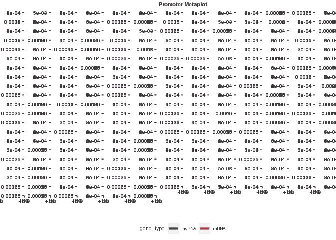<!-- -->

``` r
# saving
ggsave("figures/meta_plot_lncRNA_mRNA.pdf", width = 49, height = 12)
```

# RNAseq expression

``` r
samplesheet <- read_csv("/scratch/Shares/rinnclass/CLASS_2023/mehu6123/CLASS_2023/CLASSES/05_R_analyses/05_RNAseq/samplesheet.csv")
```

    ## Rows: 10 Columns: 10
    ## ── Column specification ────────────────────────────────────────────────────────
    ## Delimiter: ","
    ## chr (10): sample_id, sample_name, replicate, condition, cell_type, seq_type,...
    ## 
    ## ℹ Use `spec()` to retrieve the full column specification for this data.
    ## ℹ Specify the column types or set `show_col_types = FALSE` to quiet this message.

``` r
# First changing the total sample to homo_sapiens_insoluble_fraction
samplesheet[which(samplesheet$sample_name == "homo_sapiens_hepg2_R1"), "condition"] <- "homo_sapiens_insoluble_cytoplasmic_fraction"

# same for changing insoluble_cytoplasmic_fraction condition to homo_sapiens_hepg2
samplesheet[which(samplesheet$sample_name == "homo_sapiens_hepg2_insoluble_cytoplasmic_fraction_R2"), "condition"] <- "homo_sapiens_hepg2"


# rewriting sample name
samplesheet[which(samplesheet$sample_name == "homo_sapiens_hepg2_R1"), "sample_name"] <- "homo_sapiens_hepg2_insoluble_cytoplasmic_fraction_RX"


# rewrite sample name
samplesheet[which(samplesheet$sample_name == "homo_sapiens_hepg2_insoluble_cytoplasmic_fraction_R2"), "sample_name"] <- "homo_sapiens_hepg2_R1"

# change RX back
samplesheet[which(samplesheet$sample_name == "homo_sapiens_hepg2_insoluble_cytoplasmic_fraction_RX"), "sample_name"] <- "homo_sapiens_hepg2_insoluble_cytoplasmic_fraction_R2"

# finally change replicate numbers -- NOT IDEAL!
samplesheet[which(samplesheet$sample_name == "homo_sapiens_hepg2_R1"), "replicate"] <- "R1"

# finally change replicate numbers -- NOT IDEAL!
samplesheet[which(samplesheet$sample_name == "homo_sapiens_hepg2_insoluble_cytoplasmic_fraction_R2"), "replicate"] <- "R2"


# saving this to sample_sheets folder
write.csv(samplesheet, "sample_sheets/corrected_samplesheet.csv")

# Genome Annotation

# Importing genome annotations (we will export what we need in .Rdata format to avoid this step moving forward)
gencode_gtf <- rtracklayer::import("/scratch/Shares/rinnclass/CLASS_2023/data/data/genomes/gencode.v32.annotation.gtf")

# making genocde_genes GRanges to save in .Rdata session.
gencode_genes <- gencode_gtf[gencode_gtf$type == "gene"]

# It is really handy to convert gene_id (long number) to gene_name (more intuitive). 
# We are making G2S file that we can use in future to convert between the two.
g2s <- gencode_genes %>% as.data.frame() %>%
  dplyr::select(gene_id, gene_name)

# writingn this out to avoid loading Gencode in the future
write.csv(g2s, "RNAseq/g2s.csv")

# reading in salmon counts:
counts <- read_csv("/scratch/Shares/rinnclass/CLASS_2023/mehu6123/CLASS_2023/CLASSES/05_R_analyses/05_RNAseq/00_RNAseq_download_NF_core_pipeline/00_NF_CORE_RNAseq_Pipeline_run/results/salmon/salmon_merged_gene_counts.csv")
```

    ## Rows: 60180 Columns: 11
    ## ── Column specification ────────────────────────────────────────────────────────
    ## Delimiter: ","
    ## chr  (1): gene_id
    ## dbl (10): ENCSR813BDU_rep1, ENCSR887ZSY_rep1, ENCSR061SFU_rep1, ENCSR862HPO_...
    ## 
    ## ℹ Use `spec()` to retrieve the full column specification for this data.
    ## ℹ Specify the column types or set `show_col_types = FALSE` to quiet this message.

``` r
# adding rownames and converting to a matrix
counts <- column_to_rownames(counts, "gene_id") %>%
as.matrix()

# First let's put the counts columns in the same order as the samplesheet
# If they are not then we would essentially be randomizing our data later!!
counts <- counts[,samplesheet$sample_id]

# This is a handy check point to make sure the labels in 
# sample sheet and counts are similar
all(colnames(counts) == samplesheet$sample_id)
```

    ## [1] TRUE

``` r
# Now we know they're in the same order, and we can change the names
# It is nicer to have more descriptive names.
colnames(counts) <- samplesheet$sample_name

# Deseq wants round numbers so we are going to round them here:
counts <- round(counts)

# now we want to get rid of all genes with 0 across all samples.
counts_filtered <- counts[rowSums(counts) > 1,]


write_rds(counts_filtered, "RNAseq/results/counts_matrix.rds")

# reading in salmon tpm
salmon_tpm <- read.csv("/scratch/Shares/rinnclass/CLASS_2023/mehu6123/CLASS_2023/CLASSES/05_R_analyses/05_RNAseq/00_RNAseq_download_NF_core_pipeline/00_NF_CORE_RNAseq_Pipeline_run/results/salmon/salmon_merged_gene_tpm.csv")

# TPM table is in same order as samplesheet
tpm_df <- salmon_tpm %>% 
  pivot_longer(cols = 2:ncol(.), names_to = "sample_id", values_to = "tpm") %>%
  merge(samplesheet) %>%
  group_by(gene_id, condition) %>%
  summarize(tpm = mean(tpm, na.rm = T)) %>%
  pivot_wider(names_from = condition, values_from = tpm, names_prefix = "tpm_")
```

    ## `summarise()` has grouped output by 'gene_id'. You can override using the
    ## `.groups` argument.

``` r
promoter_features_df <- merge(peak_occurrence_df, tpm_df)

ggplot(peak_occurrence_df, aes(x = number_of_dbp)) +
  geom_density() 
```

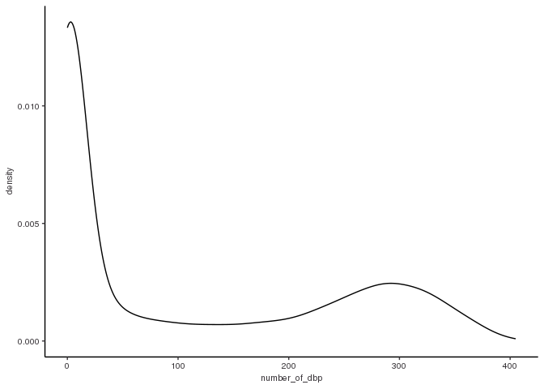<!-- -->

# What is the difference in RNA expression of mitochondrial genes and genes on chromosome 1?

``` r
mitoRNA <- filter(promoter_features_df, chr == "chrM")
chromosome1RNA <- filter(promoter_features_df, chr == "chr1")

chr_comparison <- rbind(chromosome1RNA, mitoRNA)

ggplot(chr_comparison, 
            aes(y = log2(tpm_homo_sapiens_hepg2 + 0.001), x = number_of_dbp, color = chr)) + 
geom_point() +
  geom_smooth(method = 'gam', formula = y ~ s(x, bs = "cs")) +
  geom_smooth(method = "lm") +
  scale_x_continuous(expand = c(0,0)) +
  scale_color_manual(values = c("#a8404c", "#424242"), name = "Gene type") + 
  ggtitle("Expression vs. promoter binding events for super binders") + 
  xlab(expression('Number of TFs')) +
  ylab(expression(log[2](TPM)))
```

    ## Warning: Computation failed in `stat_smooth()`
    ## Caused by error in `smooth.construct.cr.smooth.spec()`:
    ## ! x has insufficient unique values to support 10 knots: reduce k.

    ## `geom_smooth()` using formula = 'y ~ x'

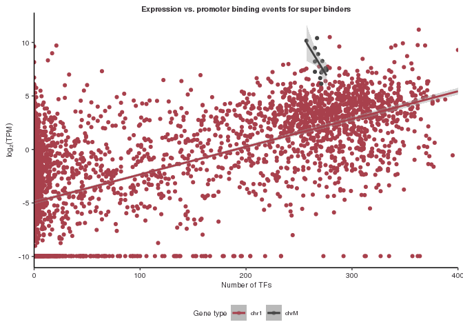<!-- -->

``` r
ggsave("figures/chr_RNA_comparison.pdf", height = 49, width = 6)
```

    ## Warning: Computation failed in `stat_smooth()`
    ## Caused by error in `smooth.construct.cr.smooth.spec()`:
    ## ! x has insufficient unique values to support 10 knots: reduce k.

    ## `geom_smooth()` using formula = 'y ~ x'

# Result: It appears that the mitochondrial genes have high RNA expression equivalent to some of the highest expressing genes on Chromosome 1. This is saved as a figure in the figures folder.

# Super Binders and RNA Expression

``` r
# First I will filter out super-binders into a new dataframe using the peak_feature_df as
# this has all the information on RNA seq as well as number of DBP
super_binders_RNA <- filter(promoter_features_df, number_of_dbp > 200)
save(super_binders_RNA, file = "RNAseq/results/super_binders_RNA.RData")


ggplot(super_binders_RNA, 
            aes(y = log2(tpm_homo_sapiens_hepg2 + 0.001), x = number_of_dbp, color = gene_type)) + 
geom_point() +
  geom_smooth(method = 'gam', formula = y ~ s(x, bs = "cs")) +
  geom_smooth(method = "lm") +
  scale_x_continuous(expand = c(0,0)) +
  scale_color_manual(values = c("#a8404c", "#424242"), name = "Gene type") + 
  ggtitle("Expression vs. promoter binding events for super binders") + 
  xlab(expression('Number of TFs')) +
  ylab(expression(log[2](TPM)))
```

    ## `geom_smooth()` using formula = 'y ~ x'

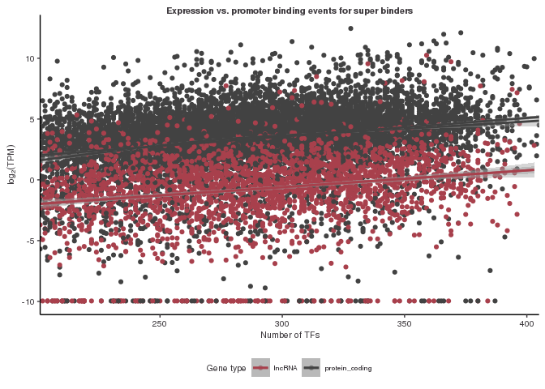<!-- -->

``` r
ggsave("figures/super_binders_RNA_Expression.pdf", height = 49, width = 6)
```

    ## `geom_smooth()` using formula = 'y ~ x'

# Result: It seems like there are quite a few super binders with little to no expression. I am wondering are these super binders in the cytosol? nucleus? or mitochondria?

# Super Binders and RNA Expression (Further Analysis)

``` r
# First filter to find all the super binders with no RNA expression
super_binders_low_RNA <- filter(super_binders_RNA, log2(tpm_homo_sapiens_hepg2 + 0.001) < -9)
save(super_binders_low_RNA, file = "RNAseq/results/super_binders_low_RNA.RData")

cytoRNA <- sum(super_binders_low_RNA$tpm_homo_sapiens_cytosolic_fraction)

nucRNA <- sum(super_binders_low_RNA$tpm_homo_sapiens_nuclear_fraction)

print(cytoRNA) # Cytoplasmic RNA Summed up 
```

    ## [1] 272.0891

``` r
print(nucRNA) # Nuclear RNA Summed Up
```

    ## [1] 336.2785

# Result: None of the low/ no expression superbinders are mitochondrial. The summed total of the cytoplasmis RNA expression from super binders is 272.0891 while the summed nuclear RNA expression is 336.2785. This might not be the best measurement to accurately determine if more of the low RNA expressing super binders are cytoplasmic or nuclear. I have saved a csv of the low RNA super binders expression in the RNASeq results folder.
